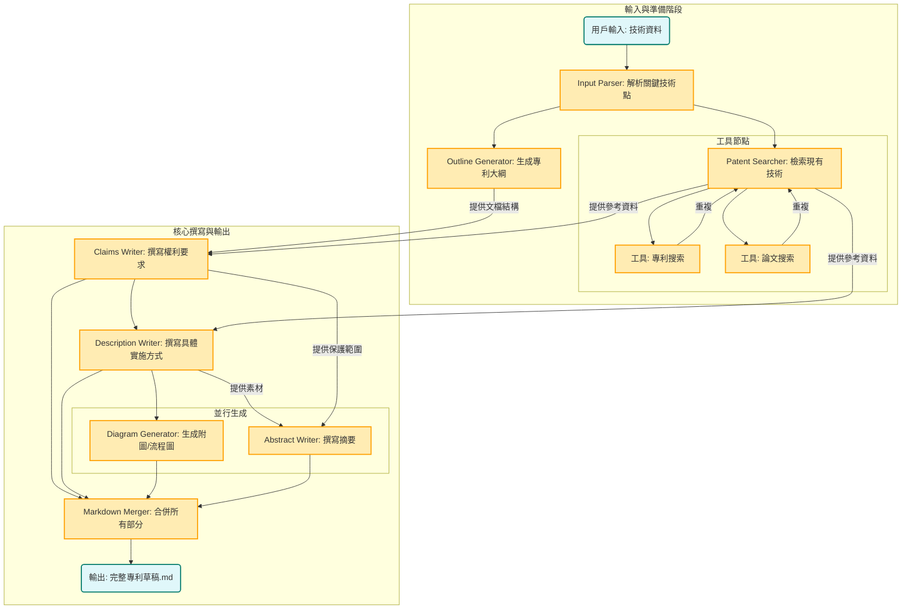

# 專利寫作智能體


```bash
# 安裝 Claude code
npm install -g @anthropic-ai/claude-code

# 安裝其他依賴
pip install -r requirements.txt

# 配置環境變量
cp .mcp.json.example .mcp.json
cp .claude/settings.local.json.example .claude/settings.local.json

# 修改 .mcp.json 中的 API KEY，包括SERPAPI_API_KEY和EXA_API_KEY
# 修改 .claude/settings.local.json 中的 Token 和 URL（配置為第三方模型，如果不使用第三方，刪除掉以ANTHROPIC開頭的env即可）

#CLI
claude --dangerously-skip-permissions "根據 data/輸入.docx 編寫專利提案 " -p  --output-format stream-json --verbose

output/temp_9ba0a678-5210-42e0-8f52-31b47bf630f6 為示例輸出

```

### Workflow 設計


