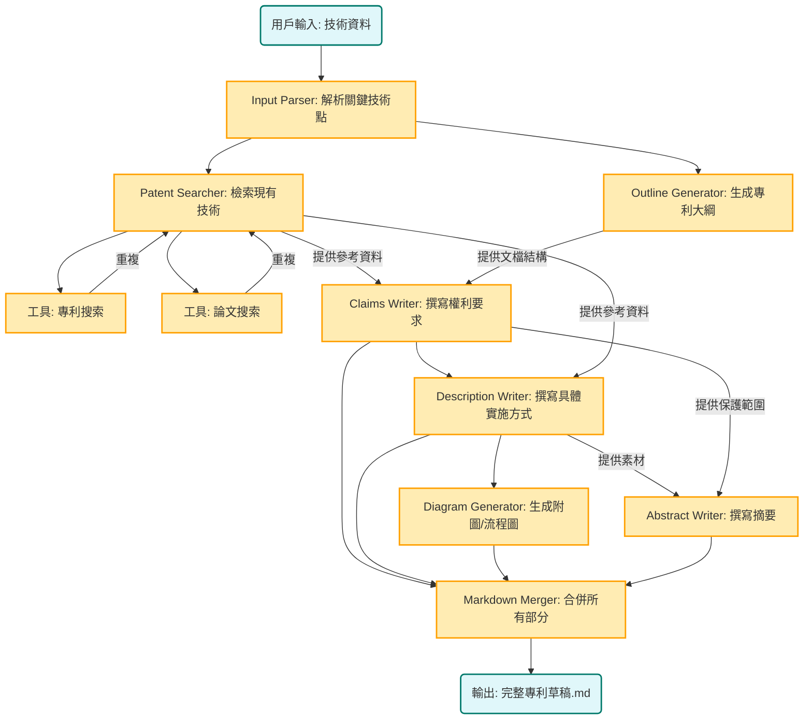

# 專利寫作智能體


```bash
# 安裝 Claude code
npm install -g @anthropic-ai/claude-code

# 安裝其他依賴
pip install -r requirements.txt

# 配置環境變量
cp .mcp.json.example .mcp.json
cp .claude/settings.local.json.example .claude/settings.local.json

# 修改 .mcp.json 中的 API KEY，包括SERPAPI_API_KEY和EXA_API_KEY
# 修改 .claude/settings.local.json 中的 Token 和 URL（配置為第三方模型，如果不使用第三方，刪除掉以ANTHROPIC開頭的env即可）

#CLI
claude --dangerously-skip-permissions "根據 data/輸入.docx 編寫專利提案 " -p  --output-format stream-json --verbose

output/temp_9ba0a678-5210-42e0-8f52-31b47bf630f6 為示例輸出

```

---

## 📊 Mermaid 圖表預覽說明

本專案文件包含大量 Mermaid 架構圖表。由於 VS Code 擴充套件的兼容性問題，**推薦使用以下方式預覽**：

### 方法 1: VS Code 獨立預覽視窗（推薦）

1. 安裝擴充套件：`vstirbu.vscode-mermaid-preview`
   ```bash
   code --install-extension vstirbu.vscode-mermaid-preview
   ```

2. 使用方式：
   - 將游標放在 Mermaid 程式碼塊中
   - 按 `Ctrl+Shift+P` → 輸入 "Mermaid: Preview Diagram"
   - 在獨立視窗中查看圖表

3. 提升效率（可選）：
   - 設定快捷鍵 `Ctrl+Alt+M` 給 "Mermaid: Preview Diagram"
   - 步驟：`Ctrl+K Ctrl+S` → 搜尋 "mermaid preview" → 設定快捷鍵

### 方法 2: 線上平台（所有環境適用）

訪問 https://mermaid.live/，複製 Mermaid 程式碼即可預覽和匯出圖片。

### 詳細說明

完整的 Mermaid 使用指南和故障排除請參考：
- [Mermaid 最終解決方案](docs/troubleshooting/Mermaid_最終解決方案.md) - 快速開始指南
- [Mermaid 使用指南](docs/troubleshooting/Mermaid_使用指南.md) - 語法參考
- [Mermaid 故障排除](docs/troubleshooting/Mermaid_故障排除.md) - 問題排查

---


### Workflow 設計


