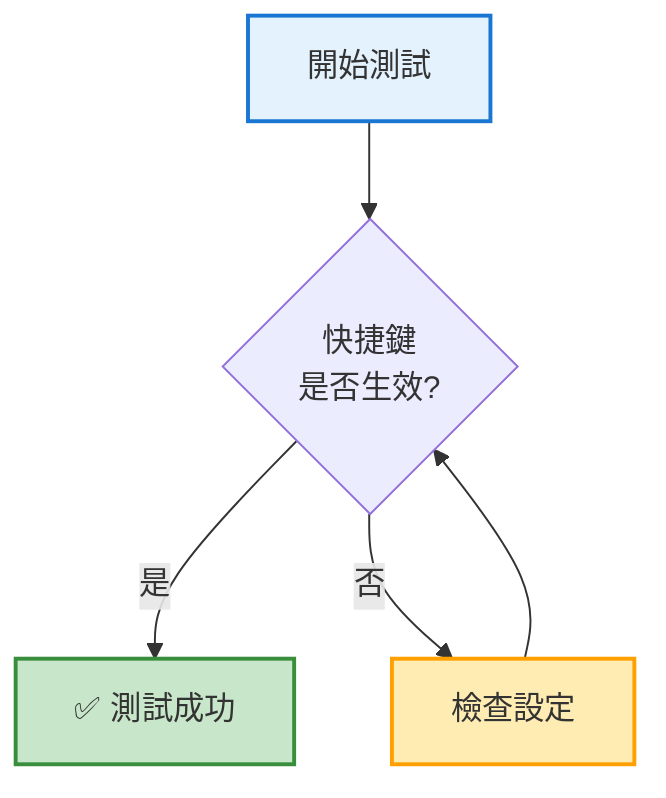
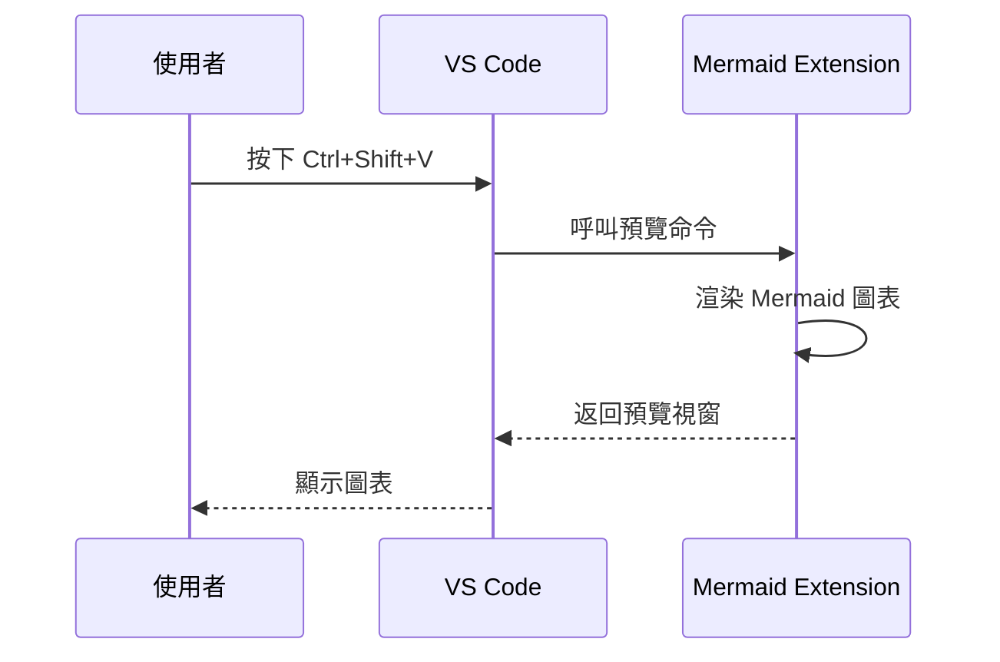

# 快捷鍵測試文件

## 🎯 測試目的

確認 `Ctrl+Shift+V` 快捷鍵已正確設定給 Mermaid Preview。

---

## 📋 測試步驟

### 步驟 1: 重新載入 VS Code
1. 按 `Ctrl+Shift+P`
2. 輸入 "Reload Window"
3. 選擇 "Developer: Reload Window"
4. 等待 VS Code 重新載入

### 步驟 2: 開啟此測試文件
- 你現在應該正在閱讀這個文件

### 步驟 3: 測試 Mermaid 預覽
1. **將游標放在下方任一個 Mermaid 程式碼塊中**
2. **按下 `Ctrl+Shift+V`**
3. **檢查右側是否開啟 Mermaid 預覽視窗**

---

## 🧪 測試案例

### 測試 1: 簡單流程圖

將游標放在此程式碼塊中，按 `Ctrl+Shift+V`：


**預期結果**：
- ✅ 右側開啟預覽視窗
- ✅ 顯示三個方塊和箭頭
- ✅ 沒有錯誤訊息

---

### 測試 2: 帶樣式的流程圖

將游標放在此程式碼塊中，按 `Ctrl+Shift+V`：



**預期結果**：
- ✅ 顯示決策流程圖
- ✅ 方塊有顏色（藍色、綠色、黃色）
- ✅ 文字清晰可讀

---

### 測試 3: 時序圖

將游標放在此程式碼塊中，按 `Ctrl+Shift+V`：



**預期結果**：
- ✅ 顯示時序圖
- ✅ 箭頭和訊息正確
- ✅ 參與者標籤清晰

---

## ✅ 測試結果檢查表

完成所有測試後，確認以下項目：

- [ ] **測試 1 成功**：簡單流程圖正常顯示
- [ ] **測試 2 成功**：帶樣式的流程圖顯示顏色
- [ ] **測試 3 成功**：時序圖正常顯示
- [ ] **快捷鍵響應快速**：按下後立即開啟預覽
- [ ] **無錯誤訊息**：沒有「No diagram type detected」錯誤
- [ ] **無閃爍問題**：圖表穩定顯示，不會閃爍消失

---

## 🔧 如果測試失敗

### 症狀：按 `Ctrl+Shift+V` 沒有反應

**可能原因**：VS Code 未重新載入

**解決方案**：
```
1. 按 Ctrl+Shift+P
2. 輸入 "Reload Window"
3. 重新測試
```

---

### 症狀：開啟的是普通 Markdown 預覽

**可能原因**：快捷鍵設定未生效

**解決方案**：
```
1. 按 Ctrl+K Ctrl+S 開啟快捷鍵設定
2. 搜尋 "ctrl+shift+v"
3. 確認 mermaid-preview.preview 有綁定
4. 確認 markdown.showPreview 的快捷鍵已改為 Ctrl+K V
5. 重新載入視窗
```

---

### 症狀：顯示錯誤「command not found」

**可能原因**：擴充套件未正確安裝

**解決方案**：
```bash
# 檢查擴充套件
code --list-extensions | grep mermaid

# 應該看到：
# bpruitt-goddard.mermaid-markdown-syntax-highlighting
# vstirbu.vscode-mermaid-preview

# 如果沒有 vstirbu，重新安裝：
code --install-extension vstirbu.vscode-mermaid-preview
```

---

## 📚 完成測試後

如果所有測試都成功：

1. **刪除此測試文件**（不需要提交到 Git）
   ```bash
   rm TEST_HOTKEY.md
   ```

2. **開始使用新的快捷鍵**
   - 在任何 Markdown 文件中
   - 將游標放在 Mermaid 程式碼塊中
   - 按 `Ctrl+Shift+V` 即可預覽

3. **記住新的快捷鍵配置**
   - `Ctrl+Shift+V` = Mermaid 預覽（新）
   - `Ctrl+K V` = Markdown 整體預覽（舊功能移到這裡）

---

## 🎓 快捷鍵速查表

| 功能 | 快捷鍵 | 說明 |
|------|--------|------|
| Mermaid 預覽 | `Ctrl+Shift+V` | 預覽游標所在的 Mermaid 圖表 |
| Markdown 預覽 | `Ctrl+K V` | 預覽整個 Markdown 文件 |
| 命令面板 | `Ctrl+Shift+P` | 萬能命令入口 |
| 快捷鍵設定 | `Ctrl+K Ctrl+S` | 查看和修改快捷鍵 |

---

**測試日期**：2025-10-30
**VS Code 版本**：1.80+
**擴充套件**：vstirbu.vscode-mermaid-preview@2.1.2
