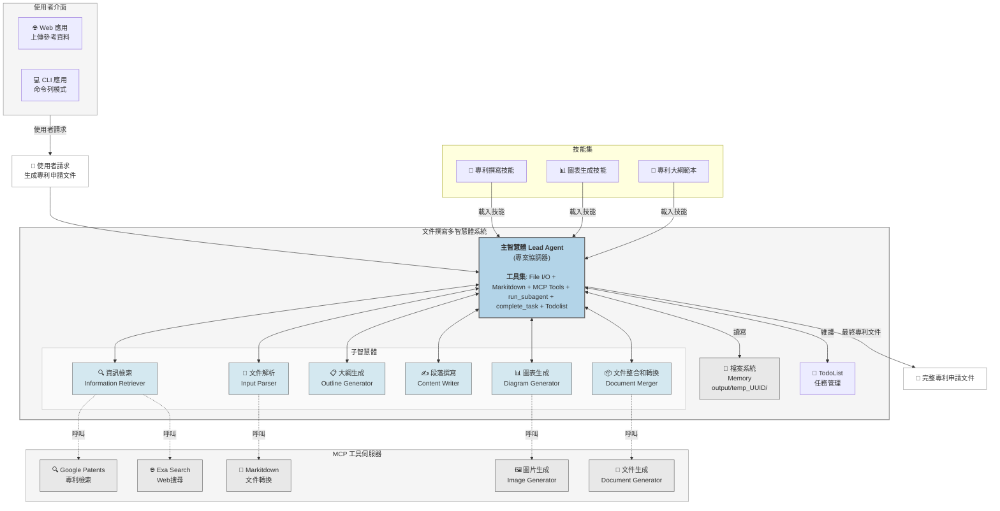

# 專利撰寫多智慧體系統架構

## 高層架構圖（High-level Architecture）

```mermaid
graph TB
    %% 使用者介面
    subgraph UserInterface["使用者介面"]
        direction LR
        WebUI["🌐 Web 應用<br/>上傳參考資料"]
        CLI["💻 CLI 應用<br/>命令列模式"]
    end

    %% 使用者請求
    UserRequest["📄 使用者請求<br/>生成專利申請文件"]

    %% 多智慧體系統
    subgraph MultiAgent["文件撰寫多智慧體系統"]
        direction TB

        %% 主智慧體
        LeadAgent["<b>主智慧體 Lead Agent</b><br/>(專案協調器)<br/><br/><b>工具集</b>: File I/O + Markitdown + MCP Tools + run_subagent + complete_task + Todolist"]

        %% 子智慧體
        subgraph Subagents["子智慧體"]
            direction LR
            S1["📄 文件解析<br/>Input Parser"]
            S2["🔍 資訊檢索<br/>Information Retriever"]
            S3["📋 大綱生成<br/>Outline Generator"]
            S4["✍️ 段落撰寫<br/>Content Writer"]
            S5["📊 圖表生成<br/>Diagram Generator"]
            S6["📦 文件整合和轉換<br/>Document Merger"]
        end

        %% 檔案系統
        Memory["💾 檔案系統<br/>Memory<br/>output/temp_UUID/"]

        %% TODO管理
        TodoList["📝 TodoList<br/>任務管理"]
    end

    %% MCP工具層
    subgraph MCPTools["MCP 工具伺服器"]
        direction LR
        GooglePatents["🔍 Google Patents<br/>專利檢索"]
        ExaSearch["🌐 Exa Search<br/>Web搜尋"]
        Markitdown["📝 Markitdown<br/>文件轉換"]
        ImageGenerator["🖼️ 圖片生成<br/>Image Generator"]
        DocumentGenerator["📄 文件生成<br/>Document Generator"]
    end

    %% 連接關係
    UserInterface -->|使用者請求| UserRequest
    UserRequest --> LeadAgent

    LeadAgent <--> S1
    LeadAgent <--> S2
    LeadAgent <--> S3
    LeadAgent <--> S4
    LeadAgent <--> S5
    LeadAgent <--> S6

    LeadAgent <-->|讀寫| Memory
    LeadAgent <-->|維護| TodoList

    S1 -.呼叫.-> Markitdown
    S2 -.呼叫.-> GooglePatents
    S2 -.呼叫.-> ExaSearch
    S5 -.呼叫.-> ImageGenerator
    S6 -.呼叫.-> DocumentGenerator

    LeadAgent -->|最終專利文件| FinalOutput["📑 完整專利申請文件"]

    subgraph Skills["技能集"]
        direction LR
        PatentSkills["🔧 專利撰寫技能"]
        DiagramSkills["📊 圖表生成技能"]
        PatentOutline["📑 專利大綱範本"]
    end

    PatentSkills -->|載入技能| LeadAgent
    DiagramSkills -->|載入技能| LeadAgent
    PatentOutline -->|載入技能| LeadAgent


    %% 樣式定義
    style LeadAgent fill:#B3D4E8,stroke:#666,stroke-width:2px,color:#333
    style S1 fill:#D4E8F0,stroke:#666,stroke-width:1px,color:#333
    style S2 fill:#D4E8F0,stroke:#666,stroke-width:1px,color:#333
    style S3 fill:#D4E8F0,stroke:#666,stroke-width:1px,color:#333
    style S4 fill:#D4E8F0,stroke:#666,stroke-width:1px,color:#333
    style S5 fill:#D4E8F0,stroke:#666,stroke-width:1px,color:#333
    style S6 fill:#D4E8F0,stroke:#666,stroke-width:1px,color:#333
    style Memory fill:#E8E8E8,stroke:#666,stroke-width:1px,color:#333
    style GooglePatents fill:#E8E8E8,stroke:#666,stroke-width:1px,color:#333
    style ExaSearch fill:#E8E8E8,stroke:#666,stroke-width:1px,color:#333
    style Markitdown fill:#E8E8E8,stroke:#666,stroke-width:1px,color:#333
    style DocumentGenerator fill:#E8E8E8,stroke:#666,stroke-width:1px,color:#333
    style ImageGenerator fill:#E8E8E8,stroke:#666,stroke-width:1px,color:#333

    style UserInterface fill:#F5F5F5,stroke:#999,stroke-width:1px
    style MultiAgent fill:#F5F5F5,stroke:#999,stroke-width:2px
    style MCPTools fill:#F5F5F5,stroke:#999,stroke-width:1px
    style Subagents fill:#FAFAFA,stroke:#CCC,stroke-width:1px
    style UserRequest fill:#FFF,stroke:#999,stroke-width:1px,color:#333
    style FinalOutput fill:#FFF,stroke:#999,stroke-width:1px,color:#333
```