# A0 專利文件自動生成系統 Grafcet 離散事件模型

## 文件資訊
- **模型名稱**: A0 System Grafcet Model
- **對應模組**: A0 (包含 A1 ~ A8)
- **建立日期**: 2025-12-16
- **版本**: v1.0

---

## 1. 模型概述

本文件使用 **Grafcet (IEC 60848)** 標準描述專利文件自動生成系統的離散事件行為。模型涵蓋了從使用者介面互動 (A1) 到流程控制 (A8) 調度各個核心模組 (A2-A7) 的完整狀態機變化。

### 符號說明
- **步驟 (Step)**: 系統的狀態，由正方形表示。初始步驟由雙框正方形表示。
- **動作 (Action)**: 與步驟關聯的操作，由矩形表示。
- **變遷 (Transition)**: 步驟之間的切換條件，由水平短線表示。
- **有向連線 (Directed Link)**: 狀態流轉方向。

---

## 2. A0 系統主 Grafcet 圖

下圖展示了系統的主控制流程。主要由 A8 (流程控制) 負責協調 A2 至 A7 的狀態轉換，A1 負責初始觸發與最終回饋。

```mermaid
graph TD
    %% --- 樣式定義 ---
    classDef step fill:#ffffff,stroke:#000000,stroke-width:2px,min-width:40px,min-height:40px,color:#000000;
    classDef initStep fill:#ffffff,stroke:#000000,stroke-width:4px,min-width:40px,min-height:40px,color:#000000;
    classDef action fill:#ffffff,stroke:#000000,stroke-width:1px,rx:5,ry:5,text-align:left,color:#000000;
    classDef trans fill:#000000,stroke:#000000,stroke-width:1px,height:4px,width:60px,shape:rect;
    classDef error fill:#ffffff,stroke:#000000,stroke-width:1px,stroke-dasharray: 5 5,color:#000000;

    %% --- 節點定義 ---

    %% 初始狀態
    S0("0"):::initStep
    Ac0["A1: 等待使用者操作<br>(UI Idle)"]:::action

    %% 變遷 1: 啟動
    Tr0[" "]:::trans
    Cond0[/"使用者上傳檔案 &<br>點擊開始撰寫"/]

    %% 步驟 1: 系統初始化
    S1("1"):::step
    Ac1["A1/A8: 建立會話 (Session)<br>A1: 鎖定 UI<br>A8: 初始化工作流狀態"]:::action

    %% 變遷 2: 初始化完成
    Tr1[" "]:::trans
    Cond1[/"會話 ID 生成 &<br>工作目錄就緒"/]

    %% 步驟 2: A2 文件解析
    S2("2"):::step
    Ac2["A2: 執行 DocParsing<br>• converting docx<br>• extracting info"]:::action

    %% 變遷 3: 解析成功
    Tr2[" "]:::trans
    Cond2[/"parsed_info.json 生成"/]

    %% 步驟 3: A3 專利檢索
    S3("3"):::step
    Ac3["A3: 執行 PatentSearch<br>• searching patents<br>• analyzing styles"]:::action

    %% 變遷 4: 檢索成功
    Tr3[" "]:::trans
    Cond3[/"similar_patents.json 生成"/]

    %% 步驟 4: A4 大綱生成
    S4("4"):::step
    Ac4["A4: 執行 OutlineGen<br>• planning structure<br>• building logic chain"]:::action

    %% 變遷 5: 大綱確認
    Tr4[" "]:::trans
    Cond4[/"patent_outline.md 生成"/]

    %% 步驟 5: A5 內容撰寫
    S5("5"):::step
    Ac5["A5: 執行 ContentWriting<br>• writing abstract<br>• writing claims<br>• writing description"]:::action

    %% 變遷 6: 撰寫完成
    Tr5[" "]:::trans
    Cond5[/"draft docs 生成 &<br>術語一致性檢查通過"/]

    %% 步驟 6: A6 圖表生成
    S6("6"):::step
    Ac6["A6: 執行 DiagramGen<br>• identifying types<br>• generating mermaid"]:::action

    %% 變遷 7: 圖表就緒
    Tr6[" "]:::trans
    Cond6[/"diagram_index.json 生成"/]

    %% 步驟 7: A7 文件整合
    S7("7"):::step
    Ac7["A7: 執行 DocMerging<br>• merging sections<br>• formatting docx"]:::action

    %% 變遷 8: 整合完成
    Tr7[" "]:::trans
    Cond7[/"final docs 生成"/]

    %% 步驟 8: 任務完成
    S8("8"):::step
    Ac8["A8: 生成品質報告<br>A1: 下載連結就緒<br>A1: 解鎖 UI"]:::action

    %% 變遷 9: 重置
    Tr8[" "]:::trans
    Cond8[/"使用者確認或<br>開始新任務"/]

    %% --- 具體錯誤處理分支 (簡化示意) ---
    %% 假設 A2-A7 任意步驟失敗進入 S99
    S99("99"):::step
    Ac99["A8: 錯誤處理 (Error Handling)<br>• Log Error<br>• Retry Strategy"]:::error
    
    %% 連線關係
    S0 -.- Ac0
    S0 --> Tr0
    Tr0 --- Cond0
    Tr0 --> S1
    S1 -.- Ac1
    S1 --> Tr1
    Tr1 --- Cond1
    Tr1 --> S2
    S2 -.- Ac2
    S2 --> Tr2
    Tr2 --- Cond2
    Tr2 --> S3
    S3 -.- Ac3
    S3 --> Tr3
    Tr3 --- Cond3
    Tr3 --> S4
    S4 -.- Ac4
    S4 --> Tr4
    Tr4 --- Cond4
    Tr4 --> S5
    S5 -.- Ac5
    S5 --> Tr5
    Tr5 --- Cond5
    Tr5 --> S6
    S6 -.- Ac6
    S6 --> Tr6
    Tr6 --- Cond6
    Tr6 --> S7
    S7 -.- Ac7
    S7 --> Tr7
    Tr7 --- Cond7
    Tr7 --> S8
    S8 -.- Ac8
    S8 --> Tr8
    Tr8 --- Cond8
    Tr8 --> S0

    %% 錯誤變遷 (示意: 從 S2 失敗跳轉)
    S2 --> TrErr1[" "]:::trans
    TrErr1 -- "Error" --> S99
    S99 -.- Ac99
    S99 --> TrRetry[" "]:::trans
    TrRetry -- "Retry OK" --> S2
    S99 --> TrFail[" "]:::trans
    TrFail -- "Fatal Error" --> S8
```

---

## 3. 詳細狀態描述表

下表詳細定義了每個 Grafcet 步驟的輸入條件、執行動態與輸出變數。

| 步驟 (Step) | 關聯模組 | 動作描述 (Action) | 變遷條件 (Receptivity) | 輸出 (Inputs/Outputs) |
|:---:|:---:|:---|:---|:---|
| **S0** | A1 | **Init**: 系統待機 **Display**: 顯示上傳介面 | `Users_Start` AND `File_Uploaded` | **IN**: User Interaction **OUT**: Uploaded File Path |
| **S1** | A1, A8 | **Do**: 建立 Session **Do**: 初始化專案目錄結構 | `Session_Created` | **IN**: File Path **OUT**: Session UUID, Work Dir |
| **S2** | A2 | **Do**: 啟動文件解析 Agent **Do**: 執行 DOCX 轉 MD | `Parsed_Json_Exists` | **IN**: raw_document.docx **OUT**: parsed_info.json |
| **S3** | A3 | **Do**: 執行 Google Patents 檢索 **Do**: 執行 Exa Search **Do**: 風格分析 | `Search_Results_Exists` | **IN**: parsed_info.json **OUT**: similar_patents.json |
| **S4** | A4 | **Do**: 生成章節大綱 Structure **Do**: 構建邏輯鏈 Logic Chain | `Outline_MD_Exists` | **IN**: parsed_info, patents **OUT**: patent_outline.md |
| **S5** | A5 | **Do**: 撰寫 Abstract **Do**: 撰寫 Claims **Do**: 撰寫 Description | `Draft_Files_Exist` | **IN**: outline.md **OUT**: abstract, claims, desc |
| **S6** | A6 | **Do**: 識別圖表需求 **Do**: 生成 Mermaid Code | `Diagrams_Index_Exists` | **IN**: description.md **OUT**: .mmd files |
| **S7** | A7 | **Do**: 合併章節 **Do**: 插入圖表 **Do**: 轉檔 DOCX | `Final_Doc_Exists` | **IN**: all md files, diagrams **OUT**: complete.docx |
| **S8** | A8, A1 | **Do**: 生成品質報告 **Do**: UI 顯示下載按鈕 | `User_Reset` OR `Download_Done` | **IN**: Execution Logs **OUT**: Final Report |
| **S99** | A8 | **Do**: 記錄錯誤 **Do**: 判斷重試策略 | `Retry < Max` OR `Fatal` | **IN**: Exception **OUT**: Retry Signal |

---

## 4. 變數定義 (Variables)

為了確保離散事件模型的精確性，定義以下布林變數用於變遷條件判斷：

### 輸入變數 (Input Variables)
*   `Users_Start`: 使用者點擊「開始」按鈕 (Edge detection: Rising Edge)
*   `File_Uploaded`: 系統檢測到有效的 DOCX 檔案已存在於暫存區

### 內部狀態變數 (Internal State Variables)
*   `Session_Created`: A1.2 成功返回 Session 物件
*   `Parsed_Json_Exists`: `parsed_info.json` 檔案驗證通過
*   `Retry_Count`: 當前步驟的重試計數器

### 錯誤標記 (Error Flags)
*   `Parsing_Error`: 文件解析失敗
*   `API_Timeout`: 外部 API 連線逾時
*   `Validation_Failed`: 內容品質檢查未通過

---

## 5. 巨集步驟 (Macro-Steps)

為了簡化主圖，S2 至 S7 可視為由 A8 調度的標準 **「執行-監控」巨集**：

```mermaid
graph TD
    classDef step fill:#ffffff,stroke:#000000,stroke-width:2px,color:#000000;
    classDef action fill:#ffffff,stroke:#000000,stroke-width:1px,color:#000000;
    classDef trans fill:#000000,stroke:#000000,stroke-width:1px,height:4px,width:40px,shape:rect;

    E1("E1"):::step
    AcE1["調度器: 啟動模組 X"]:::action
    
    TrE1[" "]:::trans
    CondE1[/"模組 X 執行中"/]

    E2("E2"):::step
    AcE2["監控器: 檢查進度 & 日誌"]:::action

    TrE2[" "]:::trans
    CondE2[/"模組 X 完成"/]

    E3("E3"):::step
    AcE3["驗證器: 檢查輸出產物"]:::action

    TrE3[" "]:::trans
    CondE3[/"驗證通過"/]

    XS("X_Start"):::step
    XE("X_End"):::step

    XS --> E1
    E1 -.- AcE1
    E1 --> TrE1
    TrE1 --> E2
    E2 -.- AcE2
    E2 --> TrE2
    TrE2 --> E3
    E3 -.- AcE3
    E3 --> TrE3
    TrE3 --> XE
```

此巨集結構適用於 A2, A3, A4, A5, A6, A7 各個功能模組的內部執行邏輯。

---
**文件結束**
