# 專利起草自動化系統 IDEF0 架構建模

## 文件資訊
- **專案名稱**: 專利起草自動化系統 (Patent Drafting Automation System)
- **建模方法**: IDEF0 (Integration Definition for Function Modeling)
- **版本**: v1.0
- **建立日期**: 2025-10-30
- **作者**: System Architect

---

## 目錄
1. [系統概述](#系統概述)
2. [IDEF0 建模說明](#idef0-建模說明)
3. [A-0: 情境圖 (Context Diagram)](#a-0-情境圖-context-diagram)
4. [A0: 頂層功能圖](#a0-頂層功能圖)
5. [A1-A8: 子功能分解](#a1-a8-子功能分解)
6. [ICOM 分析表](#icom-分析表)
7. [系統實作建議](#系統實作建議)

---

## 系統概述

### 目的
建立一個全自動化的專利申請文件起草系統，將現有的 Prompt-based 多 Agent 架構封裝為可獨立運行的產品，提供完整的使用者介面和自動化流程控制。

### 核心價值主張
1. **全自動化**: 從上傳技術交底書到輸出完整專利文件，無需人工介入
2. **模組化設計**: 各功能模組獨立運作，易於維護和擴展
3. **使用者友善**: 提供直覺的 UI 介面和即時進度回饋
4. **品質保證**: 內建驗證機制，確保輸出符合專利法規範

### 系統邊界
- **輸入**: 技術交底書 (DOCX 格式)
- **輸出**: 完整專利申請文件 (Markdown + DOCX 格式)
- **使用者**: 企業專利部門、專利事務所、研發人員
- **外部系統**: Google Patents API, Exa Search API, Claude AI API

### 高層架構圖

```mermaid
flowchart TB
    WebUI["🌐 Web 應用<br/>上傳參考資料"]
    CLI["💻 CLI 應用<br/>命令列模式"]
    UserRequest["📄 使用者請求<br/>生成專利申請文件"]
    LeadAgent["主智慧體 Lead Agent<br/>(專案協調器)<br/><br/>工具集: File I/O + Markitdown + MCP Tools + run_subagent + complete_task + Todolist"]
    S1["📄 文件解析<br/>Input Parser"]
    S2["🔍 資訊檢索<br/>Information Retriever"]
    S3["📋 大綱生成<br/>Outline Generator"]
    S4["✍️ 段落撰寫<br/>Content Writer"]
    S5["📊 圖表生成<br/>Diagram Generator"]
    S6["📦 文件整合和轉換<br/>Document Merger"]
    Memory["💾 檔案系統<br/>Memory<br/>output/temp_UUID/"]
    TodoList["📝 TodoList<br/>任務管理"]
    GooglePatents["🔍 Google Patents<br/>專利檢索"]
    ExaSearch["🌐 Exa Search<br/>Web搜尋"]
    Markitdown["📝 Markitdown<br/>文件轉換"]
    ImageGenerator["🖼️ 圖片生成<br/>Image Generator"]
    DocumentGenerator["📄 文件生成<br/>Document Generator"]
    FinalOutput["📑 完整專利申請文件"]
    PatentSkills["🔧 專利起草技能"]
    DiagramSkills["📊 圖表生成技能"]
    PatentOutline["📑 專利大綱範本"]

    WebUI -->|使用者請求| UserRequest
    CLI -->|使用者請求| UserRequest
    UserRequest --> LeadAgent

    LeadAgent <--> S1
    LeadAgent <--> S2
    LeadAgent <--> S3
    LeadAgent <--> S4
    LeadAgent <--> S5
    LeadAgent <--> S6

    LeadAgent <-->|讀寫| Memory
    LeadAgent <-->|維護| TodoList

    S1 -.呼叫.-> Markitdown
    S2 -.呼叫.-> GooglePatents
    S2 -.呼叫.-> ExaSearch
    S5 -.呼叫.-> ImageGenerator
    S6 -.呼叫.-> DocumentGenerator

    LeadAgent -->|最終專利文件| FinalOutput

    PatentSkills -->|載入技能| LeadAgent
    DiagramSkills -->|載入技能| LeadAgent
    PatentOutline -->|載入技能| LeadAgent

    style LeadAgent fill:#B3D4E8,stroke:#666,stroke-width:2px,color:#333
    style S1 fill:#D4E8F0,stroke:#666,stroke-width:1px,color:#333
    style S2 fill:#D4E8F0,stroke:#666,stroke-width:1px,color:#333
    style S3 fill:#D4E8F0,stroke:#666,stroke-width:1px,color:#333
    style S4 fill:#D4E8F0,stroke:#666,stroke-width:1px,color:#333
    style S5 fill:#D4E8F0,stroke:#666,stroke-width:1px,color:#333
    style S6 fill:#D4E8F0,stroke:#666,stroke-width:1px,color:#333
    style Memory fill:#E8E8E8,stroke:#666,stroke-width:1px,color:#333
    style GooglePatents fill:#E8E8E8,stroke:#666,stroke-width:1px,color:#333
    style ExaSearch fill:#E8E8E8,stroke:#666,stroke-width:1px,color:#333
    style Markitdown fill:#E8E8E8,stroke:#666,stroke-width:1px,color:#333
    style DocumentGenerator fill:#E8E8E8,stroke:#666,stroke-width:1px,color:#333
    style ImageGenerator fill:#E8E8E8,stroke:#666,stroke-width:1px,color:#333
    style UserRequest fill:#FFF,stroke:#999,stroke-width:1px,color:#333
    style FinalOutput fill:#FFF,stroke:#999,stroke-width:1px,color:#333
```



**架構說明**:

- **Lead Agent (主智慧體)**: 專案協調器，負責整體流程控制和任務分配
  - 工具集: File I/O, Markitdown, MCP Tools, run_subagent, complete_task, Todolist
  - 技能載入: 專利起草技能、圖表生成技能、專利大綱範本

- **子智慧體 (Sub-Agents)**: 6 個專業子 Agent 執行具體任務
  - S1: 文件解析 → 使用 Markitdown 工具
  - S2: 資訊檢索 → 使用 Google Patents + Exa Search
  - S3: 大綱生成
  - S4: 段落撰寫
  - S5: 圖表生成 → 使用 Image Generator
  - S6: 文件整合 → 使用 Document Generator

- **記憶體系統**: 檔案系統 (output/temp_UUID/) 作為 Agent 間通訊媒介
- **任務管理**: TodoList 追蹤執行進度

---

## IDEF0 建模說明

### IDEF0 四要素 (ICOM)

```
        Control (C) - 控制
              ↓
Input (I) → [活動] → Output (O)
              ↑
        Mechanism (M) - 機制
```

- **Input (I)**: 輸入資料，被活動轉換或消耗
- **Control (C)**: 控制條件，指導活動如何執行
- **Output (O)**: 輸出產物，活動的結果
- **Mechanism (M)**: 執行機制，執行活動的資源或工具

### 建模層級
- **A-0**: 情境圖 - 系統與外部環境的互動
- **A0**: 頂層圖 - 系統主要功能
- **A1-A8**: 詳細分解 - 各子功能的 ICOM 定義

---

## A-0: 情境圖 (Context Diagram)

### 圖示

```mermaid
---
config:
  layout: dagre
---
flowchart LR
    Tech["📄 技術交底書<br>DOCX"] -- 輸入 --> Core["專利文件<br>自動生成"]
    User["👤 使用者<br>專利工程師"] -- 操作指令 --> Core
    PatentDB["🗄️ 專利資料庫<br>Google Patents"] -- 現有技術資料 --> Core
    AI["🤖 AI 服務<br>Claude API"] -- AI 生成能力 --> Core
    Core -- 專利文件 --> Patent["📑 完整專利文件<br>MD + DOCX"]
    Core -- 品質報告 --> Report["📊 品質報告"]
    Patent --> User
    Report --> User
    style Tech fill:#E8F5E9,stroke:#66BB6A,stroke-width:2px
    style Core fill:#4A90E2,stroke:#2E5C8A,stroke-width:3px,color:#fff
    style User fill:#FFE5B4,stroke:#CC9966,stroke-width:2px

```



### ICOM 分析

| 要素 | 內容 | 說明 |
|------|------|------|
| **Input (I)** | 技術交底書 (DOCX) | 包含技術背景、技術方案、實施例等內容 |
| **Control (C)** | 專利法規範、使用者指令、品質標準 | 符合中國專利法、字數要求、格式規範 |
| **Output (O)** | 完整專利文件、品質報告 | Markdown + DOCX 格式，含摘要/權利要求/說明書/附圖 |
| **Mechanism (M)** | AI 服務、專利資料庫、計算資源 | Claude AI API、Google Patents、伺服器 |

---

## A0: 頂層功能圖

### 功能分解

```mermaid
flowchart TB
    Input["📄 技術交底書"] --> A1

    A1["A1 介面管理<br/>UI Management"] --> A2["A2 文件解析<br/>Document Parsing"]
    A2 --> A3["A3 專利檢索<br/>Patent Search"]
    A3 --> A4["A4 大綱生成<br/>Outline Generation"]
    A4 --> A5["A5 內容起草<br/>Content Drafting"]
    A5 --> A6["A6 圖表生成<br/>Diagram Generation"]
    A6 --> A7["A7 文件整合<br/>Document Merging"]
    A7 --> Output["📑 完整專利文件"]

    A8["A8 流程控制<br/>Workflow Control"] -.監控.-> A2
    A8 -.監控.-> A3
    A8 -.監控.-> A4
    A8 -.監控.-> A5
    A8 -.監控.-> A6
    A8 -.監控.-> A7

    Control["⚙️ 控制:<br/>專利法規範<br/>品質標準<br/>使用者設定"] -.-> A8
    Mechanism["🔧 機制:<br/>AI API<br/>專利資料庫<br/>檔案系統"] -.-> A8

    style A1 fill:#FFF9C4,stroke:#F57C00,stroke-width:2px
    style A2 fill:#C8E6C9,stroke:#388E3C,stroke-width:2px
    style A3 fill:#C8E6C9,stroke:#388E3C,stroke-width:2px
    style A4 fill:#C8E6C9,stroke:#388E3C,stroke-width:2px
    style A5 fill:#C8E6C9,stroke:#388E3C,stroke-width:2px
    style A6 fill:#C8E6C9,stroke:#388E3C,stroke-width:2px
    style A7 fill:#C8E6C9,stroke:#388E3C,stroke-width:2px
    style A8 fill:#FFCCBC,stroke:#D84315,stroke-width:2px
```



### A0 功能列表

| 功能編號 | 功能名稱 | 主要職責 | 輸出 |
|---------|---------|---------|------|
| A1 | 介面管理 | 提供使用者互動介面，處理檔案上傳 | 已上傳的 DOCX 檔案 |
| A2 | 文件解析 | 解析技術交底書，提取結構化資訊 | parsed_info.json |
| A3 | 專利檢索 | 搜尋相似專利，分析現有技術 | similar_patents.json |
| A4 | 大綱生成 | 生成專利文件大綱結構 | patent_outline.md |
| A5 | 內容起草 | 起草摘要、權利要求、說明書 | abstract.md, claims.md, description.md |
| A6 | 圖表生成 | 生成 Mermaid 流程圖、結構圖 | *.mmd 檔案 |
| A7 | 文件整合 | 合併所有內容為完整專利文件 | complete_patent.md, patent.docx |
| A8 | 流程控制 | 協調各模組執行順序，錯誤處理 | 執行日誌、品質報告 |

---

## A1-A8: 子功能分解

### A1: 介面管理 (UI Management)

#### 功能描述
提供使用者友善的 Web 介面，處理檔案上傳、會話管理和進度顯示。

#### IDEF0 圖示

```
        [專利法規範, UI/UX 設計原則]
                    ↓
[使用者操作] → [A1: 介面管理] → [已上傳檔案, 會話 ID]
                    ↑
          [Streamlit 框架, 檔案系統]
```

#### ICOM 分析

| 要素 | 項目 | 詳細說明 |
|------|------|----------|
| **Input** | 使用者操作 | 檔案上傳、按鈕點擊、參數設定 |
| | 系統狀態 | 當前會話狀態、歷史記錄 |
| **Control** | UI/UX 設計規範 | 介面佈局、互動邏輯、錯誤提示 |
| | 檔案驗證規則 | DOCX 格式檢查、大小限制 (< 50MB) |
| **Output** | 已上傳檔案 | 儲存至 `data/輸入.docx` |
| | 會話 ID | UUID 格式，用於建立工作目錄 |
| | 介面回饋 | 成功/錯誤訊息、進度條 |
| **Mechanism** | Streamlit 框架 | Python Web 框架 |
| | 檔案儲存系統 | 本地檔案系統或雲端儲存 |

#### 關鍵功能模組
1. **檔案上傳模組**
   - 支援拖放上傳
   - 格式驗證 (僅接受 .docx)
   - 大小限制檢查
   - 重複檔案處理

2. **會話管理模組**
   - 生成唯一 UUID
   - 建立工作目錄 `output/temp_[uuid]/`
   - 歷史會話查詢
   - 會話恢復功能

3. **進度顯示模組**
   - 即時進度條
   - 當前執行階段顯示
   - 日誌輸出視窗
   - 錯誤提示彈窗

---

### A2: 文件解析 (Document Parsing)

#### 功能描述
使用 NLP 技術解析技術交底書，提取技術要素、關鍵術語和結構化資訊。

#### IDEF0 圖示

```
        [解析規則, JSON Schema 定義]
                    ↓
[DOCX 檔案] → [A2: 文件解析] → [parsed_info.json]
                    ↓
              [錯誤日誌]
                    ↑
        [Markitdown, Claude AI, NLP 工具]
```

#### ICOM 分析

| 要素 | 項目 | 詳細說明 |
|------|------|----------|
| **Input** | 技術交底書 | `data/輸入.docx` |
| **Control** | 解析規則 | 章節識別、關鍵字提取規則 |
| | JSON Schema | 輸出格式定義 (技術背景、技術方案、優點等) |
| **Output** | 結構化資訊 | `01_input/parsed_info.json` |
| | 錯誤日誌 | 解析失敗的章節或格式錯誤 |
| **Mechanism** | Markitdown | DOCX → Markdown 轉換 |
| | Claude AI | 語意理解和資訊提取 |
| | input-parser Agent | 專用解析 Agent |

#### 輸出 JSON 結構範例

```json
{
  "metadata": {
    "title": "專利名稱",
    "author": "發明人",
    "date": "2025-10-30",
    "uuid": "abc123"
  },
  "technical_field": "技術領域描述",
  "background": {
    "problems": ["現有問題1", "現有問題2"],
    "prior_art": ["現有技術1", "現有技術2"]
  },
  "technical_solution": {
    "core_idea": "核心技術思想",
    "key_features": ["特徵1", "特徵2", "特徵3"],
    "implementation": "實施方式概述"
  },
  "advantages": ["優點1", "優點2", "優點3"],
  "embodiments": [
    {
      "title": "實施例1",
      "description": "詳細描述",
      "figures": ["圖1", "圖2"]
    }
  ],
  "key_terms": ["術語1", "術語2", "術語3"]
}
```

---

### A3: 專利檢索 (Patent Search)

#### 功能描述
透過 Google Patents API 檢索相似專利，分析現有技術，學習優秀的專利起草風格。

#### IDEF0 圖示

```
        [檢索策略, 相似度閾值]
                    ↓
[parsed_info.json] → [A3: 專利檢索] → [similar_patents.json]
                    ↓                    ↓
              [檢索日誌]          [prior_art_analysis.md]
                    ↑
        [Google Patents API, Exa Search]
```

#### ICOM 分析

| 要素 | 項目 | 詳細說明 |
|------|------|----------|
| **Input** | 結構化技術資訊 | `01_input/parsed_info.json` |
| | 關鍵字列表 | 從技術方案提取的關鍵術語 |
| **Control** | 檢索策略 | 關鍵字組合、檢索範圍 (中國專利、近 5 年) |
| | 相似度閾值 | 至少 70% 技術相關性 |
| | 數量限制 | 返回前 10 件最相似專利 |
| **Output** | 相似專利列表 | `02_research/similar_patents.json` |
| | 現有技術分析 | `02_research/prior_art_analysis.md` |
| | 寫作風格參考 | `02_research/writing_style_guide.md` |
| **Mechanism** | Google Patents API | 透過 MCP google-patents-mcp 呼叫 |
| | Exa Search API | 補充網頁檢索 |
| | patent-searcher Agent | 專用檢索 Agent |

#### 輸出結構

**similar_patents.json**:
```json
{
  "search_query": "關鍵字組合",
  "total_results": 156,
  "selected_patents": [
    {
      "patent_id": "CN1234567A",
      "title": "專利標題",
      "abstract": "專利摘要",
      "filing_date": "2023-05-15",
      "relevance_score": 0.85,
      "key_claims": ["權利要求1", "權利要求2"],
      "technical_features": ["特徵A", "特徵B"]
    }
  ]
}
```

---

### A4: 大綱生成 (Outline Generation)

#### 功能描述
基於解析的技術資訊和檢索的專利範例，生成符合專利法規範的文件大綱。

#### IDEF0 圖示

```
        [專利法格式要求, 章節規範]
                    ↓
[parsed_info.json, similar_patents.json] → [A4: 大綱生成] → [patent_outline.md]
                    ↓
              [structure_mapping.json]
                    ↑
              [outline-generator Agent]
```

#### ICOM 分析

| 要素 | 項目 | 詳細說明 |
|------|------|----------|
| **Input** | 技術資訊 | `01_input/parsed_info.json` |
| | 相似專利 | `02_research/similar_patents.json` |
| **Control** | 專利法章節規範 | 發明名稱、摘要、權利要求、說明書、附圖 |
| | 字數要求 | 摘要 < 300 字、說明書 > 10000 字 |
| | 邏輯完整性 | 技術問題-技術方案-技術效果的邏輯鏈 |
| **Output** | 專利大綱 | `03_outline/patent_outline.md` |
| | 結構映射 | `03_outline/structure_mapping.json` (章節-內容對應) |
| **Mechanism** | outline-generator Agent | 專用大綱生成 Agent |
| | Claude AI | 結構化規劃能力 |

#### 大綱結構範例

```markdown
# 專利大綱

## 1. 發明名稱
[基於技術核心的簡潔名稱]

## 2. 技術領域
[所屬技術領域描述]

## 3. 背景技術
### 3.1 現有技術問題
### 3.2 現有技術方案及缺陷

## 4. 發明內容
### 4.1 發明目的
### 4.2 技術方案
### 4.3 有益效果

## 5. 附圖說明
### 5.1 系統架構圖
### 5.2 方法流程圖
### 5.3 結構示意圖

## 6. 具體實施方式
### 6.1 實施例 1
### 6.2 實施例 2
### 6.3 變化例

## 7. 權利要求書
### 7.1 獨立權利要求
### 7.2 從屬權利要求

## 8. 摘要
[簡要技術方案描述]
```

---

### A5: 內容起草 (Content Drafting)

#### 功能描述
根據大綱分別起草摘要、權利要求書和具體實施方式，確保邏輯連貫、術語一致。

#### IDEF0 圖示

```
        [專利起草規範, 字數要求, 術語詞典]
                    ↓
[patent_outline.md] → [A5: 內容起草] → [abstract.md, claims.md, description.md]
                    ↓
              [術語一致性報告]
                    ↑
    [abstract-writer, claims-writer, description-writer Agents]
```

#### ICOM 分析

| 要素 | 項目 | 詳細說明 |
|------|------|----------|
| **Input** | 專利大綱 | `03_outline/patent_outline.md` |
| | 結構映射 | `03_outline/structure_mapping.json` |
| **Control** | 專利起草規範 | 摘要寫法、權利要求格式、說明書邏輯 |
| | 字數要求 | 摘要 < 300 字、說明書 > 10000 字 |
| | 術語一致性 | 全文使用統一術語，建立術語詞典 |
| **Output** | 摘要 | `04_content/abstract.md` |
| | 權利要求書 | `04_content/claims.md` (獨立+從屬權利要求) |
| | 具體實施方式 | `04_content/description.md` (>10000 字) |
| | 術語詞典 | `04_content/terminology.json` |
| **Mechanism** | abstract-drafter Agent | 摘要起草專家 |
| | claims-drafter Agent | 權利要求起草專家 |
| | description-drafter Agent | 說明書起草專家 |
| | Claude AI | 長文本生成能力 |

#### 執行流程

```mermaid
sequenceDiagram
    participant Control as A8 流程控制
    participant A5 as A5 內容起草
    participant Abstract as abstract-drafter
    participant Claims as claims-drafter
    participant Desc as description-drafter
    participant FS as 檔案系統

    Control->>A5: 啟動內容起草
    A5->>FS: 讀取 patent_outline.md

    A5->>Abstract: 起草摘要
    Abstract->>FS: 輸出 abstract.md

    A5->>Claims: 起草權利要求 (依賴摘要)
    Claims->>FS: 輸出 claims.md

    A5->>Desc: 起草說明書 (依賴權利要求)
    Desc->>FS: 輸出 description.md

    A5->>A5: 術語一致性檢查
    A5->>FS: 輸出 terminology.json
    A5->>Control: 完成,返回檔案路徑
```



---

### A6: 圖表生成 (Diagram Generation)

#### 功能描述
基於技術方案自動生成 Mermaid 格式的流程圖、結構圖和時序圖。

#### IDEF0 圖示

```
        [圖表類型規範, Mermaid 語法規則]
                    ↓
[description.md, structure_mapping.json] → [A6: 圖表生成] → [*.mmd 圖表檔案]
                    ↓
              [圖表索引]
                    ↑
              [diagram-generator Agent]
```

#### ICOM 分析

| 要素 | 項目 | 詳細說明 |
|------|------|----------|
| **Input** | 具體實施方式 | `04_content/description.md` |
| | 結構映射 | `03_outline/structure_mapping.json` |
| **Control** | 圖表類型規範 | 流程圖、結構圖、時序圖、類別圖 |
| | Mermaid 語法 | 符合 Mermaid 官方語法 |
| | 圖表數量 | 至少 3 張圖,最多 10 張圖 |
| **Output** | 流程圖 | `05_diagrams/flowcharts/*.mmd` |
| | 結構圖 | `05_diagrams/structural_diagrams/*.mmd` |
| | 時序圖 | `05_diagrams/sequence_diagrams/*.mmd` |
| | 圖表索引 | `05_diagrams/diagram_index.json` |
| **Mechanism** | diagram-generator Agent | 圖表生成專家 |
| | Mermaid 驗證器 | 語法正確性檢查 |

#### 輸出範例

**system_architecture.mmd**:

```mermaid
flowchart TB
    A[使用者介面] --> B[控制模組]
    B --> C[數據處理模組]
    B --> D[AI 推理模組]
    C --> E[儲存模組]
    D --> E
    E --> F[輸出模組]
```


---

### A7: 文件整合 (Document Merging)

#### 功能描述
將所有撰寫完成的章節和圖表整合為完整的專利文件,並轉換為 DOCX 格式。

#### IDEF0 圖示

```
        [文件格式規範, 排版規則]
                    ↓
[所有 MD 檔案 + 圖表] → [A7: 文件整合] → [complete_patent.md, patent.docx]
                    ↓
              [summary_report.md]
                    ↑
        [markdown-merger Agent, Pandoc]
```

#### ICOM 分析

| 要素 | 項目 | 詳細說明 |
|------|------|----------|
| **Input** | 摘要 | `04_content/abstract.md` |
| | 權利要求書 | `04_content/claims.md` |
| | 說明書 | `04_content/description.md` |
| | 圖表檔案 | `05_diagrams/**/*.mmd` |
| **Control** | 文件格式規範 | 章節順序、編號格式、頁碼 |
| | 排版規則 | 字體、行距、圖表位置 |
| | 品質檢查清單 | 字數、術語、格式完整性 |
| **Output** | 完整 Markdown | `06_final/complete_patent.md` |
| | Word 文件 | `06_final/patent_application.docx` |
| | 總結報告 | `06_final/summary_report.md` (字數統計、品質指標) |
| **Mechanism** | markdown-merger Agent | 文件整合專家 |
| | Pandoc | Markdown → DOCX 轉換工具 |
| | 品質檢查模組 | 自動化驗證 |

---

### A8: 流程控制 (Workflow Control)

#### 功能描述
協調所有模組的執行順序,監控進度,處理錯誤,確保整個流程自動化運行。

#### IDEF0 圖示

```
        [執行策略, 重試策略, 品質標準]
                    ↓
[啟動指令] → [A8: 流程控制] → [執行狀態, 進度報告]
              ↓     ↓     ↓
          [A2] [A3] [A4] ... [A7]
              ↑     ↑     ↑
      [狀態監控, 錯誤處理, 日誌記錄]
                    ↑
          [工作流引擎, 檔案系統]
```

#### ICOM 分析

| 要素 | 項目 | 詳細說明 |
|------|------|----------|
| **Input** | 使用者啟動指令 | 包含會話 ID、檔案路徑 |
| | 各模組狀態回報 | 成功/失敗/進行中 |
| **Control** | 執行策略 | 嚴格順序執行: A1→A2→A3→A4→A5→A6→A7 |
| | 重試策略 | 失敗最多重試 3 次,記錄錯誤 |
| | 品質標準 | 每個階段輸出必須通過驗證 |
| | 超時設定 | 單一模組最長執行時間 (如 A5 最多 30 分鐘) |
| **Output** | 執行狀態 | 當前階段、完成百分比 |
| | 進度報告 | 實時更新到 UI |
| | 錯誤日誌 | `metadata/agent_logs/[module]_error.log` |
| | 品質報告 | `metadata/quality_check.json` |
| **Mechanism** | 工作流引擎 | 狀態機管理、事件驅動 |
| | 主 Agent (Lead Agent) | 專案經理 Agent |
| | 檔案系統 | 模組間通訊媒介 |
| | 監控模組 | 資源使用、執行時間追蹤 |

#### 狀態機設計

```mermaid
stateDiagram-v2
    [*] --> Initialized: 使用者啟動
    Initialized --> Parsing: A2 文件解析
    Parsing --> Searching: 成功
    Parsing --> Error: 失敗 (重試)
    Searching --> Outlining: A3 專利檢索成功
    Searching --> Error: 失敗
    Outlining --> Writing: A4 大綱生成成功
    Outlining --> Error: 失敗
    Writing --> Diagramming: A5 內容撰寫成功
    Writing --> Error: 失敗
    Diagramming --> Merging: A6 圖表生成成功
    Diagramming --> Error: 失敗
    Merging --> Completed: A7 文件整合成功
    Merging --> Error: 失敗
    Error --> Parsing: 重試 A2
    Error --> Searching: 重試 A3
    Error --> [*]: 超過重試次數
    Completed --> [*]: 輸出完整文件
```



---

## ICOM 分析表

### 完整系統 ICOM 總覽

| 模組 | Input (輸入) | Control (控制) | Output (輸出) | Mechanism (機制) |
|------|-------------|----------------|---------------|-----------------|
| **A1: 介面管理** | 使用者操作、系統狀態 | UI/UX 規範、檔案驗證規則 | 已上傳檔案、會話 ID、介面回饋 | Streamlit、檔案系統 |
| **A2: 文件解析** | DOCX 檔案 | 解析規則、JSON Schema | parsed_info.json、錯誤日誌 | Markitdown、Claude AI、input-parser Agent |
| **A3: 專利檢索** | parsed_info.json、關鍵字 | 檢索策略、相似度閾值、數量限制 | similar_patents.json、prior_art_analysis.md | Google Patents API、patent-searcher Agent |
| **A4: 大綱生成** | parsed_info.json、similar_patents.json | 專利法章節規範、字數要求、邏輯完整性 | patent_outline.md、structure_mapping.json | outline-generator Agent、Claude AI |
| **A5: 內容起草** | patent_outline.md、structure_mapping.json | 專利起草規範、字數要求、術語一致性 | abstract.md、claims.md、description.md、terminology.json | abstract/claims/description-drafter Agents |
| **A6: 圖表生成** | description.md、structure_mapping.json | 圖表類型規範、Mermaid 語法、數量限制 | *.mmd 圖表檔案、diagram_index.json | diagram-generator Agent、Mermaid 驗證器 |
| **A7: 文件整合** | 所有 MD 檔案、圖表檔案 | 文件格式規範、排版規則、品質檢查清單 | complete_patent.md、patent.docx、summary_report.md | markdown-merger Agent、Pandoc、品質檢查模組 |
| **A8: 流程控制** | 啟動指令、各模組狀態 | 執行策略、重試策略、品質標準、超時設定 | 執行狀態、進度報告、錯誤日誌、品質報告 | 工作流引擎、Lead Agent、監控模組 |

---

## 系統實作建議

### 技術棧選擇

#### 前端 (A1: 介面管理)
```python
# 技術選型
- Streamlit 3.x: Web 框架
- streamlit-aggrid: 進階表格顯示
- streamlit-lottie: 動畫效果
```

#### 後端 (A2-A7: 核心功能)
```python
# 技術選型
- Python 3.10+: 主要開發語言
- FastAPI: API 服務 (可選,用於微服務架構)
- Celery: 非同步任務佇列 (處理長時間運行的 Agent)
- Redis: 快取和訊息佇列
```

#### AI 整合 (所有模組)
```python
# 技術選型
- anthropic-sdk: Claude AI Python SDK
- langchain: Agent 框架和 Prompt 管理
- chromadb: 向量資料庫 (用於相似專利檢索)
```

#### 工作流引擎 (A8: 流程控制)
```python
# 技術選型選項
# 選項 1: 輕量級 - 使用狀態機
- python-statemachine: 狀態機實作

# 選項 2: 企業級 - 使用工作流引擎
- Apache Airflow: DAG 工作流編排
- Prefect: 現代化工作流引擎
- Temporal: 分散式工作流引擎
```

#### 檔案處理
```python
# 技術選型
- markitdown: DOCX → Markdown
- pypandoc: Markdown → DOCX
- python-docx: DOCX 直接操作
- mermaid-cli: Mermaid 圖表渲染
```

---

### 架構模式建議

#### 選項 1: 單體式架構 (Monolithic)
**適用場景**: 小型團隊、快速原型、單機部署

```
┌─────────────────────────────────────────┐
│         Streamlit Web 應用              │
│  (包含所有 A1-A8 模組在同一進程)         │
├─────────────────────────────────────────┤
│  檔案系統 (output/temp_[uuid]/)          │
├─────────────────────────────────────────┤
│  外部 API: Claude AI, Google Patents    │
└─────────────────────────────────────────┘
```

**優點**:
- 開發簡單,易於除錯
- 部署容易,單一 Docker 容器
- 適合現有 Prompt-based 架構

**缺點**:
- 擴展性有限
- 長時間運行可能阻塞 UI

---

#### 選項 2: 微服務架構 (Microservices)
**適用場景**: 大型團隊、高併發、雲端部署

```
                ┌─────────────────┐
                │  API Gateway    │
                └────────┬────────┘
                         │
        ┌────────────────┼────────────────┐
        │                │                │
┌───────▼──────┐ ┌──────▼──────┐ ┌──────▼──────┐
│ UI Service   │ │ Parse Svc   │ │ Search Svc  │
│   (A1)       │ │   (A2)      │ │   (A3)      │
└──────────────┘ └─────────────┘ └─────────────┘
        │                │                │
        └────────────────┼────────────────┘
                         │
                ┌────────▼────────┐
                │  Workflow Svc   │
                │     (A8)        │
                └─────────────────┘
                         │
                ┌────────▼────────┐
                │  Shared Storage │
                │  (MinIO/S3)     │
                └─────────────────┘
```

**優點**:
- 高可擴展性
- 模組獨立部署
- 適合多團隊開發

**缺點**:
- 複雜度高
- 需要 DevOps 基礎設施

---

#### 選項 3: 混合式架構 (推薦)
**結合單體式和微服務的優點**

```
┌──────────────────────────────────────────┐
│         Streamlit Web 應用 (A1)           │
└─────────────────┬────────────────────────┘
                  │ HTTP API
┌─────────────────▼────────────────────────┐
│     工作流控制器 (A8) + FastAPI           │
│  - 任務佇列 (Celery)                      │
│  - 狀態管理 (Redis)                       │
└───┬──────┬──────┬──────┬──────┬──────┬───┘
    │      │      │      │      │      │
┌───▼──┐┌──▼──┐┌──▼──┐┌──▼──┐┌──▼──┐┌─▼──┐
│ A2   ││ A3  ││ A4  ││ A5  ││ A6  ││ A7 │
│Worker││Work ││Work ││Work ││Work ││Wk  │
└──────┘└─────┘└─────┘└─────┘└─────┘└────┘
    │      │      │      │      │      │
    └──────┴──────┴──────┴──────┴──────┘
                  │
          ┌───────▼────────┐
          │  檔案系統 / S3  │
          └────────────────┘
```

**優點**:
- UI 和後端分離,非同步處理
- 可擴展性好
- 複雜度適中

**實作建議**:
1. **階段 1**: 實作單體式原型,驗證 Agent 流程
2. **階段 2**: 改造為混合式架構,增加非同步處理
3. **階段 3**: 根據需求考慮拆分為微服務

---

### 資料流設計

#### 檔案系統結構

```
output/
└── temp_[uuid]/
    ├── 00_input/
    │   ├── raw_document.docx
    │   └── parsed_info.json
    ├── 01_research/
    │   ├── similar_patents.json
    │   └── prior_art_analysis.md
    ├── 02_outline/
    │   ├── patent_outline.md
    │   └── structure_mapping.json
    ├── 03_content/
    │   ├── abstract.md
    │   ├── claims.md
    │   ├── description.md
    │   └── terminology.json
    ├── 04_diagrams/
    │   ├── flowcharts/*.mmd
    │   ├── structural_diagrams/*.mmd
    │   └── sequence_diagrams/*.mmd
    ├── 05_final/
    │   ├── complete_patent.md
    │   ├── patent_application.docx
    │   └── summary_report.md
    └── metadata/
        ├── project_info.json
        ├── workflow_state.json
        ├── quality_check.json
        └── agent_logs/
            ├── a2_parsing.log
            ├── a3_search.log
            └── ...
```

---

### API 介面設計

#### REST API 端點 (FastAPI)

```python
# A1: 介面管理
POST   /api/v1/session/create          # 建立新會話
GET    /api/v1/session/{uuid}/status   # 查詢會話狀態
DELETE /api/v1/session/{uuid}          # 刪除會話

# A2-A7: 核心功能
POST   /api/v1/workflow/start          # 啟動工作流
GET    /api/v1/workflow/{uuid}/progress # 查詢進度
POST   /api/v1/workflow/{uuid}/stop    # 中止工作流

# 檔案管理
POST   /api/v1/files/upload            # 上傳檔案
GET    /api/v1/files/{uuid}/download   # 下載結果檔案
```

#### WebSocket 端點 (即時更新)

```python
WS     /api/v1/workflow/{uuid}/stream  # 即時日誌串流
```

---

### 錯誤處理策略

#### 錯誤分類

| 錯誤類型 | 處理策略 | 範例 |
|---------|---------|------|
| **輸入錯誤** | 提示使用者修正,不重試 | 檔案格式錯誤、內容不完整 |
| **網路錯誤** | 自動重試 (指數退避) | API 請求超時、連線失敗 |
| **AI 錯誤** | 重試 (最多 3 次),記錄 Prompt | Token 超限、生成格式錯誤 |
| **系統錯誤** | 記錄日誌,通知管理員 | 記憶體不足、磁碟滿 |

#### 重試策略

```python
# 指數退避重試
def retry_with_backoff(func, max_retries=3):
    for i in range(max_retries):
        try:
            return func()
        except Exception as e:
            wait_time = 2 ** i  # 1s, 2s, 4s
            time.sleep(wait_time)
            if i == max_retries - 1:
                raise
```

---

### 品質保證機制

#### 自動化檢查清單

```python
quality_checks = {
    "A2_parsing": [
        "parsed_info.json 格式正確",
        "包含必要欄位: technical_field, background, solution",
        "關鍵術語數量 >= 5"
    ],
    "A3_search": [
        "找到相似專利 >= 3 件",
        "相似度最高分 >= 0.7"
    ],
    "A5_writing": [
        "摘要字數 < 300",
        "說明書字數 > 10000",
        "術語一致性 = 100%"
    ],
    "A6_diagrams": [
        "圖表數量 >= 3",
        "所有 .mmd 檔案語法正確"
    ]
}
```

---

### 部署方案

#### Docker Compose 部署 (推薦)

```yaml
# docker-compose.yml
version: '3.8'

services:
  # Web UI
  streamlit:
    build: .
    ports:
      - "8501:8501"
    environment:
      - CLAUDE_API_KEY=${CLAUDE_API_KEY}
    volumes:
      - ./output:/workspace/output

  # 工作流控制器 + API
  api:
    build: ./api
    ports:
      - "8000:8000"
    depends_on:
      - redis
      - postgres

  # Celery Worker (處理 A2-A7)
  worker:
    build: ./api
    command: celery -A app.celery worker
    depends_on:
      - redis
    environment:
      - CLAUDE_API_KEY=${CLAUDE_API_KEY}

  # Redis (任務佇列)
  redis:
    image: redis:7-alpine
    ports:
      - "6379:6379"

  # PostgreSQL (會話狀態)
  postgres:
    image: postgres:15-alpine
    environment:
      POSTGRES_DB: patent_db
      POSTGRES_PASSWORD: ${DB_PASSWORD}
```

#### 啟動指令

```bash
# 1. 設定環境變數
cp .env.example .env
# 編輯 .env,填入 API Keys

# 2. 啟動服務
docker-compose up -d

# 3. 查看日誌
docker-compose logs -f

# 4. 停止服務
docker-compose down
```

---

### 監控和可觀測性

#### 關鍵指標

```python
metrics = {
    "業務指標": [
        "每日完成專利數量",
        "平均處理時間 (分鐘)",
        "成功率 (%)",
        "使用者滿意度"
    ],
    "技術指標": [
        "API 回應時間",
        "Claude AI Token 使用量",
        "錯誤率 (按模組)",
        "重試次數"
    ],
    "資源指標": [
        "CPU 使用率",
        "記憶體使用率",
        "磁碟空間",
        "網路流量"
    ]
}
```

#### 日誌設計

```python
# 結構化日誌格式
{
    "timestamp": "2025-10-30T12:34:56Z",
    "level": "INFO",
    "module": "A5_content_writing",
    "session_id": "abc123",
    "message": "開始撰寫說明書",
    "context": {
        "outline_length": 1234,
        "target_word_count": 10000
    }
}
```

---

## 總結

### 系統特點

✅ **模組化**: 8 個獨立功能模組,清晰的 ICOM 定義
✅ **自動化**: 端到端自動流程,最小化人工介入
✅ **可擴展**: 支援單體式 → 混合式 → 微服務演進
✅ **可監控**: 完整的日誌、指標和錯誤處理
✅ **可靠性**: 重試機制、品質檢查、狀態管理

### 開發路線圖

**Phase 1: MVP (4-6 週)**
- ✅ 實作 A1 (Streamlit UI)
- ✅ 整合現有 Prompt-based Agents (A2-A7)
- ✅ 簡單的流程控制 (A8)
- ✅ 檔案系統資料流

**Phase 2: 產品化 (6-8 週)**
- ⬜ 改造為混合式架構
- ⬜ 增加非同步處理 (Celery)
- ⬜ 完善錯誤處理和重試機制
- ⬜ 品質檢查自動化

**Phase 3: 企業化 (8-12 週)**
- ⬜ 使用者管理和權限控制
- ⬜ 雲端部署和 CI/CD
- ⬜ 監控和告警系統
- ⬜ API 文件和 SDK

---

## 附錄

### 術語表

| 術語 | 英文 | 說明 |
|-----|------|------|
| IDEF0 | Integration Definition | 功能建模方法 |
| ICOM | Input-Control-Output-Mechanism | IDEF0 四要素 |
| Agent | 智能代理 | 具有特定功能的 AI 實體 |
| MCP | Model Context Protocol | AI 工具整合協議 |
| UUID | Universally Unique Identifier | 全域唯一識別碼 |

### 參考資料

1. IDEF0 標準: NIST FIPS PUB 183
2. Claude AI API 文件: https://docs.anthropic.com
3. Streamlit 文件: https://docs.streamlit.io
4. Mermaid 圖表語法: https://mermaid.js.org

---

**文件結束**
