# A1 介面管理模組 IDEF0 詳細設計

## 文件資訊
- **模組編號**: A1
- **模組名稱**: 介面管理
- **英文名稱**: UI Management
- **版本**: v1.0
- **建立日期**: 2025-10-30
- **父模組**: A0 - 專利文件自動生成系統

---

## 目錄
1. [模組概述](#模組概述)
2. [A1-0: 情境圖](#a1-0-情境圖)
3. [A1: 頂層功能分解](#a1-頂層功能分解)
4. [子功能詳細設計](#子功能詳細設計)
5. [資料流圖](#資料流圖)
6. [介面設計規範](#介面設計規範)
7. [錯誤處理機制](#錯誤處理機制)
8. [實作建議](#實作建議)

---

## 模組概述

### 功能描述
介面管理模組是專利撰寫自動化系統的前端門戶，負責提供使用者友善的 Web 介面，處理檔案上傳、會話管理、進度顯示和使用者互動。作為系統的第一接觸點，此模組確保使用者能夠輕鬆上傳技術交底書並即時追蹤處理進度。

### 核心職責
1. **使用者互動**: 提供直覺的 Web 介面供使用者操作
2. **檔案管理**: 處理檔案上傳、驗證和儲存
3. **會話控制**: 建立和管理每個專利撰寫任務的會話
4. **進度回饋**: 即時顯示處理進度和執行狀態
5. **錯誤提示**: 友善的錯誤訊息和操作指引

### 技術特點
- **基於 Streamlit**: 快速開發的 Python Web 框架
- **單頁應用**: 所有功能集中在一個頁面中
- **即時更新**: 自動刷新進度和狀態
- **檔案驗證**: 確保輸入檔案符合格式要求

---

## A1-0: 情境圖

### 圖示


### 情境圖 ICOM 分析

| 要素 | 項目 | 詳細說明 |
|------|------|----------|
| **Input (I)** | 使用者操作 | 檔案拖放、按鈕點擊、表單輸入 |
| | 檔案內容 | DOCX 格式的技術交底書 |
| | 查詢請求 | 歷史會話查詢、狀態查詢 |
| **Control (C)** | UI/UX 設計規範 | 介面佈局、顏色配置、互動邏輯 |
| | 檔案驗證規則 | 格式限制 (.docx)、大小限制 (<50MB) |
| | 會話管理規則 | UUID 生成規則、目錄命名規範 |
| **Output (O)** | 已上傳檔案 | 儲存至 `data/輸入.docx` |
| | 會話 ID | UUID 格式，用於建立工作目錄 |
| | 介面回饋 | 成功/錯誤訊息、進度條、日誌輸出 |
| **Mechanism (M)** | Streamlit 框架 | Python Web 應用框架 |
| | 檔案系統 API | 本地檔案儲存或雲端儲存 (S3, MinIO) |
| | Session State | Streamlit 內建的會話狀態管理 |

---

## A1: 頂層功能分解

### 功能分解圖


### 子功能列表

| 功能編號 | 功能名稱 | 主要職責 | 關鍵輸出 |
|---------|---------|---------|---------|
| A1.1 | 檔案上傳處理 | 接收檔案、格式驗證、儲存至臨時區 | 已驗證的 DOCX 檔案 |
| A1.2 | 會話管理 | 生成 UUID、建立工作目錄、狀態持久化 | 會話 ID、工作目錄路徑 |
| A1.3 | 進度顯示 | 即時更新進度條、顯示當前階段、展示日誌 | 進度百分比、狀態訊息 |
| A1.4 | 使用者互動處理 | 處理按鈕事件、表單提交、參數設定 | 操作回饋、錯誤提示 |

---

## 子功能詳細設計

### A1.1: 檔案上傳處理

#### 功能描述
處理使用者上傳的技術交底書檔案，執行嚴格的格式驗證和安全檢查，確保檔案符合系統處理要求。

#### IDEF0 圖示

```
        [檔案驗證規則, 安全策略]
                    ↓
[上傳檔案] → [A1.1: 檔案上傳處理] → [已驗證檔案]
                    ↓
              [錯誤訊息]
                    ↑
        [Streamlit File Uploader, 檔案系統]
```

#### ICOM 分析

| 要素 | 項目 | 詳細說明 |
|------|------|----------|
| **Input** | 上傳的檔案 | 使用者透過拖放或瀏覽器選擇的檔案 |
| | 檔案元資料 | 檔案名稱、大小、MIME 類型 |
| **Control** | 格式限制 | 僅接受 `.docx` 格式 |
| | 大小限制 | 檔案大小 < 50MB |
| | 安全檢查 | 防止惡意檔案上傳 (病毒掃描) |
| | 命名規範 | 避免特殊字元、路徑遍歷攻擊 |
| **Output** | 已驗證檔案 | 儲存至 `data/輸入.docx` |
| | 檔案路徑 | 絕對路徑字串 |
| | 驗證狀態 | 成功/失敗標記 |
| | 錯誤訊息 | 不符合要求的具體原因 |
| **Mechanism** | Streamlit file_uploader | 檔案上傳 Widget |
| | Python pathlib | 檔案路徑處理 |
| | python-magic | MIME 類型檢測 |

#### 核心邏輯流程


#### 實作範例

```python
import streamlit as st
from pathlib import Path
import magic
import uuid

def handle_file_upload():
    """處理檔案上傳"""
    st.subheader("📤 上傳技術交底書")

    uploaded_file = st.file_uploader(
        "請選擇 DOCX 檔案",
        type=['docx'],
        help="僅支援 Microsoft Word 文件 (.docx)",
        accept_multiple_files=False
    )

    if uploaded_file is None:
        return None

    # 1. 檢查檔案大小
    file_size_mb = uploaded_file.size / (1024 * 1024)
    if file_size_mb > 50:
        st.error(f"❌ 檔案過大: {file_size_mb:.2f}MB (限制: 50MB)")
        return None

    # 2. 檢查 MIME 類型
    file_bytes = uploaded_file.getvalue()
    mime = magic.from_buffer(file_bytes, mime=True)

    expected_mime = [
        'application/vnd.openxmlformats-officedocument.wordprocessingml.document',
        'application/zip'  # DOCX 本質上是壓縮檔
    ]

    if mime not in expected_mime:
        st.error(f"❌ 檔案格式異常: {mime}")
        return None

    # 3. 儲存檔案
    try:
        save_path = Path("data") / "輸入.docx"
        save_path.parent.mkdir(parents=True, exist_ok=True)

        with open(save_path, "wb") as f:
            f.write(file_bytes)

        st.success(f"✅ 檔案上傳成功: {uploaded_file.name} ({file_size_mb:.2f}MB)")
        return save_path

    except Exception as e:
        st.error(f"❌ 檔案儲存失敗: {str(e)}")
        return None
```

---

### A1.2: 會話管理

#### 功能描述
為每個專利撰寫任務建立唯一的會話 ID，建立對應的工作目錄結構，並持久化會話狀態以支援中斷恢復。

#### IDEF0 圖示

```
        [UUID 生成規則, 目錄結構規範]
                    ↓
[啟動請求] → [A1.2: 會話管理] → [會話 ID, 工作目錄]
                    ↓
              [會話狀態檔]
                    ↑
        [uuid 模組, 檔案系統, SQLite]
```

#### ICOM 分析

| 要素 | 項目 | 詳細說明 |
|------|------|----------|
| **Input** | 啟動請求 | 使用者點擊「開始撰寫」按鈕 |
| | 檔案路徑 | 已上傳的 DOCX 檔案路徑 |
| | 使用者參數 | (可選) 專利類型、優先權資訊 |
| **Control** | UUID 規範 | UUID v4 格式 |
| | 目錄命名 | `output/temp_[uuid]/` |
| | 結構規範 | 8 個子目錄 (01_input ~ 06_final, metadata) |
| | 狀態持久化 | 儲存至 SQLite 或 JSON 檔案 |
| **Output** | 會話 ID | 32 字元的 UUID (無連字號) |
| | 工作目錄 | 完整的目錄結構 |
| | 會話狀態 | `metadata/project_info.json` |
| | 會話物件 | 包含 ID、路徑、建立時間等資訊 |
| **Mechanism** | uuid.uuid4() | Python 內建 UUID 生成器 |
| | pathlib.Path | 路徑操作 |
| | json 模組 | 狀態序列化 |
| | Streamlit Session State | 會話變數儲存 |

#### 目錄結構建立流程

```mermaid
flowchart TD
    Start([使用者啟動任務]) --> GenUUID[生成 UUID v4]
    GenUUID --> CreateRoot[建立根目錄<br/>output/temp_uuid/]

    CreateRoot --> CreateDirs[平行建立子目錄]

    CreateDirs --> Dir01[01_input/]
    CreateDirs --> Dir02[02_research/]
    CreateDirs --> Dir03[03_outline/]
    CreateDirs --> Dir04[04_content/]
    CreateDirs --> Dir05[05_diagrams/]
    CreateDirs --> Dir06[06_final/]
    CreateDirs --> DirMeta[metadata/]

    Dir01 --> CopyFile[複製上傳檔案至<br/>01_input/raw_document.docx]

    Dir05 --> SubDirs[建立圖表子目錄]
    SubDirs --> SubFlow[flowcharts/]
    SubDirs --> SubStruct[structural_diagrams/]
    SubDirs --> SubSeq[sequence_diagrams/]

    DirMeta --> CreateMeta[建立 project_info.json]

    CopyFile --> SaveState[儲存會話狀態]
    CreateMeta --> SaveState
    SubSeq --> SaveState
    Dir02 --> SaveState
    Dir03 --> SaveState
    Dir04 --> SaveState
    Dir06 --> SaveState

    SaveState --> UpdateUI[更新 UI 狀態]
    UpdateUI --> Success([✅ 返回會話物件])

    style Start fill:#E8F5E9,stroke:#66BB6A
    style GenUUID fill:#BBDEFB,stroke:#1976D2
    style Success fill:#C8E6C9,stroke:#388E3C
```



#### 實作範例

```python
import uuid
import json
from pathlib import Path
from datetime import datetime
from dataclasses import dataclass, asdict

@dataclass
class Session:
    """會話資料結構"""
    uuid: str
    root_dir: Path
    input_file: Path
    created_at: str
    status: str = "initialized"

def create_session(uploaded_file_path: Path) -> Session:
    """建立新會話"""
    # 1. 生成 UUID
    session_uuid = uuid.uuid4().hex  # 32 字元無連字號

    # 2. 建立根目錄
    root_dir = Path("output") / f"temp_{session_uuid}"
    root_dir.mkdir(parents=True, exist_ok=True)

    # 3. 建立標準子目錄
    subdirs = [
        "01_input",
        "02_research",
        "03_outline",
        "04_content",
        "05_diagrams/flowcharts",
        "05_diagrams/structural_diagrams",
        "05_diagrams/sequence_diagrams",
        "06_final",
        "metadata/agent_logs"
    ]

    for subdir in subdirs:
        (root_dir / subdir).mkdir(parents=True, exist_ok=True)

    # 4. 複製上傳檔案
    input_file = root_dir / "01_input" / "raw_document.docx"
    import shutil
    shutil.copy2(uploaded_file_path, input_file)

    # 5. 建立專案資訊檔
    project_info = {
        "uuid": session_uuid,
        "created_at": datetime.now().isoformat(),
        "status": "initialized",
        "input_file": str(input_file),
        "directory_structure": subdirs,
        "version": "1.0"
    }

    with open(root_dir / "metadata" / "project_info.json", "w", encoding="utf-8") as f:
        json.dump(project_info, f, indent=2, ensure_ascii=False)

    # 6. 建立會話物件
    session = Session(
        uuid=session_uuid,
        root_dir=root_dir,
        input_file=input_file,
        created_at=project_info["created_at"]
    )

    # 7. 儲存到 Streamlit Session State
    st.session_state['current_session'] = asdict(session)

    return session

def load_session(session_uuid: str) -> Session:
    """載入現有會話"""
    root_dir = Path("output") / f"temp_{session_uuid}"

    if not root_dir.exists():
        raise ValueError(f"會話不存在: {session_uuid}")

    project_info_path = root_dir / "metadata" / "project_info.json"
    with open(project_info_path, "r", encoding="utf-8") as f:
        info = json.load(f)

    return Session(
        uuid=info["uuid"],
        root_dir=root_dir,
        input_file=Path(info["input_file"]),
        created_at=info["created_at"],
        status=info["status"]
    )
```

---

### A1.3: 進度顯示

#### 功能描述
即時顯示專利撰寫任務的執行進度，包括當前階段、完成百分比、詳細日誌輸出和預估剩餘時間。

#### IDEF0 圖示

```
        [進度計算規則, UI 更新頻率]
                    ↓
[A8 執行狀態] → [A1.3: 進度顯示] → [進度視覺化]
                    ↓
              [日誌輸出]
                    ↑
        [Streamlit Widgets, WebSocket (可選)]
```

#### ICOM 分析

| 要素 | 項目 | 詳細說明 |
|------|------|----------|
| **Input** | A8 執行狀態 | 當前階段 (A2~A7)、狀態 (進行中/完成/失敗) |
| | 進度百分比 | 0-100% 的完成度 |
| | 日誌訊息 | 各 Agent 輸出的實時日誌 |
| | 時間資訊 | 開始時間、已執行時間 |
| **Control** | 進度映射規則 | A2:15%, A3:25%, A4:35%, A5:70%, A6:85%, A7:100% |
| | UI 更新頻率 | 每 2 秒刷新一次 |
| | 日誌過濾規則 | 僅顯示 INFO 及以上級別 |
| **Output** | 進度條 | 視覺化的進度指示器 |
| | 階段標籤 | 當前執行的模組名稱和描述 |
| | 日誌視窗 | 滾動的日誌輸出區域 |
| | 時間估算 | 預計剩餘時間 |
| **Mechanism** | st.progress() | Streamlit 進度條元件 |
| | st.status() | 狀態顯示元件 |
| | st.expander() | 可折疊的日誌區域 |
| | st.empty() | 動態更新的容器 |

#### 進度計算邏輯


#### 實作範例

```python
import streamlit as st
from enum import Enum

class Stage(Enum):
    """執行階段"""
    PARSING = ("A2: 文件解析", 0, 15)
    SEARCHING = ("A3: 專利檢索", 15, 25)
    OUTLINING = ("A4: 大綱生成", 25, 35)
    WRITING = ("A5: 內容撰寫", 35, 70)
    DIAGRAMMING = ("A6: 圖表生成", 70, 85)
    MERGING = ("A7: 文件整合", 85, 100)

    def __init__(self, name, start, end):
        self.stage_name = name
        self.start_progress = start
        self.end_progress = end

def display_progress(current_stage: Stage, sub_progress: float = 0.0):
    """
    顯示進度

    Args:
        current_stage: 當前階段
        sub_progress: 子階段進度 (0.0 ~ 1.0)
    """
    # 計算總進度
    stage_range = current_stage.end_progress - current_stage.start_progress
    total_progress = current_stage.start_progress + (stage_range * sub_progress)

    # 進度條
    progress_bar = st.progress(total_progress / 100)

    # 階段資訊
    st.markdown(f"""
    ### 🔄 執行中: {current_stage.stage_name}

    **總進度**: {total_progress:.1f}%
    **當前階段進度**: {sub_progress * 100:.1f}%
    """)

    # 階段狀態卡片
    stages_status = {
        Stage.PARSING: "✅ 完成" if total_progress > 15 else ("🔄 進行中" if total_progress > 0 else "⏳ 等待中"),
        Stage.SEARCHING: "✅ 完成" if total_progress > 25 else ("🔄 進行中" if total_progress > 15 else "⏳ 等待中"),
        Stage.OUTLINING: "✅ 完成" if total_progress > 35 else ("🔄 進行中" if total_progress > 25 else "⏳ 等待中"),
        Stage.WRITING: "✅ 完成" if total_progress > 70 else ("🔄 進行中" if total_progress > 35 else "⏳ 等待中"),
        Stage.DIAGRAMMING: "✅ 完成" if total_progress > 85 else ("🔄 進行中" if total_progress > 70 else "⏳ 等待中"),
        Stage.MERGING: "✅ 完成" if total_progress >= 100 else ("🔄 進行中" if total_progress > 85 else "⏳ 等待中"),
    }

    cols = st.columns(6)
    for idx, (stage, status) in enumerate(stages_status.items()):
        with cols[idx]:
            st.metric(
                label=stage.stage_name.split(":")[0],
                value=status
            )

def display_logs(log_file_path: Path):
    """顯示即時日誌"""
    with st.expander("📋 詳細日誌", expanded=False):
        log_container = st.empty()

        try:
            with open(log_file_path, "r", encoding="utf-8") as f:
                logs = f.read()
                log_container.code(logs, language="log")
        except FileNotFoundError:
            log_container.info("尚無日誌資料")

# 使用範例
if __name__ == "__main__":
    st.title("專利撰寫進度監控")

    # 模擬進度更新
    current = Stage.WRITING
    sub_prog = 0.6  # 當前階段完成 60%

    display_progress(current, sub_prog)
```

---

### A1.4: 使用者互動處理

#### 功能描述
統一處理所有使用者互動事件，包括按鈕點擊、表單提交、參數設定等，確保操作邏輯正確且提供即時回饋。

#### IDEF0 圖示

```
        [事件處理規則, 驗證邏輯]
                    ↓
[使用者事件] → [A1.4: 使用者互動處理] → [操作結果]
                    ↓
              [錯誤訊息]
                    ↑
        [Streamlit Event System, Session State]
```

#### ICOM 分析

| 要素 | 項目 | 詳細說明 |
|------|------|----------|
| **Input** | 按鈕點擊 | 開始撰寫、停止任務、下載檔案 |
| | 表單輸入 | 專利名稱、發明人資訊、參數設定 |
| | 選擇操作 | 歷史會話選擇、檔案選擇 |
| **Control** | 事件優先級 | 停止 > 開始 > 查詢 |
| | 狀態檢查 | 防止重複提交、檢查前置條件 |
| | 參數驗證 | 必填欄位、格式檢查 |
| **Output** | 操作成功訊息 | 綠色提示框 |
| | 錯誤訊息 | 紅色警告框 |
| | 狀態更新 | Session State 變更 |
| | 頁面跳轉 | (可選) 導航到結果頁 |
| **Mechanism** | Streamlit Callbacks | 按鈕回調函數 |
| | Form Submit | 表單提交處理 |
| | Session State | 狀態持久化 |

#### 事件處理流程


#### 實作範例

```python
import streamlit as st
from pathlib import Path

def init_session_state():
    """初始化 Session State"""
    if 'uploaded_file' not in st.session_state:
        st.session_state.uploaded_file = None
    if 'current_session' not in st.session_state:
        st.session_state.current_session = None
    if 'workflow_status' not in st.session_state:
        st.session_state.workflow_status = "idle"  # idle, running, completed, error

def handle_user_interactions():
    """處理使用者互動"""
    init_session_state()

    st.title("📝 專利撰寫自動化系統")

    # === 區域 1: 檔案上傳 ===
    st.header("1️⃣ 上傳技術交底書")

    uploaded_file_path = handle_file_upload()  # 呼叫 A1.1
    if uploaded_file_path:
        st.session_state.uploaded_file = str(uploaded_file_path)

    # === 區域 2: 參數設定 ===
    st.header("2️⃣ 參數設定 (可選)")

    with st.form("parameters_form"):
        patent_name = st.text_input("專利名稱", placeholder="例: 基於 AI 的專利撰寫系統")
        inventor = st.text_input("發明人", placeholder="例: 張三")
        patent_type = st.selectbox("專利類型", ["發明專利", "實用新型", "外觀設計"])

        submitted = st.form_submit_button("💾 儲存參數")

        if submitted:
            st.session_state.parameters = {
                "patent_name": patent_name,
                "inventor": inventor,
                "patent_type": patent_type
            }
            st.success("✅ 參數已儲存")

    # === 區域 3: 啟動任務 ===
    st.header("3️⃣ 開始撰寫")

    col1, col2, col3 = st.columns([2, 1, 1])

    with col1:
        start_button = st.button(
            "🚀 開始撰寫專利",
            type="primary",
            disabled=(st.session_state.uploaded_file is None or
                     st.session_state.workflow_status == "running"),
            use_container_width=True
        )

    with col2:
        stop_button = st.button(
            "🛑 停止任務",
            disabled=(st.session_state.workflow_status != "running"),
            use_container_width=True
        )

    with col3:
        clear_button = st.button(
            "🗑️ 清除",
            use_container_width=True
        )

    # 處理開始按鈕
    if start_button:
        if st.session_state.uploaded_file is None:
            st.error("❌ 請先上傳技術交底書")
        else:
            with st.spinner("正在建立會話..."):
                # 呼叫 A1.2 建立會話
                session = create_session(Path(st.session_state.uploaded_file))
                st.session_state.current_session = asdict(session)
                st.session_state.workflow_status = "running"

                # TODO: 呼叫 A8 啟動工作流
                # start_workflow(session.uuid)

                st.success(f"✅ 任務已啟動 (會話 ID: {session.uuid})")
                st.rerun()

    # 處理停止按鈕
    if stop_button:
        if st.session_state.workflow_status == "running":
            # TODO: 呼叫 A8 停止工作流
            # stop_workflow(st.session_state.current_session['uuid'])

            st.session_state.workflow_status = "stopped"
            st.warning("⚠️ 任務已停止")
            st.rerun()

    # 處理清除按鈕
    if clear_button:
        for key in list(st.session_state.keys()):
            del st.session_state[key]
        st.success("✅ 已清除所有資料")
        st.rerun()

    # === 區域 4: 進度顯示 ===
    if st.session_state.workflow_status == "running":
        st.header("4️⃣ 執行進度")

        # 呼叫 A1.3 顯示進度
        # 這裡需要從 A8 獲取實時狀態
        display_progress(Stage.WRITING, 0.6)

        # 顯示日誌
        if st.session_state.current_session:
            log_path = Path(st.session_state.current_session['root_dir']) / "metadata" / "agent_logs" / "workflow.log"
            display_logs(log_path)

    # === 區域 5: 結果下載 ===
    if st.session_state.workflow_status == "completed":
        st.header("5️⃣ 下載結果")

        session_root = Path(st.session_state.current_session['root_dir'])
        final_md = session_root / "06_final" / "complete_patent.md"
        final_docx = session_root / "06_final" / "patent_application.docx"

        col1, col2 = st.columns(2)

        with col1:
            if final_md.exists():
                with open(final_md, "rb") as f:
                    st.download_button(
                        label="📄 下載 Markdown",
                        data=f,
                        file_name="patent.md",
                        mime="text/markdown"
                    )

        with col2:
            if final_docx.exists():
                with open(final_docx, "rb") as f:
                    st.download_button(
                        label="📄 下載 Word 文件",
                        data=f,
                        file_name="patent.docx",
                        mime="application/vnd.openxmlformats-officedocument.wordprocessingml.document"
                    )

# 主程式入口
if __name__ == "__main__":
    handle_user_interactions()
```

---

## 資料流圖

### 完整資料流


### Session State 資料流


---

## 介面設計規範

### 版面配置

#### 主頁面結構

```
┌─────────────────────────────────────────────────────────┐
│  🏠 專利撰寫自動化系統                      [說明] [設定]│
├─────────────────────────────────────────────────────────┤
│                                                         │
│  1️⃣ 上傳技術交底書                                      │
│  ┌───────────────────────────────────────────────────┐ │
│  │  📤 拖放檔案或點擊上傳                             │ │
│  │     支援格式: .docx  |  大小限制: < 50MB          │ │
│  └───────────────────────────────────────────────────┘ │
│  ✅ 已上傳: 技術交底書_v1.docx (2.3 MB)                │
│                                                         │
│  2️⃣ 參數設定 (可選)                                     │
│  ┌─────────────┬─────────────┬──────────────────────┐ │
│  │ 專利名稱     │ 發明人      │ 專利類型              │ │
│  │ [________]  │ [________]  │ [發明專利 ▼]         │ │
│  └─────────────┴─────────────┴──────────────────────┘ │
│                                                         │
│  3️⃣ 開始撰寫                                            │
│  ┌─────────────────┬──────────┬──────────────────────┐ │
│  │ [🚀 開始撰寫專利] │ [🛑 停止] │ [🗑️ 清除]           │ │
│  └─────────────────┴──────────┴──────────────────────┘ │
│                                                         │
│  4️⃣ 執行進度                                            │
│  ━━━━━━━━━━━━━━━━━━━━━━━━━━━━━━━━━━━━━━━━━━━━━ 65%    │
│  🔄 執行中: A5: 內容撰寫                                 │
│                                                         │
│  ┌─────┬─────┬─────┬─────┬─────┬─────┐                │
│  │ A2  │ A3  │ A4  │ A5  │ A6  │ A7  │                │
│  │ ✅  │ ✅  │ ✅  │ 🔄  │ ⏳  │ ⏳  │                │
│  └─────┴─────┴─────┴─────┴─────┴─────┘                │
│                                                         │
│  📋 詳細日誌 [展開 ▼]                                    │
│                                                         │
│  5️⃣ 下載結果                                            │
│  ┌────────────────────────┬─────────────────────────┐  │
│  │ [📄 下載 Markdown]      │ [📄 下載 Word 文件]      │  │
│  └────────────────────────┴─────────────────────────┘  │
│                                                         │
└─────────────────────────────────────────────────────────┘
```

### 色彩規範

| 元素類型 | 色彩 | Hex Code | 用途 |
|---------|------|----------|------|
| 主色調 | 藍色 | `#1976D2` | 主要按鈕、標題 |
| 成功 | 綠色 | `#388E3C` | 完成狀態、成功訊息 |
| 警告 | 橙色 | `#F57C00` | 警告訊息、注意事項 |
| 錯誤 | 紅色 | `#D32F2F` | 錯誤訊息、失敗狀態 |
| 進行中 | 黃色 | `#FBC02D` | 執行中狀態 |
| 等待 | 灰色 | `#9E9E9E` | 未開始狀態 |
| 背景 | 白色 | `#FFFFFF` | 主要背景 |
| 次要背景 | 淺灰 | `#F5F5F5` | 卡片背景 |

### 圖示規範

| 功能 | 圖示 | Unicode | 說明 |
|-----|------|---------|------|
| 上傳 | 📤 | U+1F4E4 | 檔案上傳 |
| 檔案 | 📄 | U+1F4C4 | 文件檔案 |
| 成功 | ✅ | U+2705 | 操作成功 |
| 錯誤 | ❌ | U+274C | 操作失敗 |
| 進行中 | 🔄 | U+1F504 | 正在執行 |
| 等待 | ⏳ | U+23F3 | 等待中 |
| 啟動 | 🚀 | U+1F680 | 開始任務 |
| 停止 | 🛑 | U+1F6D1 | 停止任務 |
| 下載 | ⬇️ | U+2B07 | 下載檔案 |
| 設定 | ⚙️ | U+2699 | 系統設定 |

### 響應式設計

```python
# Streamlit 響應式佈局
def responsive_layout():
    # 桌面版 (>1024px)
    if st.session_state.get('screen_width', 1920) > 1024:
        col1, col2, col3 = st.columns([2, 3, 2])
        with col1:
            display_sidebar()
        with col2:
            display_main_content()
        with col3:
            display_progress_panel()

    # 平板版 (768px ~ 1024px)
    elif st.session_state.get('screen_width', 1920) > 768:
        display_main_content()
        display_progress_panel()

    # 手機版 (<768px)
    else:
        st.warning("⚠️ 建議使用桌面瀏覽器以獲得最佳體驗")
        display_main_content()
```

---

## 錯誤處理機制

### 錯誤分類

| 錯誤類型 | 觸發條件 | 處理策略 | 使用者提示 |
|---------|---------|---------|-----------|
| **檔案格式錯誤** | 上傳非 DOCX 檔案 | 拒絕上傳，清除快取 | "❌ 僅支援 .docx 格式" |
| **檔案過大** | 檔案 > 50MB | 拒絕上傳 | "❌ 檔案過大,請壓縮後重試" |
| **檔案損壞** | DOCX 無法解析 | 拒絕上傳，記錄錯誤 | "❌ 檔案損壞，請檢查檔案完整性" |
| **會話建立失敗** | 磁碟空間不足 | 回滾操作，清理暫存 | "❌ 系統錯誤，請聯絡管理員" |
| **工作流執行失敗** | Agent 報錯 | 顯示錯誤階段，提供重試 | "❌ A5 執行失敗，[重試] [查看日誌]" |
| **網路連線失敗** | API 無回應 | 自動重試 3 次 | "⚠️ 網路不穩定，正在重試..." |
| **使用者中斷** | 點擊停止按鈕 | 優雅停止，保存中間結果 | "⚠️ 任務已停止，中間結果已保存" |

### 錯誤處理流程


### 錯誤訊息範本

```python
ERROR_MESSAGES = {
    # 檔案相關
    "FILE_FORMAT_ERROR": {
        "title": "檔案格式錯誤",
        "message": "僅支援 Microsoft Word 文件 (.docx) 格式",
        "suggestion": "請確認檔案是 DOCX 格式，而非 DOC 或其他格式",
        "icon": "❌"
    },
    "FILE_SIZE_ERROR": {
        "title": "檔案過大",
        "message": "檔案大小超過 50MB 限制",
        "suggestion": "請壓縮檔案或移除不必要的圖片",
        "icon": "❌"
    },
    "FILE_CORRUPTED": {
        "title": "檔案損壞",
        "message": "無法讀取檔案內容",
        "suggestion": "請檢查檔案是否完整，嘗試重新建立或修復檔案",
        "icon": "❌"
    },

    # 系統相關
    "SESSION_CREATE_ERROR": {
        "title": "會話建立失敗",
        "message": "無法建立工作目錄",
        "suggestion": "請聯絡系統管理員檢查磁碟空間",
        "icon": "⚠️"
    },
    "WORKFLOW_ERROR": {
        "title": "執行失敗",
        "message": "工作流在 {stage} 階段發生錯誤",
        "suggestion": "請查看詳細日誌或重試任務",
        "icon": "❌"
    },

    # 網路相關
    "NETWORK_TIMEOUT": {
        "title": "網路超時",
        "message": "AI API 請求超時",
        "suggestion": "正在自動重試，請稍候...",
        "icon": "⚠️"
    },

    # 使用者操作
    "NO_FILE_UPLOADED": {
        "title": "尚未上傳檔案",
        "message": "請先上傳技術交底書",
        "suggestion": "點擊上方的上傳區域選擇檔案",
        "icon": "💡"
    },
    "TASK_ALREADY_RUNNING": {
        "title": "任務執行中",
        "message": "已有任務正在執行",
        "suggestion": "請等待當前任務完成或停止後再啟動新任務",
        "icon": "💡"
    }
}

def show_error(error_code: str, **kwargs):
    """顯示錯誤訊息"""
    if error_code not in ERROR_MESSAGES:
        st.error("❌ 未知錯誤")
        return

    error = ERROR_MESSAGES[error_code]
    message = error["message"].format(**kwargs) if kwargs else error["message"]

    st.error(f"{error['icon']} **{error['title']}**")
    st.write(message)
    st.info(f"💡 **建議**: {error['suggestion']}")
```

---

## 實作建議

### 技術選型

#### 前端框架
- **Streamlit 1.30+**: 快速開發 Python Web 應用
- **streamlit-extras**: 額外的 UI 元件
- **streamlit-aggrid**: 進階表格顯示

#### 檔案處理
- **python-magic**: MIME 類型檢測
- **pathlib**: 現代化路徑操作
- **shutil**: 高階檔案操作

#### 狀態管理
- **Streamlit Session State**: 內建會話狀態
- **SQLite3**: (可選) 持久化會話記錄
- **Redis**: (可選) 分散式會話儲存

### 程式碼結構

```
src/
├── ui/
│   ├── __init__.py
│   ├── app.py                 # 主應用入口
│   ├── components/            # UI 元件
│   │   ├── __init__.py
│   │   ├── file_uploader.py   # A1.1: 檔案上傳
│   │   ├── session_manager.py # A1.2: 會話管理
│   │   ├── progress_bar.py    # A1.3: 進度顯示
│   │   └── interaction.py     # A1.4: 互動處理
│   ├── styles/                # 樣式定義
│   │   ├── colors.py
│   │   └── layouts.py
│   ├── utils/                 # 工具函數
│   │   ├── validators.py      # 驗證邏輯
│   │   ├── error_handler.py   # 錯誤處理
│   │   └── logger.py          # 日誌記錄
│   └── config.py              # UI 配置
└── tests/
    └── ui/
        ├── test_file_upload.py
        ├── test_session.py
        └── test_interaction.py
```

### API 介面設計

```python
# ui/components/file_uploader.py
from pathlib import Path
from typing import Optional

class FileUploader:
    """檔案上傳元件"""

    def __init__(self, max_size_mb: int = 50):
        self.max_size_mb = max_size_mb

    def validate_file(self, file_bytes: bytes, filename: str) -> tuple[bool, str]:
        """
        驗證檔案

        Returns:
            (is_valid, error_message)
        """
        pass

    def save_file(self, file_bytes: bytes, dest_path: Path) -> bool:
        """儲存檔案"""
        pass

    def render(self) -> Optional[Path]:
        """
        渲染上傳介面

        Returns:
            儲存的檔案路徑，若未上傳則返回 None
        """
        pass

# ui/components/session_manager.py
from dataclasses import dataclass
from pathlib import Path
from typing import Optional

@dataclass
class Session:
    uuid: str
    root_dir: Path
    input_file: Path
    created_at: str
    status: str

class SessionManager:
    """會話管理元件"""

    def create_session(self, input_file: Path) -> Session:
        """建立新會話"""
        pass

    def load_session(self, uuid: str) -> Optional[Session]:
        """載入現有會話"""
        pass

    def list_sessions(self) -> list[Session]:
        """列出所有會話"""
        pass

    def delete_session(self, uuid: str) -> bool:
        """刪除會話"""
        pass

# ui/components/progress_bar.py
from enum import Enum

class Stage(Enum):
    PARSING = ("A2: 文件解析", 0, 15)
    SEARCHING = ("A3: 專利檢索", 15, 25)
    # ...

class ProgressDisplay:
    """進度顯示元件"""

    def render(self, current_stage: Stage, sub_progress: float):
        """渲染進度條"""
        pass

    def display_logs(self, log_file: Path):
        """顯示日誌"""
        pass
```

### 測試策略

#### 單元測試

```python
# tests/ui/test_file_upload.py
import pytest
from pathlib import Path
from ui.components.file_uploader import FileUploader

def test_validate_docx_file():
    """測試 DOCX 檔案驗證"""
    uploader = FileUploader()

    # 正確的 DOCX 檔案
    with open("tests/fixtures/valid.docx", "rb") as f:
        is_valid, error = uploader.validate_file(f.read(), "valid.docx")

    assert is_valid is True
    assert error == ""

def test_reject_oversized_file():
    """測試拒絕過大檔案"""
    uploader = FileUploader(max_size_mb=1)  # 限制 1MB

    # 2MB 的檔案
    large_file = b"x" * (2 * 1024 * 1024)
    is_valid, error = uploader.validate_file(large_file, "large.docx")

    assert is_valid is False
    assert "過大" in error

def test_reject_non_docx_file():
    """測試拒絕非 DOCX 檔案"""
    uploader = FileUploader()

    # PDF 檔案
    with open("tests/fixtures/test.pdf", "rb") as f:
        is_valid, error = uploader.validate_file(f.read(), "test.pdf")

    assert is_valid is False
    assert "格式" in error
```

#### 整合測試

```python
# tests/ui/test_integration.py
import pytest
import streamlit as st
from ui.app import main

@pytest.fixture
def streamlit_app():
    """Streamlit 應用 fixture"""
    # 使用 streamlit.testing 模組
    return st.testing.create_app(main)

def test_complete_workflow(streamlit_app, tmp_path):
    """測試完整工作流程"""
    # 1. 上傳檔案
    test_file = tmp_path / "test.docx"
    test_file.write_bytes(b"mock docx content")

    # 模擬上傳
    streamlit_app.file_uploader.upload(test_file)

    # 2. 啟動任務
    streamlit_app.button("開始撰寫").click()

    # 3. 驗證會話建立
    assert streamlit_app.session_state.current_session is not None

    # 4. 驗證目錄結構
    session = streamlit_app.session_state.current_session
    assert (Path(session['root_dir']) / "01_input").exists()
    assert (Path(session['root_dir']) / "metadata").exists()
```

### 效能優化

#### 快取策略

```python
import streamlit as st
from functools import lru_cache

# 1. Streamlit 快取
@st.cache_data
def load_session_list():
    """快取會話列表"""
    # 從資料庫載入所有會話
    return query_all_sessions()

@st.cache_resource
def get_file_validator():
    """快取檔案驗證器實例"""
    return FileUploader()

# 2. Python LRU 快取
@lru_cache(maxsize=100)
def get_mime_type(file_hash: str) -> str:
    """快取 MIME 類型檢測結果"""
    # 昂貴的 MIME 檢測操作
    pass
```

#### 非同步處理

```python
import asyncio
import streamlit as st

async def async_file_upload(file_bytes: bytes, dest: Path):
    """非同步檔案上傳"""
    # 在背景執行檔案寫入
    await asyncio.to_thread(dest.write_bytes, file_bytes)

async def async_create_directories(root: Path, subdirs: list[str]):
    """非同步建立目錄"""
    tasks = [
        asyncio.to_thread((root / subdir).mkdir, parents=True, exist_ok=True)
        for subdir in subdirs
    ]
    await asyncio.gather(*tasks)

# 在 Streamlit 中使用
async def create_session_async(input_file: Path) -> Session:
    """非同步建立會話"""
    uuid = generate_uuid()
    root_dir = Path("output") / f"temp_{uuid}"

    # 平行建立目錄和複製檔案
    await asyncio.gather(
        async_create_directories(root_dir, SUBDIRS),
        async_file_upload(input_file.read_bytes(), root_dir / "01_input" / "raw_document.docx")
    )

    return Session(...)

# Streamlit 入口
def main():
    if st.button("開始"):
        with st.spinner("建立會話中..."):
            session = asyncio.run(create_session_async(input_file))
```

### 安全性考量

#### 檔案安全

```python
import hashlib
import magic
from pathlib import Path

def secure_file_upload(file_bytes: bytes, filename: str, dest_dir: Path) -> Path:
    """安全的檔案上傳"""
    # 1. 防止路徑遍歷攻擊
    safe_filename = Path(filename).name  # 移除路徑部分
    if ".." in safe_filename or safe_filename.startswith("/"):
        raise ValueError("非法檔案名稱")

    # 2. 驗證 MIME 類型 (不依賴副檔名)
    mime = magic.from_buffer(file_bytes, mime=True)
    if mime not in ALLOWED_MIMES:
        raise ValueError(f"不允許的檔案類型: {mime}")

    # 3. 使用雜湊值命名 (避免檔名衝突和注入攻擊)
    file_hash = hashlib.sha256(file_bytes).hexdigest()[:16]
    safe_dest = dest_dir / f"{file_hash}_{safe_filename}"

    # 4. 寫入檔案 (原子操作)
    temp_file = safe_dest.with_suffix(".tmp")
    temp_file.write_bytes(file_bytes)
    temp_file.rename(safe_dest)

    return safe_dest
```

#### 輸入驗證

```python
from pydantic import BaseModel, validator, constr

class SessionParameters(BaseModel):
    """會話參數驗證"""
    patent_name: constr(min_length=1, max_length=200)
    inventor: constr(min_length=1, max_length=100)
    patent_type: str

    @validator('patent_type')
    def validate_patent_type(cls, v):
        allowed_types = ["發明專利", "實用新型", "外觀設計"]
        if v not in allowed_types:
            raise ValueError(f"專利類型必須是: {allowed_types}")
        return v

# 使用
try:
    params = SessionParameters(
        patent_name=user_input_name,
        inventor=user_input_inventor,
        patent_type=user_input_type
    )
except ValidationError as e:
    st.error(f"參數驗證失敗: {e}")
```

---

## 總結

### 模組特點

✅ **使用者友善**: 直覺的 Web 介面，降低學習成本
✅ **即時回饋**: 進度條、狀態更新、日誌輸出
✅ **健壯性**: 完善的檔案驗證和錯誤處理
✅ **可擴展**: 模組化設計，易於增加新功能
✅ **安全性**: 檔案安全、輸入驗證、防止攻擊

### 關鍵指標

| 指標 | 目標值 | 測量方法 |
|-----|-------|---------|
| 檔案上傳成功率 | > 99% | 成功上傳數 / 總上傳數 |
| 頁面載入時間 | < 2 秒 | 首次渲染時間 |
| 進度更新延遲 | < 3 秒 | 狀態變更到 UI 更新的時間 |
| 錯誤訊息覆蓋率 | 100% | 所有錯誤都有友善提示 |
| 介面響應時間 | < 500ms | 使用者操作到回饋的時間 |

### 後續改進方向

1. **多語言支援**: 提供英文、日文等多語言介面
2. **暗黑模式**: 支援暗色主題
3. **批次處理**: 一次上傳多個技術交底書
4. **範本管理**: 提供專利範本下載和自訂
5. **歷史記錄**: 詳細的任務歷史和統計資訊
6. **協作功能**: 多使用者共同編輯和審核
7. **行動版優化**: 支援手機和平板瀏覽器

---

**文件結束**
