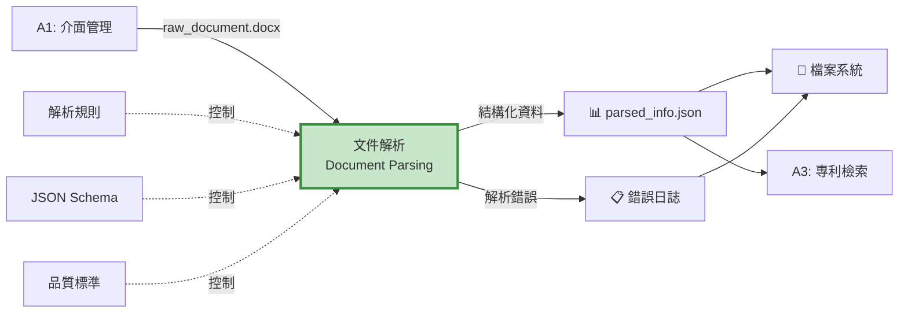
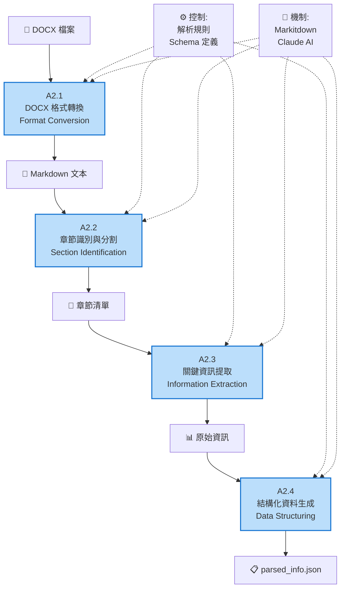
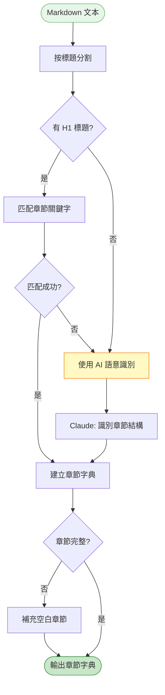
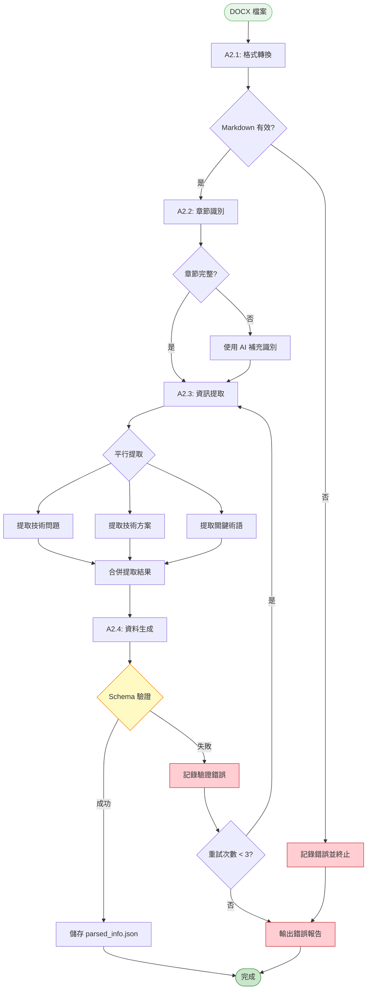

# A2 文件解析模組 IDEF0 詳細設計

## 文件資訊
- **模組編號**: A2
- **模組名稱**: 文件解析
- **英文名稱**: Document Parsing
- **版本**: v1.0
- **建立日期**: 2025-10-30
- **父模組**: A0 - 專利文件自動生成系統

---

## 目錄
1. [模組概述](#模組概述)
2. [A2-0: 情境圖](#a2-0-情境圖)
3. [A2: 頂層功能分解](#a2-頂層功能分解)
4. [子功能詳細設計](#子功能詳細設計)
5. [解析演算法流程](#解析演算法流程)
6. [JSON Schema 定義](#json-schema-定義)
7. [品質驗證規則](#品質驗證規則)
8. [實作建議](#實作建議)

---

## 模組概述

### 功能描述
文件解析模組負責將 DOCX 格式的技術交底書轉換為結構化資料，提取技術要素、關鍵術語和章節資訊，為後續的專利檢索和撰寫提供標準化輸入。

### 核心職責
1. **格式轉換**: DOCX → Markdown → 結構化 JSON
2. **章節識別**: 辨識技術領域、背景技術、發明內容等章節
3. **資訊提取**: 提取技術問題、技術方案、技術效果
4. **術語提取**: 識別並提取關鍵技術術語
5. **品質驗證**: 確保提取的資訊完整且符合格式要求

### 技術特點
- **基於 Markitdown**: 高品質的 DOCX 轉 Markdown
- **AI 增強**: 使用 Claude 進行語意理解
- **結構化輸出**: 嚴格的 JSON Schema 驗證
- **錯誤容忍**: 處理格式不規範的文件

---

## A2-0: 情境圖

### 圖示



### 情境圖 ICOM 分析

| 要素 | 項目 | 詳細說明 |
|------|------|----------|
| **Input (I)** | raw_document.docx | 技術交底書 DOCX 檔案 |
| **Control (C)** | 解析規則 | 章節識別模式、關鍵字列表 |
| | JSON Schema | 輸出資料結構定義 |
| | 品質標準 | 必填欄位、最少術語數量 |
| **Output (O)** | parsed_info.json | 結構化技術資訊 |
| | 錯誤日誌 | 解析失敗的章節記錄 |
| **Mechanism (M)** | Markitdown | DOCX 轉 Markdown 工具 |
| | Claude AI | 語意理解和資訊提取 |
| | input-parser Agent | 專用解析 Agent |

---

## A2: 頂層功能分解

### 功能分解圖



### 子功能列表

| 功能編號 | 功能名稱 | 主要職責 | 關鍵輸出 |
|---------|---------|---------|---------|
| A2.1 | DOCX 格式轉換 | 將 DOCX 轉為純文本 Markdown | Markdown 文本 |
| A2.2 | 章節識別與分割 | 識別章節結構並分割內容 | 章節字典 |
| A2.3 | 關鍵資訊提取 | 提取技術要素、術語、實施例 | 資訊字典 |
| A2.4 | 結構化資料生成 | 組織為標準 JSON 格式並驗證 | parsed_info.json |

---

## 子功能詳細設計

### A2.1: DOCX 格式轉換

#### 功能描述
使用 Markitdown 將 DOCX 檔案轉換為結構化的 Markdown 文本，保留標題層級、列表、表格等格式資訊。

#### IDEF0 圖示

```
        [轉換規則, 編碼標準]
                ↓
[DOCX 檔案] → [A2.1: 格式轉換] → [Markdown 文本]
                ↓
         [轉換日誌]
                ↑
        [Markitdown, python-docx]
```

#### ICOM 分析

| 要素 | 項目 | 詳細說明 |
|------|------|----------|
| **Input** | DOCX 檔案 | `01_input/raw_document.docx` |
| **Control** | 編碼標準 | UTF-8 編碼 |
| | 格式保留 | 標題、列表、表格、粗體 |
| **Output** | Markdown 文本 | 完整的文檔內容 |
| | 轉換日誌 | 成功/失敗記錄 |
| **Mechanism** | Markitdown | Microsoft 開源轉換工具 |
| | python-docx | 備用解析庫 |

#### 實作範例

```python
from markitdown import MarkItDown
from pathlib import Path

def convert_docx_to_markdown(docx_path: Path) -> str:
    """
    將 DOCX 轉換為 Markdown

    Args:
        docx_path: DOCX 檔案路徑

    Returns:
        Markdown 文本字串
    """
    try:
        converter = MarkItDown()
        result = converter.convert(str(docx_path))
        markdown_text = result.text_content

        # 記錄轉換日誌
        log_path = docx_path.parent / "conversion.log"
        log_path.write_text(f"✅ 轉換成功\n長度: {len(markdown_text)} 字元", encoding="utf-8")

        return markdown_text

    except Exception as e:
        error_msg = f"❌ 轉換失敗: {str(e)}"
        log_path = docx_path.parent / "conversion.log"
        log_path.write_text(error_msg, encoding="utf-8")
        raise RuntimeError(error_msg)
```

---

### A2.2: 章節識別與分割

#### 功能描述
基於標題層級和關鍵字模式識別文檔章節結構，將內容分割為技術領域、背景技術、發明內容等標準章節。

#### IDEF0 圖示

```
        [章節模式, 關鍵字字典]
                ↓
[Markdown] → [A2.2: 章節識別] → [章節字典]
                ↓
         [識別信心度]
                ↑
        [正則表達式, Claude AI]
```

#### ICOM 分析

| 要素 | 項目 | 詳細說明 |
|------|------|----------|
| **Input** | Markdown 文本 | 轉換後的完整文本 |
| **Control** | 章節模式 | 標題關鍵字: "技術領域", "背景技術", "發明內容" |
| | 識別策略 | 優先標題匹配，次要語意匹配 |
| **Output** | 章節字典 | `{"technical_field": "...", "background": "..."}` |
| | 識別信心度 | 每個章節的匹配分數 |
| **Mechanism** | 正則表達式 | 模式匹配 |
| | Claude AI | 語意理解 (當模式匹配失敗時) |

#### 章節識別流程



#### 實作範例

```python
import re
from typing import Dict

SECTION_KEYWORDS = {
    "technical_field": ["技術領域", "所屬技術領域", "technical field"],
    "background": ["背景技術", "現有技術", "prior art", "background"],
    "invention_content": ["發明內容", "技術方案", "invention", "summary"],
    "embodiments": ["具體實施方式", "實施例", "embodiment", "detailed description"],
    "advantages": ["有益效果", "優點", "advantageous effects"]
}

def identify_sections(markdown_text: str) -> Dict[str, str]:
    """
    識別章節結構

    Args:
        markdown_text: Markdown 文本

    Returns:
        章節字典
    """
    sections = {}

    # 按標題分割
    lines = markdown_text.split("\n")
    current_section = None
    current_content = []

    for line in lines:
        # 檢查是否為標題
        if line.startswith("#"):
            # 儲存前一個章節
            if current_section:
                sections[current_section] = "\n".join(current_content).strip()

            # 識別新章節
            current_section = match_section_type(line)
            current_content = []
        else:
            current_content.append(line)

    # 儲存最後一個章節
    if current_section:
        sections[current_section] = "\n".join(current_content).strip()

    # 驗證必要章節
    required_sections = ["technical_field", "background", "invention_content"]
    for section in required_sections:
        if section not in sections:
            sections[section] = ""

    return sections

def match_section_type(heading: str) -> str:
    """匹配章節類型"""
    heading_lower = heading.lower().strip("#").strip()

    for section_key, keywords in SECTION_KEYWORDS.items():
        for keyword in keywords:
            if keyword.lower() in heading_lower:
                return section_key

    return "other"
```

---

### A2.3: 關鍵資訊提取

#### 功能描述
從各章節中提取技術問題、技術方案、技術效果、關鍵術語等核心資訊，使用 AI 進行語意理解和結構化。

#### IDEF0 圖示

```
        [提取模板, Prompt 規則]
                ↓
[章節字典] → [A2.3: 資訊提取] → [結構化資訊]
                ↓
         [提取日誌]
                ↑
        [Claude AI, NER 模型]
```

#### ICOM 分析

| 要素 | 項目 | 詳細說明 |
|------|------|----------|
| **Input** | 章節字典 | 各章節的文本內容 |
| **Control** | 提取模板 | 各章節的提取規則 |
| | Prompt 工程 | AI 提示詞設計 |
| **Output** | 技術問題列表 | 背景技術中的問題 |
| | 技術方案字典 | 核心思想、關鍵特徵 |
| | 技術效果列表 | 有益效果 |
| | 關鍵術語列表 | 技術術語及定義 |
| **Mechanism** | Claude AI | 語意理解和提取 |
| | spaCy/NLTK | 輔助 NER (Named Entity Recognition) |

#### 提取 Prompt 範例

```python
EXTRACTION_PROMPTS = {
    "technical_problems": """
請從以下背景技術章節中提取技術問題:

{background_text}

輸出格式 (JSON):
{{
  "problems": [
    "問題1描述",
    "問題2描述"
  ]
}}
""",

    "technical_solution": """
請從以下發明內容章節中提取技術方案:

{invention_content}

輸出格式 (JSON):
{{
  "core_idea": "核心技術思想一句話概括",
  "key_features": ["特徵1", "特徵2", "特徵3"],
  "implementation": "實施方式概述"
}}
""",

    "key_terms": """
請從以下文本中提取關鍵技術術語:

{full_text}

輸出格式 (JSON):
{{
  "terms": [
    {{"term": "術語1", "definition": "定義1"}},
    {{"term": "術語2", "definition": "定義2"}}
  ]
}}
"""
}

async def extract_information(sections: Dict[str, str], claude_client) -> Dict:
    """
    提取關鍵資訊

    Args:
        sections: 章節字典
        claude_client: Claude AI 客戶端

    Returns:
        提取的結構化資訊
    """
    extracted = {}

    # 1. 提取技術問題
    if sections.get("background"):
        prompt = EXTRACTION_PROMPTS["technical_problems"].format(
            background_text=sections["background"]
        )
        response = await claude_client.messages.create(
            model="claude-3-5-sonnet-20241022",
            max_tokens=1024,
            messages=[{"role": "user", "content": prompt}]
        )
        extracted["problems"] = parse_json_response(response.content[0].text)

    # 2. 提取技術方案
    if sections.get("invention_content"):
        prompt = EXTRACTION_PROMPTS["technical_solution"].format(
            invention_content=sections["invention_content"]
        )
        response = await claude_client.messages.create(
            model="claude-3-5-sonnet-20241022",
            max_tokens=2048,
            messages=[{"role": "user", "content": prompt}]
        )
        extracted["solution"] = parse_json_response(response.content[0].text)

    # 3. 提取關鍵術語
    full_text = "\n\n".join(sections.values())
    prompt = EXTRACTION_PROMPTS["key_terms"].format(full_text=full_text[:5000])
    response = await claude_client.messages.create(
        model="claude-3-5-sonnet-20241022",
        max_tokens=2048,
        messages=[{"role": "user", "content": prompt}]
    )
    extracted["key_terms"] = parse_json_response(response.content[0].text)

    return extracted
```

---

### A2.4: 結構化資料生成

#### 功能描述
將提取的資訊組織為標準 JSON 格式，進行 Schema 驗證，並儲存為 `parsed_info.json`。

#### IDEF0 圖示

```
        [JSON Schema, 驗證規則]
                ↓
[原始資訊] → [A2.4: 資料生成] → [parsed_info.json]
                ↓
         [驗證報告]
                ↑
        [Pydantic, jsonschema]
```

#### ICOM 分析

| 要素 | 項目 | 詳細說明 |
|------|------|----------|
| **Input** | 原始資訊字典 | 前一步提取的所有資訊 |
| | 文檔元資料 | 檔案名稱、建立時間 |
| **Control** | JSON Schema | 標準資料結構定義 |
| | 驗證規則 | 必填欄位、資料類型、值範圍 |
| **Output** | parsed_info.json | 完整的結構化檔案 |
| | 驗證報告 | 通過/失敗及錯誤詳情 |
| **Mechanism** | Pydantic | Python 資料驗證 |
| | jsonschema | JSON Schema 驗證 |

#### JSON Schema 定義

```python
from pydantic import BaseModel, Field, validator
from typing import List, Dict, Optional
from datetime import datetime

class TechnicalProblem(BaseModel):
    """技術問題"""
    description: str = Field(..., min_length=10, max_length=500)

class TechnicalSolution(BaseModel):
    """技術方案"""
    core_idea: str = Field(..., min_length=20)
    key_features: List[str] = Field(..., min_items=3, max_items=10)
    implementation: str = Field(..., min_length=50)

class KeyTerm(BaseModel):
    """關鍵術語"""
    term: str = Field(..., min_length=2, max_length=50)
    definition: str = Field(..., min_length=5, max_length=300)

class Embodiment(BaseModel):
    """實施例"""
    title: str
    description: str = Field(..., min_length=100)
    figures: List[str] = []

class Metadata(BaseModel):
    """元資料"""
    title: str = Field(default="", description="專利名稱")
    author: str = Field(default="", description="發明人")
    date: str = Field(default_factory=lambda: datetime.now().isoformat())
    uuid: str = Field(..., description="會話 UUID")

class ParsedInfo(BaseModel):
    """完整的解析結果"""
    metadata: Metadata
    technical_field: str = Field(..., min_length=10, description="技術領域")
    background: Dict[str, List[str]] = Field(
        default_factory=lambda: {"problems": [], "prior_art": []},
        description="背景技術"
    )
    technical_solution: TechnicalSolution
    advantages: List[str] = Field(default_factory=list, description="有益效果")
    embodiments: List[Embodiment] = Field(default_factory=list)
    key_terms: List[KeyTerm] = Field(..., min_items=5, description="關鍵術語")

    @validator('key_terms')
    def validate_key_terms(cls, v):
        if len(v) < 5:
            raise ValueError("至少需要 5 個關鍵術語")
        return v

    class Config:
        json_schema_extra = {
            "example": {
                "metadata": {
                    "title": "基於 AI 的專利撰寫系統",
                    "author": "張三",
                    "date": "2025-10-30",
                    "uuid": "abc123"
                },
                "technical_field": "人工智慧輔助寫作技術領域",
                "background": {
                    "problems": ["現有專利撰寫效率低", "專業人才短缺"],
                    "prior_art": ["人工撰寫", "簡單模板生成"]
                },
                "technical_solution": {
                    "core_idea": "使用大語言模型自動生成專利文件",
                    "key_features": ["多 Agent 協作", "結構化資料流", "品質驗證"],
                    "implementation": "基於 Claude API 構建流程控制系統"
                },
                "advantages": ["提高效率", "降低成本", "保證品質"],
                "embodiments": [],
                "key_terms": [
                    {"term": "大語言模型", "definition": "基於 Transformer 的生成式 AI"},
                    {"term": "Agent", "definition": "具有特定功能的智能代理"}
                ]
            }
        }

def generate_structured_data(
    sections: Dict[str, str],
    extracted_info: Dict,
    session_uuid: str,
    output_path: Path
) -> ParsedInfo:
    """
    生成並驗證結構化資料

    Args:
        sections: 章節字典
        extracted_info: 提取的資訊
        session_uuid: 會話 UUID
        output_path: 輸出檔案路徑

    Returns:
        驗證後的 ParsedInfo 物件
    """
    try:
        # 建立結構化資料
        parsed_data = ParsedInfo(
            metadata=Metadata(uuid=session_uuid),
            technical_field=sections.get("technical_field", ""),
            background={
                "problems": extracted_info.get("problems", []),
                "prior_art": []
            },
            technical_solution=TechnicalSolution(**extracted_info.get("solution", {})),
            key_terms=[KeyTerm(**term) for term in extracted_info.get("key_terms", {}).get("terms", [])]
        )

        # 儲存為 JSON
        output_path.parent.mkdir(parents=True, exist_ok=True)
        with open(output_path, "w", encoding="utf-8") as f:
            f.write(parsed_data.model_dump_json(indent=2, exclude_none=True))

        return parsed_data

    except ValidationError as e:
        # 驗證失敗
        error_path = output_path.parent / "validation_error.log"
        error_path.write_text(str(e), encoding="utf-8")
        raise
```

---

## 解析演算法流程

### 完整流程



---

## JSON Schema 定義

完整的 JSON Schema 定義請參考上文 A2.4 的 Pydantic 模型。

---

## 品質驗證規則

### 驗證清單

| 驗證項目 | 規則 | 錯誤處理 |
|---------|------|---------|
| **必填欄位** | technical_field, technical_solution, key_terms 必須存在 | 提示缺少欄位，拒絕生成 |
| **字數限制** | technical_field >= 10 字 | 警告並要求補充 |
| **術語數量** | key_terms >= 5 個 | AI 補充提取 |
| **技術特徵** | key_features >= 3 個 | AI 補充提取 |
| **JSON 格式** | 符合 JSON 語法 | 自動修復或報錯 |
| **編碼格式** | UTF-8 | 自動轉換 |

### 品質評分

```python
def calculate_quality_score(parsed_info: ParsedInfo) -> float:
    """
    計算解析品質分數 (0-100)

    評分標準:
    - 章節完整性 (30%)
    - 關鍵術語數量和品質 (25%)
    - 技術方案詳細度 (25%)
    - 實施例數量 (10%)
    - 資料完整性 (10%)
    """
    score = 0.0

    # 1. 章節完整性 (30 分)
    required_fields = ["technical_field", "technical_solution", "key_terms"]
    filled_fields = sum(1 for field in required_fields if getattr(parsed_info, field))
    score += (filled_fields / len(required_fields)) * 30

    # 2. 關鍵術語 (25 分)
    term_count = len(parsed_info.key_terms)
    score += min(term_count / 10, 1.0) * 25  # 10 個術語得滿分

    # 3. 技術方案詳細度 (25 分)
    feature_count = len(parsed_info.technical_solution.key_features)
    implementation_length = len(parsed_info.technical_solution.implementation)
    score += min(feature_count / 5, 1.0) * 15  # 5 個特徵得 15 分
    score += min(implementation_length / 200, 1.0) * 10  # 200 字得 10 分

    # 4. 實施例數量 (10 分)
    embodiment_count = len(parsed_info.embodiments)
    score += min(embodiment_count / 3, 1.0) * 10  # 3 個實施例得滿分

    # 5. 資料完整性 (10 分)
    has_problems = len(parsed_info.background.get("problems", [])) > 0
    has_advantages = len(parsed_info.advantages) > 0
    score += (has_problems + has_advantages) * 5

    return round(score, 2)
```

---

## 實作建議

### 技術選型

```python
# 核心依賴
dependencies = [
    "markitdown>=0.1.0",          # DOCX 轉 Markdown
    "anthropic>=0.18.0",          # Claude AI SDK
    "pydantic>=2.0.0",            # 資料驗證
    "python-docx>=0.8.11",        # 備用 DOCX 解析
    "spacy>=3.7.0",               # NLP 工具
    "jsonschema>=4.20.0",         # JSON Schema 驗證
]

# 可選依賴
optional_dependencies = [
    "tiktoken>=0.5.0",            # Token 計數
    "langchain>=0.1.0",           # Agent 框架
]
```

### 程式碼結構

```
src/
├── parsing/
│   ├── __init__.py
│   ├── converter.py           # A2.1: 格式轉換
│   ├── section_identifier.py  # A2.2: 章節識別
│   ├── extractor.py           # A2.3: 資訊提取
│   ├── structurer.py          # A2.4: 資料生成
│   ├── models.py              # Pydantic 模型
│   ├── prompts.py             # AI Prompts
│   └── validators.py          # 驗證器
└── tests/
    └── parsing/
        ├── test_converter.py
        ├── test_extractor.py
        └── test_integration.py
```

### 測試策略

```python
# tests/parsing/test_extractor.py
import pytest
from parsing.extractor import extract_information

@pytest.fixture
def sample_sections():
    return {
        "technical_field": "人工智慧技術領域",
        "background": "現有技術存在效率低下的問題...",
        "invention_content": "本發明提供一種基於 AI 的自動化系統..."
    }

@pytest.mark.asyncio
async def test_extract_technical_problems(sample_sections, claude_client):
    """測試技術問題提取"""
    result = await extract_information(sample_sections, claude_client)

    assert "problems" in result
    assert len(result["problems"]) > 0
    assert all(len(problem) >= 10 for problem in result["problems"])

@pytest.mark.asyncio
async def test_extract_key_terms(sample_sections, claude_client):
    """測試關鍵術語提取"""
    result = await extract_information(sample_sections, claude_client)

    assert "key_terms" in result
    assert len(result["key_terms"]["terms"]) >= 5

    for term in result["key_terms"]["terms"]:
        assert "term" in term
        assert "definition" in term
```

---

## 總結

### 模組特點

✅ **智能化**: AI 增強的語意理解
✅ **結構化**: 嚴格的 JSON Schema 驗證
✅ **容錯性**: 多層級錯誤處理和重試
✅ **可追溯**: 完整的日誌和驗證報告
✅ **高品質**: 品質評分和驗證機制

### 關鍵指標

| 指標 | 目標值 | 測量方法 |
|-----|-------|---------|
| 解析成功率 | > 95% | 成功解析數 / 總檔案數 |
| 章節識別準確率 | > 90% | 正確識別章節數 / 總章節數 |
| 術語提取數量 | >= 10 個 | 平均每份文檔的術語數 |
| 處理時間 | < 2 分鐘 | 從輸入到輸出的時間 |
| 品質評分 | > 80 分 | 平均品質分數 |

---

**文件結束**
