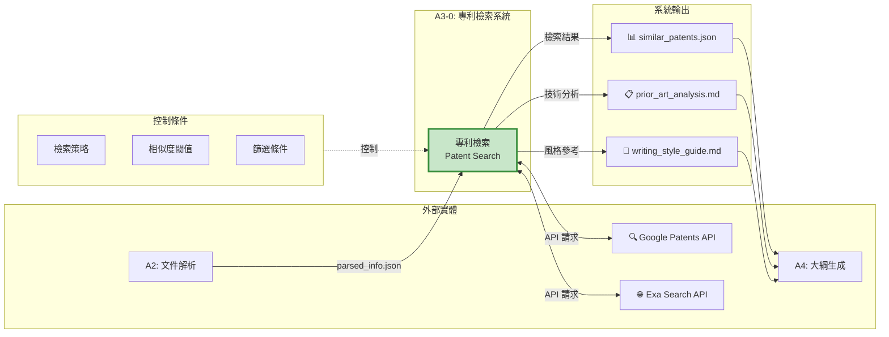
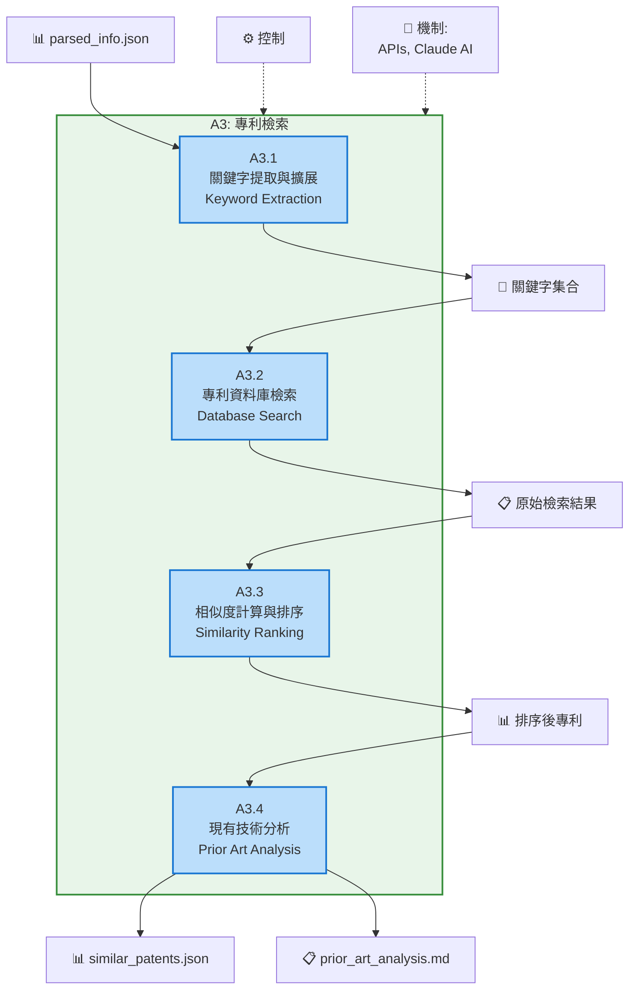
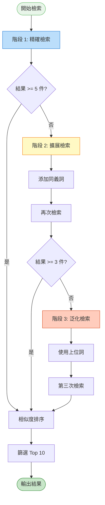

# A3 專利檢索模組 IDEF0 詳細設計

## 文件資訊
- **模組編號**: A3
- **模組名稱**: 專利檢索
- **英文名稱**: Patent Search
- **版本**: v1.0
- **建立日期**: 2025-10-30
- **父模組**: A0 - 專利文件自動生成系統

---

## 模組概述

### 功能描述
專利檢索模組透過 Google Patents API 和 Exa Search API 檢索相似專利,分析現有技術,並學習優秀的專利撰寫風格,為後續的大綱生成和內容撰寫提供參考依據。

### 核心職責
1. **關鍵字提取與擴展**: 從技術資訊中提取檢索關鍵字
2. **專利資料庫檢索**: 透過 API 檢索相似專利
3. **相似度計算與排序**: 評估專利與技術方案的相似度
4. **現有技術分析**: 分析專利技術要點和撰寫風格
5. **結果輸出**: 生成結構化的檢索結果和分析報告

---

## A3-0: 情境圖



### 情境圖 ICOM 分析

| 要素 | 項目 | 詳細說明 |
|------|------|----------|
| **Input (I)** | parsed_info.json | 解析後的技術資訊 |
| | 關鍵術語列表 | 技術特徵、領域術語 |
| **Control (C)** | 檢索策略 | 關鍵字組合規則、布林運算子 |
| | 相似度閾值 | >= 70% 技術相關性 |
| | 篩選條件 | 地區 (中國)、時間範圍 (近 5 年)、狀態 (已授權) |
| | 數量限制 | 最多返回 10 件專利 |
| **Output (O)** | similar_patents.json | 相似專利列表及元資料 |
| | prior_art_analysis.md | 現有技術分析報告 |
| | writing_style_guide.md | 撰寫風格參考 |
| **Mechanism (M)** | Google Patents API | 透過 MCP 呼叫 |
| | Exa Search API | 補充網頁檢索 |
| | patent-searcher Agent | 專用檢索 Agent |
| | Claude AI | 相似度計算、文本分析 |

---

## A3: 頂層功能分解



---

## 子功能詳細設計

### A3.1: 關鍵字提取與擴展

#### 功能描述
從 parsed_info.json 中提取核心技術關鍵字,並透過同義詞擴展、領域詞彙補充等方式生成檢索查詢。

#### ICOM 分析

| 要素 | 項目 | 詳細說明 |
|------|------|----------|
| **Input** | 技術方案 | core_idea, key_features |
| | 關鍵術語 | key_terms 列表 |
| | 技術領域 | technical_field |
| **Control** | 提取規則 | TF-IDF, NER |
| | 擴展策略 | 同義詞、上位詞、領域詞 |
| | 查詢語法 | IPC 分類號、布林運算 |
| **Output** | 核心關鍵字 | 3-5 個主要術語 |
| | 擴展關鍵字 | 10-15 個相關術語 |
| | 查詢字串 | Google Patents 查詢語法 |
| **Mechanism** | Claude AI | 語意擴展 |
| | WordNet/HowNet | 同義詞庫 |

#### 實作範例

```python
async def extract_and_expand_keywords(parsed_info: ParsedInfo, claude_client) -> Dict[str, List[str]]:
    """提取並擴展關鍵字"""

    # 1. 提取核心關鍵字
    core_keywords = [
        parsed_info.technical_solution.core_idea,
        *parsed_info.technical_solution.key_features[:3],
        *[term.term for term in parsed_info.key_terms[:5]]
    ]

    # 2. AI 擴展關鍵字
    prompt = f"""
請為以下技術方案擴展檢索關鍵字:

技術領域: {parsed_info.technical_field}
核心思想: {parsed_info.technical_solution.core_idea}
關鍵特徵: {', '.join(parsed_info.technical_solution.key_features)}

要求:
1. 提供 5 個同義詞或近義詞
2. 提供 3 個上位概念詞
3. 提供相關的 IPC 分類號 (如適用)

輸出 JSON 格式:
{{
  "synonyms": ["同義詞1", "同義詞2", ...],
  "broader_terms": ["上位詞1", "上位詞2", ...],
  "ipc_codes": ["G06F", ...]
}}
"""

    response = await claude_client.messages.create(
        model="claude-3-5-sonnet-20241022",
        max_tokens=1024,
        messages=[{"role": "user", "content": prompt}]
    )

    expanded = json.loads(response.content[0].text)

    return {
        "core_keywords": core_keywords[:5],
        "synonyms": expanded.get("synonyms", []),
        "broader_terms": expanded.get("broader_terms", []),
        "ipc_codes": expanded.get("ipc_codes", [])
    }

def build_search_query(keywords: Dict[str, List[str]]) -> str:
    """建立檢索查詢字串"""

    # Google Patents 查詢語法
    core = " OR ".join(f'"{kw}"' for kw in keywords["core_keywords"])
    synonyms = " OR ".join(keywords["synonyms"])

    query = f"({core}) AND ({synonyms})"

    # 添加 IPC 分類號
    if keywords.get("ipc_codes"):
        ipc_query = " OR ".join(f"CPC={code}" for code in keywords["ipc_codes"])
        query += f" AND ({ipc_query})"

    return query
```

---

### A3.2: 專利資料庫檢索

#### 功能描述
使用建立的查詢字串呼叫 Google Patents API 和 Exa Search API,獲取相似專利的原始結果。

#### ICOM 分析

| 要素 | 項目 | 詳細說明 |
|------|------|----------|
| **Input** | 查詢字串 | 布林運算查詢 |
| | 篩選條件 | 國家、時間、狀態 |
| **Control** | API 限制 | 每次最多 100 件 |
| | 超時設定 | 30 秒超時 |
| | 重試策略 | 失敗重試 3 次 |
| **Output** | 專利列表 | 標題、摘要、申請號、日期 |
| | 元資料 | IPC 分類、申請人、引用關係 |
| **Mechanism** | Google Patents MCP | MCP Server |
| | Exa Search API | RESTful API |

#### 實作範例

```python
async def search_patents(query: str, filters: Dict) -> List[Dict]:
    """檢索專利"""

    results = []

    # 1. Google Patents 檢索
    try:
        # 使用 MCP google-patents-mcp
        google_results = await mcp_client.call_tool(
            "google-patents-mcp",
            "search_patents",
            {
                "query": query,
                "country": filters.get("country", "CN"),
                "language": filters.get("language", "zh"),
                "num_results": filters.get("limit", 50),
                "start_date": filters.get("start_date", "2019-01-01"),
                "end_date": filters.get("end_date", "2025-12-31")
            }
        )
        results.extend(google_results)

    except Exception as e:
        logger.error(f"Google Patents 檢索失敗: {e}")

    # 2. Exa Search 補充檢索 (網頁專利資料)
    try:
        exa_results = await exa_client.search_and_contents(
            query=f"{query} site:patents.google.com OR site:patentscope.wipo.int",
            num_results=20,
            text={"max_characters": 1000}
        )
        results.extend(parse_exa_results(exa_results))

    except Exception as e:
        logger.error(f"Exa Search 檢索失敗: {e}")

    return results
```

---

### A3.3: 相似度計算與排序

#### 功能描述
計算每件專利與目標技術方案的相似度,並按相似度排序,篩選出最相關的專利。

#### ICOM 分析

| 要素 | 項目 | 詳細說明 |
|------|------|----------|
| **Input** | 原始檢索結果 | 專利列表 |
| | 目標技術方案 | parsed_info.technical_solution |
| **Control** | 相似度演算法 | Cosine Similarity, Semantic Similarity |
| | 閾值 | >= 0.7 |
| | 排序規則 | 相似度降序 |
| **Output** | 排序後專利 | Top 10 最相似專利 |
| | 相似度分數 | 0.0 - 1.0 |
| **Mechanism** | sentence-transformers | 語意向量 |
| | Claude AI | 深度語意比對 |

#### 相似度計算演算法

```python
from sentence_transformers import SentenceTransformer
import numpy as np

# 載入模型
model = SentenceTransformer('paraphrase-multilingual-mpnet-base-v2')

def calculate_similarity(target_solution: str, patent_abstract: str) -> float:
    """
    計算語意相似度

    Args:
        target_solution: 目標技術方案描述
        patent_abstract: 專利摘要

    Returns:
        相似度分數 (0.0 - 1.0)
    """
    # 生成向量
    target_embedding = model.encode(target_solution)
    patent_embedding = model.encode(patent_abstract)

    # 計算 Cosine Similarity
    similarity = np.dot(target_embedding, patent_embedding) / (
        np.linalg.norm(target_embedding) * np.linalg.norm(patent_embedding)
    )

    return float(similarity)

async def rank_patents(patents: List[Dict], parsed_info: ParsedInfo) -> List[Dict]:
    """對專利進行排序"""

    target_text = f"{parsed_info.technical_solution.core_idea} {' '.join(parsed_info.technical_solution.key_features)}"

    scored_patents = []
    for patent in patents:
        # 合併標題和摘要
        patent_text = f"{patent.get('title', '')} {patent.get('abstract', '')}"

        # 計算相似度
        score = calculate_similarity(target_text, patent_text)

        scored_patents.append({
            **patent,
            "relevance_score": round(score, 4)
        })

    # 排序並篩選
    sorted_patents = sorted(
        scored_patents,
        key=lambda x: x["relevance_score"],
        reverse=True
    )

    return sorted_patents[:10]  # 返回 Top 10
```

---

### A3.4: 現有技術分析

#### 功能描述
分析篩選出的相似專利,提取技術要點、撰寫風格特徵,生成現有技術分析報告和寫作風格指南。

#### ICOM 分析

| 要素 | 項目 | 詳細說明 |
|------|------|----------|
| **Input** | Top 10 專利 | 排序後的專利列表 |
| **Control** | 分析維度 | 技術方案、權利要求、描述詳細度 |
| | 風格要素 | 句式結構、術語使用、段落組織 |
| **Output** | prior_art_analysis.md | 技術分析報告 |
| | writing_style_guide.md | 寫作風格參考 |
| | similar_patents.json | 完整結構化數據 |
| **Mechanism** | Claude AI | 文本分析和總結 |

#### 實作範例

```python
async def analyze_prior_art(patents: List[Dict], claude_client) -> Dict[str, str]:
    """分析現有技術"""

    # 1. 生成技術分析報告
    analysis_prompt = f"""
請分析以下相似專利的技術要點:

{format_patents_for_analysis(patents)}

請從以下維度分析:
1. 共同技術特徵
2. 差異化要點
3. 技術演進趨勢
4. 可借鑑的創新點

輸出 Markdown 格式報告。
"""

    analysis_response = await claude_client.messages.create(
        model="claude-3-5-sonnet-20241022",
        max_tokens=4096,
        messages=[{"role": "user", "content": analysis_prompt}]
    )

    prior_art_analysis = analysis_response.content[0].text

    # 2. 生成寫作風格指南
    style_prompt = f"""
請分析以下專利的撰寫風格:

{format_patents_for_style_analysis(patents[:3])}

請總結:
1. 摘要撰寫特點 (長度、結構、用詞)
2. 權利要求撰寫模式 (獨立/從屬、層次)
3. 說明書組織方式 (章節順序、詳細程度)
4. 術語使用習慣

輸出 Markdown 格式指南。
"""

    style_response = await claude_client.messages.create(
        model="claude-3-5-sonnet-20241022",
        max_tokens=2048,
        messages=[{"role": "user", "content": style_prompt}]
    )

    writing_style_guide = style_response.content[0].text

    return {
        "prior_art_analysis": prior_art_analysis,
        "writing_style_guide": writing_style_guide
    }
```

---

## 檢索策略設計

### 多階段檢索策略



---

## 相似度演算法

### 混合相似度計算

```python
def hybrid_similarity(
    target: ParsedInfo,
    patent: Dict,
    weights: Dict[str, float] = None
) -> float:
    """
    混合相似度計算

    組合多種相似度指標:
    - 語意相似度 (40%)
    - 關鍵詞重疊度 (30%)
    - IPC 分類相似度 (20%)
    - 時間相關性 (10%)
    """
    if weights is None:
        weights = {
            "semantic": 0.4,
            "keyword": 0.3,
            "ipc": 0.2,
            "temporal": 0.1
        }

    # 1. 語意相似度
    semantic_score = calculate_semantic_similarity(
        target.technical_solution.core_idea,
        patent.get("abstract", "")
    )

    # 2. 關鍵詞重疊度
    target_keywords = set(term.term for term in target.key_terms)
    patent_keywords = extract_keywords_from_text(patent.get("abstract", ""))
    keyword_score = len(target_keywords & patent_keywords) / max(len(target_keywords), 1)

    # 3. IPC 分類相似度
    target_ipc = infer_ipc_from_field(target.technical_field)
    patent_ipc = patent.get("ipc_codes", [])
    ipc_score = calculate_ipc_similarity(target_ipc, patent_ipc)

    # 4. 時間相關性 (越新越好)
    filing_year = int(patent.get("filing_date", "2000")[:4])
    current_year = 2025
    temporal_score = max(0, 1 - (current_year - filing_year) / 10)

    # 加權求和
    total_score = (
        semantic_score * weights["semantic"] +
        keyword_score * weights["keyword"] +
        ipc_score * weights["ipc"] +
        temporal_score * weights["temporal"]
    )

    return round(total_score, 4)
```

---

## API 整合規範

### Google Patents MCP 整合

```python
# MCP Server 配置
mcp_config = {
    "server": "google-patents-mcp",
    "tools": {
        "search_patents": {
            "parameters": {
                "query": "str",
                "country": "str (default: CN)",
                "language": "str (default: zh)",
                "num_results": "int (default: 50)",
                "start_date": "str (YYYY-MM-DD)",
                "end_date": "str (YYYY-MM-DD)"
            },
            "returns": "List[Patent]"
        },
        "get_patent_details": {
            "parameters": {
                "patent_id": "str"
            },
            "returns": "PatentDetails"
        }
    }
}

# 使用範例
async def use_mcp_search(query: str):
    """使用 MCP 檢索專利"""
    result = await mcp_client.call_tool(
        server="google-patents-mcp",
        tool="search_patents",
        arguments={
            "query": query,
            "country": "CN",
            "num_results": 50
        }
    )
    return result
```

### Exa Search API 整合

```python
from exa_py import Exa

exa = Exa(api_key=os.environ["EXA_API_KEY"])

async def exa_patent_search(keywords: List[str]) -> List[Dict]:
    """Exa Search 專利檢索"""

    query = " ".join(keywords) + " site:patents.google.com"

    results = exa.search_and_contents(
        query=query,
        type="keyword",
        num_results=20,
        text={"max_characters": 2000},
        use_autoprompt=True
    )

    patents = []
    for result in results.results:
        patents.append({
            "title": result.title,
            "url": result.url,
            "abstract": result.text[:500],
            "published_date": result.published_date,
            "score": result.score
        })

    return patents
```

---

## 實作建議

### 技術選型

```python
dependencies = [
    "sentence-transformers>=2.2.0",  # 語意相似度
    "anthropic>=0.18.0",             # Claude AI
    "exa-py>=1.0.0",                 # Exa Search
    "numpy>=1.24.0",                 # 數值計算
    "pandas>=2.0.0",                 # 數據處理
]
```

### 程式碼結構

```
src/
├── search/
│   ├── __init__.py
│   ├── keyword_extractor.py    # A3.1
│   ├── patent_searcher.py      # A3.2
│   ├── similarity_ranker.py    # A3.3
│   ├── prior_art_analyzer.py   # A3.4
│   ├── models.py               # 數據模型
│   └── utils.py                # 工具函數
```

---

## 總結

### 模組特點

✅ **多源檢索**: Google Patents + Exa Search
✅ **智能排序**: 混合相似度算法
✅ **深度分析**: AI 驅動的技術分析
✅ **風格學習**: 自動提取撰寫模式

### 關鍵指標

| 指標 | 目標值 |
|-----|-------|
| 檢索成功率 | > 95% |
| 相關專利數 | >= 5 件 |
| 相似度準確率 | > 85% |
| 檢索時間 | < 3 分鐘 |

---

**文件結束**
