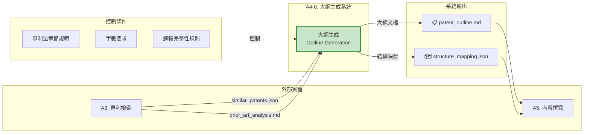
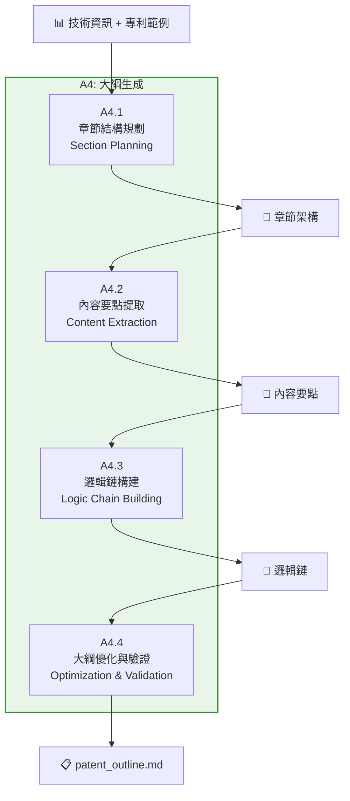
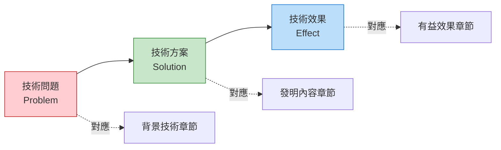
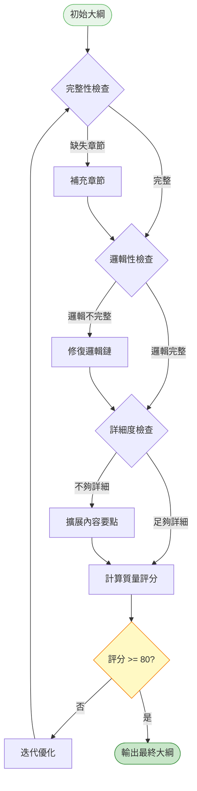

# A4 大綱生成模組 IDEF0 詳細設計

## 文件資訊
- **模組編號**: A4
- **模組名稱**: 大綱生成
- **英文名稱**: Outline Generation
- **版本**: v1.0
- **建立日期**: 2025-10-30
- **父模組**: A0 - 專利文件自動生成系統

---

## 模組概述

### 功能描述
大綱生成模組基於解析的技術資訊和檢索的專利範例,生成符合中國專利法規範的文件大綱結構,為後續的內容撰寫提供清晰的組織框架。

### 核心職責
1. **章節結構規劃**: 規劃專利文件的完整章節架構
2. **內容要點提取**: 確定每個章節的核心內容要點
3. **邏輯鏈構建**: 建立技術問題-技術方案-技術效果的邏輯鏈
4. **大綱優化與驗證**: 確保大綱符合專利法要求

---

## A4-0: 情境圖



---

## A4: 頂層功能分解



---

## 子功能詳細設計

### A4.1: 章節結構規劃

#### 功能描述
基於專利法規範和參考專利的結構,規劃完整的章節架構。

#### ICOM 分析

| 要素 | 項目 | 詳細說明 |
|------|------|----------|
| **Input** | 技術資訊 | parsed_info.json |
| | 參考專利結構 | similar_patents 的章節組織 |
| **Control** | 專利法章節規範 | 發明名稱、摘要、權利要求、說明書、附圖 |
| | 章節順序 | 技術領域 → 背景技術 → 發明內容 → 實施方式 |
| **Output** | 章節架構 | 三級標題結構 |
| | 章節模板 | 每個章節的內容框架 |
| **Mechanism** | Claude AI | 結構化規劃 |
| | 章節模板庫 | 預定義模板 |

#### 標準章節結構

```markdown
# 專利大綱

## 1. 發明名稱
[基於核心技術的簡潔名稱,<25字]

## 2. 技術領域
[所屬技術領域的明確說明,50-100字]

## 3. 背景技術
### 3.1 技術背景介紹
### 3.2 現有技術方案
### 3.3 現有技術存在的問題

## 4. 發明內容
### 4.1 發明目的
### 4.2 技術方案
#### 4.2.1 總體技術方案
#### 4.2.2 關鍵技術特徵
#### 4.2.3 可選技術特徵
### 4.3 有益效果

## 5. 附圖說明
### 5.1 圖1: [系統架構圖]
### 5.2 圖2: [方法流程圖]
### 5.3 圖3: [模組結構圖]

## 6. 具體實施方式
### 6.1 整體方案描述
### 6.2 實施例1: [主要實施方式]
### 6.3 實施例2: [變化實施方式]
### 6.4 實施例3: [可選實施方式]

## 7. 權利要求書
### 7.1 獨立權利要求1 (方法)
### 7.2 從屬權利要求2-10
### 7.3 獨立權利要求11 (系統)
### 7.4 從屬權利要求12-20

## 8. 摘要
[技術方案簡要描述,200-300字]
```

---

### A4.2: 內容要點提取

#### 功能描述
為每個章節提取具體的內容要點,確定需要撰寫的核心內容。

#### 實作範例

```python
async def extract_content_points(
    parsed_info: ParsedInfo,
    similar_patents: List[Dict],
    claude_client
) -> Dict[str, List[str]]:
    """提取各章節內容要點"""

    prompt = f"""
基於以下技術資訊和參考專利,為專利大綱的每個章節提取內容要點:

技術資訊:
{json.dumps(parsed_info.model_dump(), ensure_ascii=False, indent=2)}

參考專利:
{format_patents(similar_patents[:3])}

請為以下章節提取 3-5 個內容要點:
1. 技術領域
2. 背景技術
3. 發明內容
4. 具體實施方式

輸出 JSON 格式:
{{
  "technical_field": ["要點1", "要點2"],
  "background": ["要點1", "要點2", "要點3"],
  "invention_content": ["要點1", "要點2", "要點3"],
  "embodiments": ["要點1", "要點2", "要點3", "要點4"]
}}
"""

    response = await claude_client.messages.create(
        model="claude-3-5-sonnet-20241022",
        max_tokens=2048,
        messages=[{"role": "user", "content": prompt}]
    )

    return json.loads(response.content[0].text)
```

---

### A4.3: 邏輯鏈構建

#### 功能描述
構建"技術問題 → 技術方案 → 技術效果"的完整邏輯鏈,確保專利的邏輯自洽性。

#### 邏輯鏈模型



#### 邏輯驗證規則

```python
def validate_logic_chain(outline: Dict) -> Dict[str, bool]:
    """驗證邏輯鏈完整性"""

    checks = {
        "has_problem": False,
        "has_solution": False,
        "has_effect": False,
        "problem_solution_match": False,
        "solution_effect_match": False
    }

    # 1. 檢查是否包含技術問題
    background = outline.get("background", {})
    if background.get("problems") and len(background["problems"]) > 0:
        checks["has_problem"] = True

    # 2. 檢查是否包含技術方案
    invention = outline.get("invention_content", {})
    if invention.get("technical_solution"):
        checks["has_solution"] = True

    # 3. 檢查是否包含技術效果
    if invention.get("advantages") and len(invention["advantages"]) > 0:
        checks["has_effect"] = True

    # 4. 驗證問題與方案的對應關係
    # (使用 AI 進行語意匹配)
    if checks["has_problem"] and checks["has_solution"]:
        checks["problem_solution_match"] = verify_problem_solution_match(
            background["problems"],
            invention["technical_solution"]
        )

    # 5. 驗證方案與效果的對應關係
    if checks["has_solution"] and checks["has_effect"]:
        checks["solution_effect_match"] = verify_solution_effect_match(
            invention["technical_solution"],
            invention["advantages"]
        )

    return checks
```

---

### A4.4: 大綱優化與驗證

#### 功能描述
優化大綱結構,確保符合專利法要求和質量標準。

#### 優化規則

| 檢查項目 | 標準 | 優化策略 |
|---------|------|---------|
| **章節完整性** | 必須包含 8 個主要章節 | 補充缺失章節 |
| **邏輯完整性** | 問題-方案-效果鏈完整 | AI 補充缺失環節 |
| **詳細度** | 每個章節至少 3 個要點 | 擴展內容要點 |
| **字數預估** | 說明書預估 > 10000 字 | 增加實施例數量 |
| **術語一致性** | 全文使用統一術語 | 建立術語詞典 |

#### 大綱評分機制

```python
def score_outline(outline: Dict) -> Dict[str, float]:
    """大綱質量評分"""

    scores = {
        "completeness": 0.0,      # 完整性 (30%)
        "logic": 0.0,             # 邏輯性 (30%)
        "detail": 0.0,            # 詳細度 (20%)
        "structure": 0.0,         # 結構性 (20%)
        "total": 0.0
    }

    # 1. 完整性評分
    required_sections = [
        "title", "technical_field", "background",
        "invention_content", "embodiments", "claims", "abstract"
    ]
    present_sections = sum(1 for sec in required_sections if sec in outline)
    scores["completeness"] = (present_sections / len(required_sections)) * 30

    # 2. 邏輯性評分
    logic_checks = validate_logic_chain(outline)
    logic_score = sum(logic_checks.values()) / len(logic_checks)
    scores["logic"] = logic_score * 30

    # 3. 詳細度評分
    total_points = sum(
        len(outline.get(sec, {}).get("points", []))
        for sec in ["background", "invention_content", "embodiments"]
    )
    scores["detail"] = min(total_points / 15, 1.0) * 20  # 15 個要點得滿分

    # 4. 結構性評分
    has_hierarchy = check_hierarchical_structure(outline)
    has_numbering = check_section_numbering(outline)
    scores["structure"] = (has_hierarchy + has_numbering) / 2 * 20

    # 總分
    scores["total"] = sum(scores[k] for k in ["completeness", "logic", "detail", "structure"])

    return scores
```

---

## 章節模板庫

### 技術領域模板

```markdown
**模板**: 本發明涉及{主技術領域}領域,具體涉及{細分領域},尤其涉及{具體技術點}。

**範例**: 本發明涉及人工智慧技術領域,具體涉及自然語言處理領域,尤其涉及一種基於大語言模型的專利文件自動生成方法及系統。
```

### 背景技術模板

```markdown
**結構**:
1. 技術背景介紹 (50-100字)
2. 現有技術方案1 (100-150字)
3. 現有技術方案2 (100-150字)
4. 現有技術存在的問題 (150-200字)
   - 問題1: ...
   - 問題2: ...
   - 問題3: ...

**範例**:
隨著知識產權保護意識的增強,專利申請數量逐年增加。專利文件的撰寫需要專業知識和豐富經驗,現有技術主要依靠人工撰寫。

現有技術方案一是完全人工撰寫,由專利代理人根據技術交底書撰寫專利申請文件。該方案的優點是質量有保障,但存在效率低、成本高、對撰寫人員要求高的問題。

現有技術方案二是使用簡單的模板生成工具,將技術內容填充到預定義模板中。該方案的優點是速度快,但存在靈活性差、質量不穩定、無法處理複雜技術方案的問題。

因此,現有技術存在以下問題:
1. 人工撰寫效率低下,週期長達數週
2. 專業人才短缺,成本高昂
3. 模板工具靈活性不足,無法適應多樣化需求
4. 質量參差不齊,缺乏統一標準
```

### 發明內容模板

```markdown
**結構**:
1. 發明目的 (100字)
2. 技術方案
   - 總體方案 (200-300字)
   - 關鍵技術特徵 (每個 50-100字)
   - 可選技術特徵 (每個 30-50字)
3. 有益效果 (150-200字)

**範例**:
本發明的目的在於提供一種基於大語言模型的專利文件自動生成方法及系統,以解決現有技術中專利撰寫效率低、成本高、質量不穩定的問題。

為實現上述目的,本發明採用的技術方案是:
一種基於大語言模型的專利文件自動生成方法,包括以下步驟:
S1. 接收並解析技術交底書,提取結構化技術資訊
S2. 檢索相似專利,分析現有技術和撰寫風格
S3. 生成專利文件大綱,構建邏輯鏈
S4. 基於大綱撰寫各章節內容
S5. 生成技術圖表並整合為完整文件

關鍵技術特徵包括:
1. 使用 AI 進行文檔解析和資訊提取
2. 多源專利檢索和智能排序
3. 邏輯鏈自動構建和驗證
4. 多 Agent 協作的內容生成

本發明的有益效果在於:
1. 大幅提高撰寫效率,從數週縮短至數小時
2. 降低成本,減少對專業人才的依賴
3. 保證質量,通過 AI 驗證邏輯完整性
4. 靈活適應各種技術領域和撰寫需求
```

---

## 邏輯完整性檢查

### 檢查清單

```python
LOGIC_CHECKLIST = {
    "problem_defined": {
        "description": "技術問題是否明確定義",
        "location": "背景技術章節",
        "criteria": "至少描述 2 個具體問題"
    },
    "solution_proposed": {
        "description": "技術方案是否完整提出",
        "location": "發明內容章節",
        "criteria": "包含總體方案和關鍵特徵"
    },
    "effect_explained": {
        "description": "技術效果是否充分說明",
        "location": "有益效果章節",
        "criteria": "每個問題都有對應的解決效果"
    },
    "problem_solution_link": {
        "description": "問題與方案是否對應",
        "validation": "AI 語意匹配",
        "threshold": 0.7
    },
    "solution_effect_link": {
        "description": "方案與效果是否對應",
        "validation": "AI 語意匹配",
        "threshold": 0.7
    },
    "claims_aligned": {
        "description": "權利要求是否與技術方案一致",
        "validation": "關鍵特徵覆蓋度",
        "threshold": 0.9
    }
}
```

---

## 大綱優化流程



---

## 實作建議

### 技術選型

```python
dependencies = [
    "anthropic>=0.18.0",      # Claude AI
    "pydantic>=2.0.0",        # 數據驗證
    "jinja2>=3.1.0",          # 模板引擎
    "markdown>=3.5.0",        # Markdown 處理
]
```

### 程式碼結構

```
src/
├── outline/
│   ├── __init__.py
│   ├── section_planner.py      # A4.1
│   ├── content_extractor.py    # A4.2
│   ├── logic_builder.py        # A4.3
│   ├── optimizer.py            # A4.4
│   ├── templates/              # 章節模板
│   │   ├── technical_field.md
│   │   ├── background.md
│   │   ├── invention.md
│   │   └── embodiments.md
│   └── validators.py           # 驗證器
```

---

## 總結

### 模組特點

✅ **結構化**: 嚴格的章節組織
✅ **邏輯性**: 完整的問題-方案-效果鏈
✅ **可驗證**: 自動化質量檢查
✅ **可擴展**: 模板化設計

### 關鍵指標

| 指標 | 目標值 |
|-----|-------|
| 大綱完整性 | 100% |
| 邏輯鏈完整性 | > 90% |
| 質量評分 | > 80 分 |
| 生成時間 | < 5 分鐘 |

---

**文件結束**
