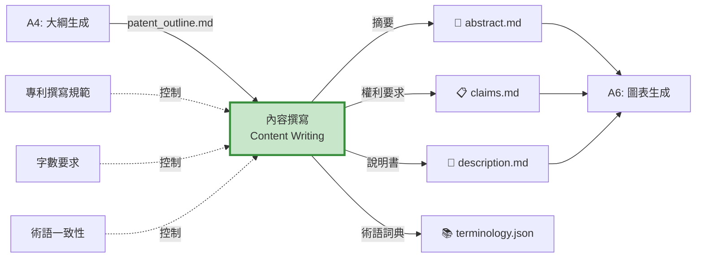
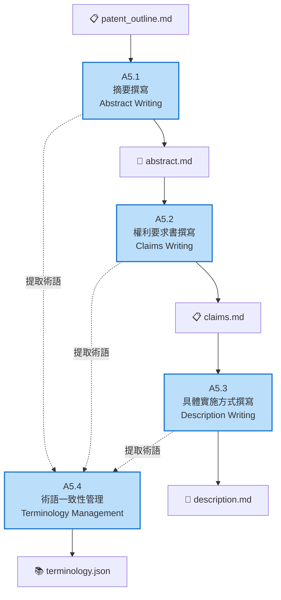

# A5 內容撰寫模組 IDEF0 詳細設計

## 文件資訊
- **模組編號**: A5
- **模組名稱**: 內容撰寫
- **英文名稱**: Content Writing
- **版本**: v1.0
- **建立日期**: 2025-10-30
- **父模組**: A0 - 專利文件自動生成系統

---

## 模組概述

### 功能描述
內容撰寫模組是專利生成的核心,負責根據大綱撰寫摘要、權利要求書和具體實施方式,確保邏輯連貫、術語一致、符合專利法規範。

### 核心職責
1. **摘要撰寫**: 生成 200-300 字的技術方案摘要
2. **權利要求書撰寫**: 撰寫獨立和從屬權利要求
3. **具體實施方式撰寫**: 生成 >10000 字的詳細說明
4. **術語一致性管理**: 確保全文術語統一

---

## A5-0: 情境圖



---

## A5: 頂層功能分解



---

## 子功能詳細設計

### A5.1: 摘要撰寫

#### 功能描述
根據大綱的發明內容章節,生成 200-300 字的專利摘要,包含技術問題、技術方案和技術效果。

#### ICOM 分析

| 要素 | 項目 | 詳細說明 |
|------|------|----------|
| **Input** | 大綱-發明內容 | 技術方案、關鍵特徵、有益效果 |
| **Control** | 摘要撰寫規範 | 200-300 字、包含問題/方案/效果 |
| | 語言風格 | 簡潔、準確、客觀 |
| **Output** | abstract.md | 完整摘要文檔 |
| **Mechanism** | abstract-writer Agent | 專用摘要撰寫 Agent |
| | Claude AI | 文本生成 |

#### Prompt 範例

```python
ABSTRACT_PROMPT = """
請根據以下專利大綱撰寫專利摘要:

發明名稱: {title}
技術領域: {technical_field}
技術問題: {problems}
技術方案: {solution}
有益效果: {advantages}

要求:
1. 字數: 200-300 字
2. 結構: 技術問題(1-2句) + 技術方案(3-4句) + 有益效果(1-2句)
3. 語言: 簡潔、準確、客觀
4. 避免: 商業宣傳、主觀評價

輸出格式:
本發明公開了...[技術方案概述]。具體地,...[關鍵步驟/特徵]。本發明的有益效果在於...[主要優點]。
"""

async def write_abstract(outline: Dict, claude_client) -> str:
    """撰寫摘要"""
    prompt = ABSTRACT_PROMPT.format(
        title=outline.get("title", ""),
        technical_field=outline.get("technical_field", ""),
        problems="; ".join(outline.get("background", {}).get("problems", [])),
        solution=outline.get("invention_content", {}).get("technical_solution", ""),
        advantages="; ".join(outline.get("invention_content", {}).get("advantages", []))
    )

    response = await claude_client.messages.create(
        model="claude-3-5-sonnet-20241022",
        max_tokens=1024,
        messages=[{"role": "user", "content": prompt}]
    )

    abstract = response.content[0].text

    # 驗證字數
    word_count = len(abstract)
    if not (200 <= word_count <= 300):
        # 重新生成或調整
        abstract = adjust_abstract_length(abstract, target=250)

    return abstract
```

---

### A5.2: 權利要求書撰寫

#### 功能描述
撰寫獨立權利要求和從屬權利要求,確保保護範圍合理且層次清晰。

#### ICOM 分析

| 要素 | 項目 | 詳細說明 |
|------|------|----------|
| **Input** | 大綱-技術方案 | 關鍵特徵、可選特徵 |
| | 摘要 | abstract.md |
| **Control** | 權利要求規範 | 獨立+從屬結構、引用關係 |
| | 層次規劃 | 3-4 個保護層次 |
| **Output** | claims.md | 完整權利要求書 |
| **Mechanism** | claims-writer Agent | 專用權利要求撰寫 Agent |

#### 權利要求結構

```markdown
# 權利要求書

## 獨立權利要求

### 權利要求 1 (方法)
一種[技術方案名稱],其特徵在於,包括以下步驟:
S1. [步驟1描述];
S2. [步驟2描述];
S3. [步驟3描述];
...

## 從屬權利要求

### 權利要求 2
根據權利要求1所述的[技術方案],其特徵在於,[可選特徵1]。

### 權利要求 3
根據權利要求1或2所述的[技術方案],其特徵在於,[可選特徵2]。

...

## 獨立權利要求

### 權利要求 11 (系統)
一種[技術方案名稱]的系統,其特徵在於,包括:
[模組1],用於[功能1];
[模組2],用於[功能2];
...

### 權利要求 12
根據權利要求11所述的系統,其特徵在於,[可選特徵]。
```

#### 權利要求撰寫策略

```python
async def write_claims(outline: Dict, abstract: str, claude_client) -> str:
    """撰寫權利要求書"""

    # 1. 撰寫獨立權利要求1 (方法)
    method_claim = await write_independent_claim_method(
        outline["invention_content"],
        claude_client
    )

    # 2. 撰寫從屬權利要求2-10 (方法的可選特徵)
    dependent_claims_method = await write_dependent_claims(
        method_claim,
        outline["invention_content"].get("optional_features", []),
        base_claim_num=1,
        claude_client
    )

    # 3. 撰寫獨立權利要求11 (系統)
    system_claim = await write_independent_claim_system(
        outline["invention_content"],
        claude_client
    )

    # 4. 撰寫從屬權利要求12-20 (系統的可選特徵)
    dependent_claims_system = await write_dependent_claims(
        system_claim,
        outline["invention_content"].get("optional_features", []),
        base_claim_num=11,
        claude_client
    )

    # 合併所有權利要求
    all_claims = [
        method_claim,
        *dependent_claims_method,
        system_claim,
        *dependent_claims_system
    ]

    return format_claims_document(all_claims)
```

---

### A5.3: 具體實施方式撰寫

#### 功能描述
撰寫詳細的具體實施方式章節,要求 >10000 字,包含多個實施例和詳細的技術細節。

#### ICOM 分析

| 要素 | 項目 | 詳細說明 |
|------|------|----------|
| **Input** | 大綱-實施方式 | 實施例要點列表 |
| | 權利要求書 | claims.md |
| **Control** | 字數要求 | >10000 字 |
| | 實施例數量 | >= 3 個 |
| | 詳細度要求 | 充分公開,可實施 |
| **Output** | description.md | 具體實施方式文檔 |
| **Mechanism** | description-writer Agent | 專用說明書撰寫 Agent |
| | 長文本生成 | Claude 長上下文能力 |

#### 撰寫策略

```python
async def write_description(
    outline: Dict,
    claims: str,
    claude_client
) -> str:
    """撰寫具體實施方式 (>10000字)"""

    sections = []

    # 1. 整體方案描述 (1000-1500字)
    overall_desc = await write_overall_description(
        outline["invention_content"],
        claude_client
    )
    sections.append(overall_desc)

    # 2. 實施例1: 主要實施方式 (3000-4000字)
    embodiment1 = await write_detailed_embodiment(
        outline["embodiments"][0] if outline.get("embodiments") else {},
        claims,
        is_primary=True,
        claude_client
    )
    sections.append(embodiment1)

    # 3. 實施例2: 變化實施方式 (2000-3000字)
    embodiment2 = await write_detailed_embodiment(
        outline["embodiments"][1] if len(outline.get("embodiments", [])) > 1 else {},
        claims,
        is_primary=False,
        claude_client
    )
    sections.append(embodiment2)

    # 4. 實施例3: 可選實施方式 (2000-3000字)
    embodiment3 = await write_detailed_embodiment(
        outline["embodiments"][2] if len(outline.get("embodiments", [])) > 2 else {},
        claims,
        is_primary=False,
        claude_client
    )
    sections.append(embodiment3)

    # 5. 技術細節補充 (1000-2000字)
    technical_details = await write_technical_details(
        outline["invention_content"],
        claude_client
    )
    sections.append(technical_details)

    # 合併所有章節
    full_description = "\n\n".join(sections)

    # 驗證字數
    word_count = len(full_description)
    if word_count < 10000:
        # 擴展內容
        full_description = await expand_description(
            full_description,
            target_words=10000,
            claude_client
        )

    return full_description

async def write_detailed_embodiment(
    embodiment_outline: Dict,
    claims: str,
    is_primary: bool,
    claude_client
) -> str:
    """撰寫詳細實施例"""

    prompt = f"""
請撰寫專利的具體實施例:

實施例要點:
{json.dumps(embodiment_outline, ensure_ascii=False, indent=2)}

權利要求書:
{claims}

要求:
1. 字數: {'' if is_primary else '2000-3000'} 字
2. 結構:
   - 實施例概述 (100-200字)
   - 系統/方法組成 (500-1000字)
   - 詳細步驟/流程 (1000-2000字)
   - 具體參數和配置 (500-1000字)
   - 實施效果 (200-300字)
3. 風格: 詳細、具體、可實施
4. 引用: 對應權利要求的特徵

輸出 Markdown 格式。
"""

    response = await claude_client.messages.create(
        model="claude-3-5-sonnet-20241022",
        max_tokens=8192,
        messages=[{"role": "user", "content": prompt}]
    )

    return response.content[0].text
```

---

### A5.4: 術語一致性管理

#### 功能描述
從所有撰寫的內容中提取術語,建立術語詞典,並確保全文術語使用一致。

#### ICOM 分析

| 要素 | 項目 | 詳細說明 |
|------|------|----------|
| **Input** | abstract.md | 摘要文檔 |
| | claims.md | 權利要求書 |
| | description.md | 具體實施方式 |
| **Control** | 術語提取規則 | NER、關鍵詞提取 |
| | 一致性規則 | 同一概念使用同一術語 |
| **Output** | terminology.json | 術語詞典 |
| | 一致性報告 | 不一致術語列表 |
| **Mechanism** | NLP 工具 | spaCy, NLTK |
| | Claude AI | 術語標準化 |

#### 術語一致性檢查

```python
def extract_terminology(
    abstract: str,
    claims: str,
    description: str
) -> Dict[str, str]:
    """提取全文術語"""

    all_text = f"{abstract}\n{claims}\n{description}"

    # 使用 NER 提取專業術語
    terms = extract_technical_terms(all_text)

    # 建立術語詞典
    terminology = {}
    for term in terms:
        if term not in terminology:
            # 第一次出現的定義作為標準
            definition = find_term_definition(term, all_text)
            terminology[term] = definition

    return terminology

def check_terminology_consistency(
    abstract: str,
    claims: str,
    description: str,
    terminology: Dict[str, str]
) -> List[Dict]:
    """檢查術語一致性"""

    inconsistencies = []

    for term in terminology.keys():
        # 查找同義詞或變體
        variants = find_term_variants(term, [abstract, claims, description])

        if len(variants) > 1:
            inconsistencies.append({
                "standard_term": term,
                "variants": variants,
                "locations": find_term_locations(variants, [abstract, claims, description])
            })

    return inconsistencies

def standardize_terminology(
    content: str,
    terminology: Dict[str, str],
    inconsistencies: List[Dict]
) -> str:
    """標準化術語"""

    standardized_content = content

    for issue in inconsistencies:
        standard_term = issue["standard_term"]
        for variant in issue["variants"]:
            if variant != standard_term:
                standardized_content = standardized_content.replace(variant, standard_term)

    return standardized_content
```

---

## Prompt 工程設計

### 撰寫風格 Prompt

```python
WRITING_STYLE_GUIDELINES = """
## 專利撰寫風格指南

### 語言風格
- 使用第三人稱,避免第一人稱
- 使用陳述句,避免疑問句
- 使用客觀描述,避免主觀評價
- 使用專業術語,避免口語化表達

### 句式結構
- 使用完整句子,避免片段
- 適當使用長句,表達複雜邏輯
- 使用並列結構,增強可讀性
- 使用標點符號,明確邏輯關係

### 段落組織
- 每段集中一個主題
- 段落間邏輯連貫
- 使用過渡句銜接
- 適當使用編號和列表

### 術語使用
- 首次出現給出定義
- 全文使用統一術語
- 避免使用縮寫 (除非通用)
- 使用領域標準術語

### 範例

❌ 錯誤:
我們的系統很好用,用戶都很喜歡。它比現有的方案快很多。

✅ 正確:
本發明提供的系統具有操作簡便、性能優越的特點。相比現有技術方案,處理速度提升 50% 以上,用戶滿意度顯著提高。
"""
```

### 長文本生成策略

```python
async def generate_long_content(
    outline: str,
    target_words: int,
    claude_client
) -> str:
    """生成長文本 (>10000字)"""

    # 策略 1: 分段生成
    sections = split_outline_into_sections(outline)

    generated_sections = []
    for i, section in enumerate(sections):
        section_words = target_words // len(sections)

        prompt = f"""
請撰寫專利說明書的第 {i+1} 部分:

{section}

要求:
- 字數: 約 {section_words} 字
- 風格: 詳細、具體、專業
- 包含: 技術細節、參數、步驟、示例

{WRITING_STYLE_GUIDELINES}
"""

        response = await claude_client.messages.create(
            model="claude-3-5-sonnet-20241022",
            max_tokens=8192,
            messages=[{"role": "user", "content": prompt}]
        )

        generated_sections.append(response.content[0].text)

    # 合併所有段落
    full_content = "\n\n".join(generated_sections)

    return full_content
```

---

## 品質控制機制

### 品質檢查清單

```python
QUALITY_CHECKLIST = {
    "abstract": {
        "word_count": (200, 300),
        "structure": ["問題", "方案", "效果"],
        "style": ["客觀", "簡潔"]
    },
    "claims": {
        "independent_claims": (2, 5),
        "dependent_claims": (10, 20),
        "claim_structure": ["前序部分", "特徵部分"],
        "reference": ["正確引用前序權利要求"]
    },
    "description": {
        "word_count": (10000, float("inf")),
        "embodiments": (3, 10),
        "detail_level": ["可實施", "充分公開"],
        "alignment": ["與權利要求對應"]
    },
    "terminology": {
        "consistency": 1.0,  # 100% 一致
        "definition": ["首次出現給出定義"],
        "standardization": ["使用領域標準術語"]
    }
}

def check_content_quality(
    abstract: str,
    claims: str,
    description: str
) -> Dict[str, Dict]:
    """檢查內容質量"""

    results = {}

    # 1. 檢查摘要
    results["abstract"] = {
        "word_count": len(abstract),
        "word_count_ok": 200 <= len(abstract) <= 300,
        "has_problem": "問題" in abstract or "缺陷" in abstract,
        "has_solution": "方案" in abstract or "方法" in abstract,
        "has_effect": "效果" in abstract or "優點" in abstract
    }

    # 2. 檢查權利要求
    claims_list = parse_claims(claims)
    results["claims"] = {
        "total_claims": len(claims_list),
        "independent_claims": count_independent_claims(claims_list),
        "dependent_claims": count_dependent_claims(claims_list),
        "structure_ok": all(check_claim_structure(c) for c in claims_list)
    }

    # 3. 檢查說明書
    results["description"] = {
        "word_count": len(description),
        "word_count_ok": len(description) >= 10000,
        "embodiments": count_embodiments(description),
        "detail_level": assess_detail_level(description),
        "alignment": check_claims_description_alignment(claims, description)
    }

    # 4. 檢查術語一致性
    terminology = extract_terminology(abstract, claims, description)
    inconsistencies = check_terminology_consistency(abstract, claims, description, terminology)
    results["terminology"] = {
        "total_terms": len(terminology),
        "inconsistencies": len(inconsistencies),
        "consistency_rate": 1 - len(inconsistencies) / max(len(terminology), 1)
    }

    return results
```

---

## 實作建議

### 技術選型

```python
dependencies = [
    "anthropic>=0.18.0",          # Claude AI
    "tiktoken>=0.5.0",            # Token 計數
    "spacy>=3.7.0",               # NLP
    "zh-core-web-sm",             # 中文 NLP 模型
]
```

### 程式碼結構

```
src/
├── writing/
│   ├── __init__.py
│   ├── abstract_writer.py      # A5.1
│   ├── claims_writer.py        # A5.2
│   ├── description_writer.py   # A5.3
│   ├── terminology_manager.py  # A5.4
│   ├── prompts.py              # Prompt 庫
│   ├── validators.py           # 質量檢查
│   └── utils.py
```

---

## 總結

### 模組特點

✅ **專業性**: 符合專利法規範
✅ **完整性**: 摘要+權利要求+說明書
✅ **詳細度**: 說明書 >10000 字
✅ **一致性**: 全文術語統一

### 關鍵指標

| 指標 | 目標值 |
|-----|-------|
| 摘要字數 | 200-300 字 |
| 說明書字數 | >10000 字 |
| 權利要求數 | 15-25 項 |
| 術語一致性 | >95% |
| 生成時間 | <20 分鐘 |

---

**文件結束**
