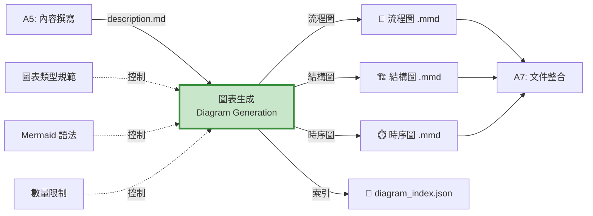
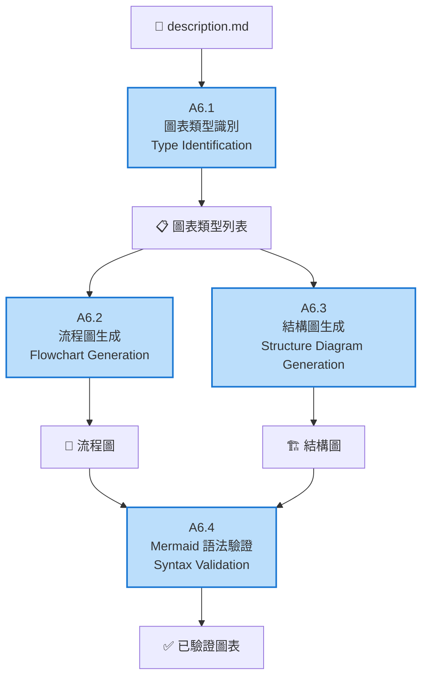
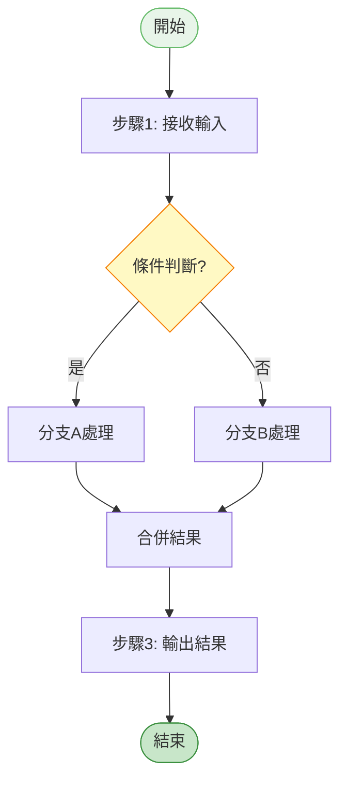
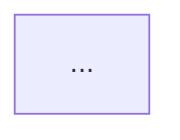
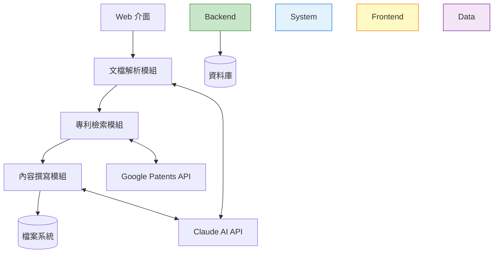
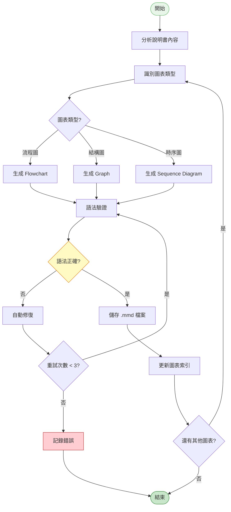

# A6 圖表生成模組 IDEF0 詳細設計

## 文件資訊
- **模組編號**: A6
- **模組名稱**: 圖表生成
- **英文名稱**: Diagram Generation
- **版本**: v1.0
- **建立日期**: 2025-10-30
- **父模組**: A0 - 專利文件自動生成系統

---

## 模組概述

### 功能描述
圖表生成模組基於技術方案自動生成 Mermaid 格式的流程圖、結構圖和時序圖,使專利文件更加直觀易懂。

### 核心職責
1. **圖表類型識別**: 判斷需要生成的圖表類型
2. **流程圖生成**: 生成方法流程圖
3. **結構圖生成**: 生成系統架構圖、模組圖
4. **Mermaid 語法驗證**: 確保圖表語法正確

---

## A6-0: 情境圖



---

## A6: 頂層功能分解



---

## 子功能詳細設計

### A6.1: 圖表類型識別

#### 功能描述
分析技術方案內容,自動識別需要生成的圖表類型及數量。

#### ICOM 分析

| 要素 | 項目 | 詳細說明 |
|------|------|----------|
| **Input** | description.md | 具體實施方式 |
| | structure_mapping.json | 結構映射 |
| **Control** | 識別規則 | 關鍵字匹配、語意分析 |
| | 數量限制 | 3-10 張圖 |
| **Output** | 圖表類型列表 | 需要生成的圖表及描述 |
| **Mechanism** | Claude AI | 內容分析 |

#### 圖表類型映射

```python
DIAGRAM_TYPE_RULES = {
    "flowchart": {
        "keywords": ["步驟", "流程", "方法", "過程", "執行"],
        "patterns": [r"S\d+[.、]", r"步驟\d+", r"首先.*然後.*最後"],
        "description": "方法流程圖"
    },
    "system_architecture": {
        "keywords": ["系統", "架構", "模組", "組件", "包括"],
        "patterns": [r"包括.*模組", r"由.*組成", r"系統架構"],
        "description": "系統架構圖"
    },
    "component_structure": {
        "keywords": ["組成", "結構", "部件", "單元"],
        "patterns": [r"包含.*部分", r"由.*構成"],
        "description": "組件結構圖"
    },
    "sequence_diagram": {
        "keywords": ["交互", "通信", "調用", "請求", "響應"],
        "patterns": [r".*向.*發送", r".*調用.*"],
        "description": "時序圖"
    },
    "data_flow": {
        "keywords": ["數據", "流轉", "傳輸", "處理"],
        "patterns": [r"數據流", r"數據傳輸"],
        "description": "數據流圖"
    }
}

async def identify_diagram_types(description: str, claude_client) -> List[Dict]:
    """識別需要的圖表類型"""

    prompt = f"""
請分析以下專利說明書,識別需要生成的圖表:

{description[:5000]}

請判斷需要哪些類型的圖表:
1. 流程圖 (Flowchart): 方法步驟流程
2. 系統架構圖 (System Architecture): 整體系統組成
3. 組件結構圖 (Component Structure): 模組/組件結構
4. 時序圖 (Sequence Diagram): 模組間交互
5. 數據流圖 (Data Flow): 數據流轉過程

輸出 JSON 格式:
{{
  "diagrams": [
    {{
      "type": "flowchart",
      "title": "專利方法流程圖",
      "description": "展示整體方法的執行流程",
      "priority": 1
    }},
    ...
  ]
}}
"""

    response = await claude_client.messages.create(
        model="claude-3-5-sonnet-20241022",
        max_tokens=2048,
        messages=[{"role": "user", "content": prompt}]
    )

    result = json.loads(response.content[0].text)
    return result.get("diagrams", [])
```

---

### A6.2: 流程圖生成

#### 功能描述
根據方法步驟生成 Mermaid flowchart 格式的流程圖。

#### Mermaid Flowchart 語法



#### 流程圖生成實作

```python
async def generate_flowchart(method_description: str, claude_client) -> str:
    """生成流程圖"""

    prompt = f"""
請根據以下方法描述生成 Mermaid flowchart 語法:

{method_description}

要求:
1. 使用 flowchart TD (Top-Down) 佈局
2. 節點類型:
   - 開始/結束: ([文字])
   - 處理步驟: [文字]
   - 判斷: {{文字?}}
   - 子流程: [[文字]]
3. 箭頭標籤: -->|條件|
4. 樣式: 為關鍵節點添加 style 定義
5. 確保語法正確,可直接渲染

輸出格式:

"""

    response = await claude_client.messages.create(
        model="claude-3-5-sonnet-20241022",
        max_tokens=2048,
        messages=[{"role": "user", "content": prompt}]
    )

    # 提取 Mermaid 代碼
    mermaid_code = extract_mermaid_code(response.content[0].text)

    return mermaid_code

def extract_mermaid_code(text: str) -> str:
    """從回應中提取 Mermaid 代碼"""
    pattern = r"```mermaid\n(.*?)\n```"
    match = re.search(pattern, text, re.DOTALL)
    if match:
        return match.group(1).strip()
    return text.strip()
```

---

### A6.3: 結構圖生成

#### 功能描述
根據系統架構描述生成結構圖。

#### 結構圖範例



#### 結構圖生成實作

```python
async def generate_structure_diagram(system_description: str, claude_client) -> str:
    """生成系統結構圖"""

    prompt = f"""
請根據以下系統描述生成 Mermaid graph 語法的結構圖:

{system_description}

要求:
1. 使用 graph TB (Top-Bottom) 佈局
2. 使用 subgraph 組織層次結構
3. 節點形狀:
   - 模組: [矩形]
   - 資料庫: [(圓柱)]
   - 外部服務: [[雙框]]
4. 連接:
   - 單向: -->
   - 雙向: <-->
   - 虛線: -.->
5. 為每個 subgraph 添加 style

輸出 Mermaid 代碼。
"""

    response = await claude_client.messages.create(
        model="claude-3-5-sonnet-20241022",
        max_tokens=3072,
        messages=[{"role": "user", "content": prompt}]
    )

    return extract_mermaid_code(response.content[0].text)
```

---

### A6.4: Mermaid 語法驗證

#### 功能描述
驗證生成的 Mermaid 圖表語法正確性。

#### 驗證規則

```python
def validate_mermaid_syntax(mermaid_code: str, diagram_type: str) -> Dict[str, Any]:
    """驗證 Mermaid 語法"""

    errors = []
    warnings = []

    # 1. 基本語法檢查
    if not mermaid_code.strip():
        errors.append("圖表代碼為空")
        return {"valid": False, "errors": errors}

    # 2. 檢查圖表類型聲明
    valid_types = ["flowchart", "graph", "sequenceDiagram", "classDiagram", "stateDiagram"]
    first_line = mermaid_code.split("\n")[0].strip()

    has_valid_type = any(first_line.startswith(t) for t in valid_types)
    if not has_valid_type:
        errors.append(f"缺少圖表類型聲明,應以 {', '.join(valid_types)} 之一開頭")

    # 3. 檢查節點定義
    nodes = re.findall(r"(\w+)[\[\(\{]", mermaid_code)
    if len(nodes) < 2:
        warnings.append("節點數量過少 (< 2)")

    # 4. 檢查連接定義
    connections = re.findall(r"-->|<-->|\-\.-", mermaid_code)
    if len(connections) < 1:
        warnings.append("缺少節點連接")

    # 5. 檢查括號匹配
    for bracket_pair in [("[", "]"), ("(", ")"), ("{", "}")]:
        open_count = mermaid_code.count(bracket_pair[0])
        close_count = mermaid_code.count(bracket_pair[1])
        if open_count != close_count:
            errors.append(f"括號不匹配: {bracket_pair[0]} 有 {open_count} 個, {bracket_pair[1]} 有 {close_count} 個")

    # 6. 檢查常見錯誤
    if "subgraph" in mermaid_code and "end" not in mermaid_code:
        errors.append("subgraph 缺少對應的 end")

    # 7. 檢查中文編碼
    try:
        mermaid_code.encode('utf-8')
    except UnicodeEncodeError:
        errors.append("包含無效字符")

    return {
        "valid": len(errors) == 0,
        "errors": errors,
        "warnings": warnings,
        "node_count": len(set(nodes)),
        "connection_count": len(connections)
    }

async def auto_fix_mermaid_syntax(mermaid_code: str, errors: List[str], claude_client) -> str:
    """自動修復 Mermaid 語法錯誤"""

    if not errors:
        return mermaid_code

    prompt = f"""
以下 Mermaid 圖表代碼存在語法錯誤:

```mermaid
{mermaid_code}
```

錯誤列表:
{chr(10).join(f"- {e}" for e in errors)}

請修復這些錯誤,輸出正確的 Mermaid 代碼。
"""

    response = await claude_client.messages.create(
        model="claude-3-5-sonnet-20241022",
        max_tokens=2048,
        messages=[{"role": "user", "content": prompt}]
    )

    fixed_code = extract_mermaid_code(response.content[0].text)

    return fixed_code
```

---

## 圖表生成演算法

### 完整生成流程



---

## Mermaid 語法規範

### 支援的圖表類型

| 圖表類型 | Mermaid 語法 | 用途 |
|---------|-------------|------|
| 流程圖 | `flowchart TD` | 方法流程、算法流程 |
| 結構圖 | `graph TB` | 系統架構、模組組成 |
| 時序圖 | `sequenceDiagram` | 模組交互、通信流程 |
| 狀態圖 | `stateDiagram-v2` | 狀態轉換 |
| 類圖 | `classDiagram` | 類結構 (面向對象系統) |

### 節點形狀參考


---

## 圖表品質評估

### 評分標準

```python
def assess_diagram_quality(mermaid_code: str, diagram_type: str) -> Dict[str, float]:
    """評估圖表質量"""

    scores = {
        "syntax": 0.0,      # 語法正確性 (30%)
        "clarity": 0.0,     # 清晰度 (30%)
        "complexity": 0.0,  # 複雜度適中 (20%)
        "style": 0.0,       # 樣式美觀 (20%)
        "total": 0.0
    }

    # 1. 語法正確性
    validation = validate_mermaid_syntax(mermaid_code, diagram_type)
    scores["syntax"] = 30 if validation["valid"] else 0

    # 2. 清晰度
    node_count = validation["node_count"]
    connection_count = validation["connection_count"]

    # 節點數適中 (5-15)
    if 5 <= node_count <= 15:
        clarity_score = 15
    elif 3 <= node_count < 5 or 15 < node_count <= 20:
        clarity_score = 10
    else:
        clarity_score = 5

    # 連接數合理
    if connection_count >= node_count - 1:  # 至少形成連通圖
        clarity_score += 15

    scores["clarity"] = clarity_score

    # 3. 複雜度
    # 不要過於複雜 (節點 < 20)
    if node_count <= 20:
        scores["complexity"] = 20
    else:
        scores["complexity"] = 10

    # 4. 樣式
    has_style = "style" in mermaid_code
    has_subgraph = "subgraph" in mermaid_code
    has_labels = re.search(r"\|.*\|", mermaid_code) is not None

    style_score = 0
    if has_style:
        style_score += 7
    if has_subgraph:
        style_score += 7
    if has_labels:
        style_score += 6

    scores["style"] = style_score

    # 總分
    scores["total"] = sum(scores[k] for k in ["syntax", "clarity", "complexity", "style"])

    return scores
```

---

## 實作建議

### 技術選型

```python
dependencies = [
    "anthropic>=0.18.0",      # Claude AI
    "mermaid-cli>=10.0.0",    # (可選) 圖表渲染
]
```

### 程式碼結構

```
src/
├── diagrams/
│   ├── __init__.py
│   ├── identifier.py          # A6.1
│   ├── flowchart_generator.py # A6.2
│   ├── structure_generator.py # A6.3
│   ├── validator.py           # A6.4
│   ├── templates/             # 圖表模板
│   │   ├── flowchart_template.mmd
│   │   └── architecture_template.mmd
│   └── utils.py
```

---

## 總結

### 模組特點

✅ **自動化**: 自動識別圖表類型
✅ **多樣性**: 支援多種圖表類型
✅ **驗證**: 自動語法驗證
✅ **修復**: 自動錯誤修復

### 關鍵指標

| 指標 | 目標值 |
|-----|-------|
| 圖表生成成功率 | > 90% |
| 語法正確率 | > 95% |
| 圖表數量 | 3-10 張 |
| 生成時間 | < 5 分鐘 |

---

**文件結束**
