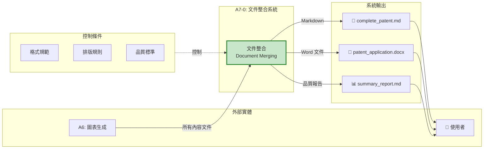
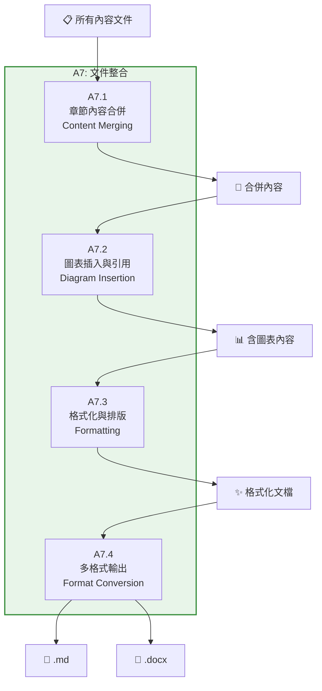
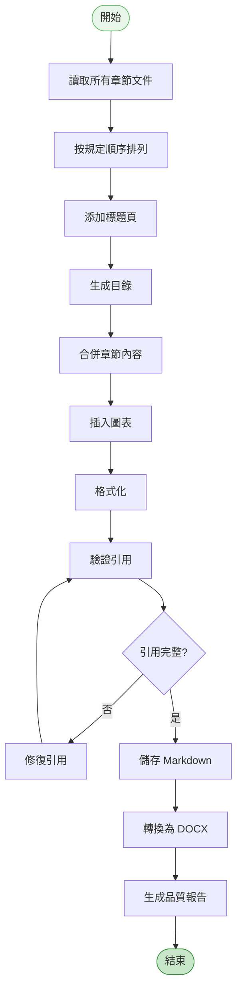

# A7 文件整合模組 IDEF0 詳細設計

## 文件資訊
- **模組編號**: A7
- **模組名稱**: 文件整合
- **英文名稱**: Document Merging
- **版本**: v1.0
- **建立日期**: 2025-10-30
- **父模組**: A0 - 專利文件自動生成系統

---

## 模組概述

### 功能描述
文件整合模組將所有撰寫完成的章節和圖表整合為完整的專利文件,並轉換為多種格式(Markdown, DOCX),同時生成品質報告。

### 核心職責
1. **章節內容合併**: 按順序合併所有章節
2. **圖表插入與引用**: 將圖表嵌入文檔並建立引用
3. **格式化與排版**: 統一格式和樣式
4. **多格式輸出**: 生成 MD 和 DOCX 格式

---

## A7-0: 情境圖



---

## A7: 頂層功能分解



---

## 子功能詳細設計

### A7.1: 章節內容合併

#### 功能描述
按照專利法規定的順序合併所有章節內容。

#### ICOM 分析

| 要素 | 項目 | 詳細說明 |
|------|------|----------|
| **Input** | abstract.md | 摘要 |
| | claims.md | 權利要求書 |
| | description.md | 具體實施方式 |
| | 其他章節 | 技術領域、背景技術等 |
| **Control** | 章節順序 | 發明名稱 → 技術領域 → 背景 → ... |
| | 編號規範 | 一級、二級、三級標題 |
| **Output** | 合併文檔 | 完整的 Markdown 文檔 |
| **Mechanism** | 文本處理 | Python 字符串操作 |

#### 標準章節順序

```python
SECTION_ORDER = [
    "01_title",                  # 發明名稱
    "02_technical_field",        # 技術領域
    "03_background",             # 背景技術
    "04_invention_content",      # 發明內容
    "05_figures",                # 附圖說明
    "06_embodiments",            # 具體實施方式
    "07_claims",                 # 權利要求書
    "08_abstract"                # 摘要
]

def merge_sections(content_dir: Path) -> str:
    """合併所有章節"""

    merged_content = []

    # 讀取所有章節文件
    sections = {
        "title": content_dir / "title.md",
        "technical_field": content_dir / "technical_field.md",
        "background": content_dir / "background.md",
        "invention_content": content_dir / "invention_content.md",
        "figures": content_dir / "figures.md",
        "embodiments": content_dir / "description.md",
        "claims": content_dir / "claims.md",
        "abstract": content_dir / "abstract.md"
    }

    # 按順序合併
    for section_key in ["title", "technical_field", "background", "invention_content",
                        "figures", "embodiments", "claims", "abstract"]:
        section_file = sections.get(section_key)

        if section_file and section_file.exists():
            content = section_file.read_text(encoding="utf-8")
            merged_content.append(content)
            merged_content.append("\n---\n")  # 分隔線

    return "\n\n".join(merged_content)
```

---

### A7.2: 圖表插入與引用

#### 功能描述
將生成的圖表插入到相應位置,並建立引用關係。

#### 圖表引用格式

```markdown
## 附圖說明

### 圖1 系統架構圖
如圖1所示,本發明的系統包括...


### 圖2 方法流程圖
如圖2所示,本發明的方法包括以下步驟...


```

#### 圖表插入實作

```python
def insert_diagrams(content: str, diagram_dir: Path) -> str:
    """插入圖表"""

    # 讀取圖表索引
    diagram_index_file = diagram_dir / "diagram_index.json"
    if not diagram_index_file.exists():
        return content

    with open(diagram_index_file, "r", encoding="utf-8") as f:
        diagram_index = json.load(f)

    # 處理每個圖表
    for i, diagram in enumerate(diagram_index.get("diagrams", []), 1):
        diagram_file = diagram_dir / diagram["file"]

        if not diagram_file.exists():
            continue

        # 讀取圖表內容
        diagram_content = diagram_file.read_text(encoding="utf-8")

        # 建立圖表區塊
        diagram_block = f"""
### 圖{i} {diagram['title']}

{diagram.get('description', '')}

```mermaid
{diagram_content}
```
"""

        # 插入到附圖說明章節
        figures_marker = "## 附圖說明"
        if figures_marker in content:
            # 在附圖說明章節後插入
            content = content.replace(
                figures_marker,
                f"{figures_marker}\n\n{diagram_block}"
            )
        else:
            # 如果沒有附圖說明章節,在具體實施方式前插入
            embodiments_marker = "## 具體實施方式"
            if embodiments_marker in content:
                content = content.replace(
                    embodiments_marker,
                    f"## 附圖說明\n\n{diagram_block}\n\n{embodiments_marker}"
                )

    return content

def create_diagram_references(content: str) -> str:
    """建立圖表引用"""

    # 找到所有"如圖X所示"的位置,確保引用正確
    pattern = r"如圖(\d+)所示"
    matches = re.finditer(pattern, content)

    for match in matches:
        fig_num = match.group(1)
        # 驗證圖表是否存在
        fig_marker = f"### 圖{fig_num}"
        if fig_marker not in content:
            # 圖表不存在,添加警告
            content = content.replace(
                match.group(0),
                f"{match.group(0)} [⚠️ 圖表缺失]"
            )

    return content
```

---

### A7.3: 格式化與排版

#### 功能描述
統一文檔格式,添加目錄、頁碼、樣式等。

#### 格式化規則

```python
FORMATTING_RULES = {
    "heading_1": {
        "prefix": "#",
        "numbering": True,
        "font_size": 20,
        "bold": True
    },
    "heading_2": {
        "prefix": "##",
        "numbering": True,
        "font_size": 18,
        "bold": True
    },
    "heading_3": {
        "prefix": "###",
        "numbering": True,
        "font_size": 16,
        "bold": False
    },
    "paragraph": {
        "line_spacing": 1.5,
        "alignment": "justify",
        "first_line_indent": 2
    },
    "code_block": {
        "background": "#f6f8fa",
        "border": "1px solid #d0d7de",
        "font_family": "monospace"
    }
}

def format_document(content: str) -> str:
    """格式化文檔"""

    # 1. 添加標題編號
    content = add_heading_numbers(content)

    # 2. 統一段落格式
    content = format_paragraphs(content)

    # 3. 格式化列表
    content = format_lists(content)

    # 4. 格式化代碼塊
    content = format_code_blocks(content)

    return content

def add_heading_numbers(content: str) -> str:
    """添加標題編號"""

    lines = content.split("\n")
    numbered_lines = []

    h1_count = 0
    h2_count = 0
    h3_count = 0

    for line in lines:
        if line.startswith("# ") and not line.startswith("##"):
            h1_count += 1
            h2_count = 0
            h3_count = 0
            numbered_lines.append(f"# {h1_count}. {line[2:]}")

        elif line.startswith("## ") and not line.startswith("###"):
            h2_count += 1
            h3_count = 0
            numbered_lines.append(f"## {h1_count}.{h2_count} {line[3:]}")

        elif line.startswith("### "):
            h3_count += 1
            numbered_lines.append(f"### {h1_count}.{h2_count}.{h3_count} {line[4:]}")

        else:
            numbered_lines.append(line)

    return "\n".join(numbered_lines)
```

---

### A7.4: 多格式輸出

#### 功能描述
將 Markdown 文檔轉換為 DOCX 格式,並生成品質報告。

#### Markdown → DOCX 轉換

```python
import pypandoc
from docx import Document
from docx.shared import Pt, Inches, RGBColor
from docx.enum.text import WD_ALIGN_PARAGRAPH

def convert_md_to_docx(md_file: Path, docx_file: Path):
    """
    使用 Pandoc 轉換 Markdown 到 DOCX

    優點: 保留格式、支援複雜結構
    """
    try:
        pypandoc.convert_file(
            str(md_file),
            'docx',
            outputfile=str(docx_file),
            extra_args=[
                '--reference-doc=templates/patent_template.docx',  # 使用模板
                '--toc',  # 生成目錄
                '--toc-depth=3',  # 目錄深度
            ]
        )
    except Exception as e:
        logger.error(f"Pandoc 轉換失敗: {e}")
        # 回退到手動轉換
        convert_md_to_docx_manual(md_file, docx_file)

def convert_md_to_docx_manual(md_file: Path, docx_file: Path):
    """手動轉換 (備用方案)"""

    # 讀取 Markdown 內容
    md_content = md_file.read_text(encoding="utf-8")

    # 建立 Word 文檔
    doc = Document()

    # 設定頁面
    section = doc.sections[0]
    section.page_height = Inches(11.69)  # A4 高度
    section.page_width = Inches(8.27)    # A4 寬度
    section.top_margin = Inches(1)
    section.bottom_margin = Inches(1)
    section.left_margin = Inches(1.25)
    section.right_margin = Inches(1.25)

    # 解析 Markdown 並轉換
    lines = md_content.split("\n")

    for line in lines:
        if line.startswith("# "):
            # 一級標題
            heading = doc.add_heading(line[2:], level=1)
            heading.alignment = WD_ALIGN_PARAGRAPH.CENTER

        elif line.startswith("## "):
            # 二級標題
            doc.add_heading(line[3:], level=2)

        elif line.startswith("### "):
            # 三級標題
            doc.add_heading(line[4:], level=3)

        elif line.startswith("```"):
            # 代碼塊 (跳過)
            continue

        elif line.strip():
            # 普通段落
            paragraph = doc.add_paragraph(line)
            paragraph.paragraph_format.line_spacing = 1.5
            paragraph.paragraph_format.first_line_indent = Inches(0.25)

    # 儲存
    doc.save(docx_file)
```

#### 品質報告生成

```python
def generate_summary_report(
    content_dir: Path,
    final_md: Path,
    final_docx: Path
) -> str:
    """生成品質報告"""

    report = f"""# 專利文件生成報告

## 基本資訊
- **生成時間**: {datetime.now().strftime("%Y-%m-%d %H:%M:%S")}
- **會話 ID**: {content_dir.parent.name}
- **輸出路徑**: {final_md.parent}

## 文檔統計

### 字數統計
"""

    # 讀取各章節內容
    abstract = (content_dir / "abstract.md").read_text(encoding="utf-8") if (content_dir / "abstract.md").exists() else ""
    claims = (content_dir / "claims.md").read_text(encoding="utf-8") if (content_dir / "claims.md").exists() else ""
    description = (content_dir / "description.md").read_text(encoding="utf-8") if (content_dir / "description.md").exists() else ""

    report += f"""
| 章節 | 字數 | 狀態 |
|-----|------|------|
| 摘要 | {len(abstract)} | {'✅' if 200 <= len(abstract) <= 300 else '⚠️'} |
| 權利要求書 | {len(claims)} | {'✅' if len(claims) > 0 else '❌'} |
| 具體實施方式 | {len(description)} | {'✅' if len(description) >= 10000 else '⚠️'} |
| **總計** | **{len(abstract) + len(claims) + len(description)}** | |

### 權利要求統計
"""

    # 統計權利要求
    claim_count = count_claims(claims)
    independent_claims = count_independent_claims(claims)
    dependent_claims = claim_count - independent_claims

    report += f"""
| 類型 | 數量 |
|-----|------|
| 獨立權利要求 | {independent_claims} |
| 從屬權利要求 | {dependent_claims} |
| **總計** | **{claim_count}** |

### 圖表統計
"""

    # 統計圖表
    diagram_dir = content_dir.parent / "05_diagrams"
    diagram_count = len(list(diagram_dir.glob("**/*.mmd"))) if diagram_dir.exists() else 0

    report += f"""
| 類型 | 數量 |
|-----|------|
| 流程圖 | {len(list((diagram_dir / "flowcharts").glob("*.mmd")))} |
| 結構圖 | {len(list((diagram_dir / "structural_diagrams").glob("*.mmd")))} |
| 時序圖 | {len(list((diagram_dir / "sequence_diagrams").glob("*.mmd")))} |
| **總計** | **{diagram_count}** |

## 品質檢查

### 完整性檢查
"""

    # 品質檢查
    checks = {
        "摘要字數符合要求": 200 <= len(abstract) <= 300,
        "說明書字數符合要求": len(description) >= 10000,
        "至少有 3 個獨立權利要求": independent_claims >= 2,
        "至少有 3 張圖表": diagram_count >= 3,
        "術語一致性": check_terminology_consistency_score(abstract, claims, description) > 0.9
    }

    for check_item, passed in checks.items():
        status = "✅ 通過" if passed else "❌ 未通過"
        report += f"- {check_item}: {status}\n"

    report += f"""
## 輸出文件

- Markdown: `{final_md.name}`
- Word 文件: `{final_docx.name}`

## 總體評分: {calculate_overall_score(checks)}/100

---
**報告結束**
"""

    return report

def calculate_overall_score(checks: Dict[str, bool]) -> int:
    """計算總體評分"""
    passed = sum(1 for v in checks.values() if v)
    total = len(checks)
    return int((passed / total) * 100)
```

---

## 合併策略

### 內容合併流程



---

## 格式轉換流程

### Pandoc 轉換選項

```bash
pandoc input.md \
  -o output.docx \
  --reference-doc=template.docx \
  --toc \
  --toc-depth=3 \
  --number-sections \
  --highlight-style=tango \
  --resource-path=./diagrams \
  --metadata title="專利申請文件"
```

---

## 最終品質檢查

### 檢查清單

```python
FINAL_QUALITY_CHECKLIST = {
    "文檔完整性": {
        "所有必要章節存在": True,
        "章節順序正確": True,
        "章節編號連續": True
    },
    "內容品質": {
        "摘要字數 200-300": True,
        "說明書字數 >= 10000": True,
        "權利要求數量 >= 10": True,
        "圖表數量 >= 3": True
    },
    "格式規範": {
        "標題層級正確": True,
        "圖表引用完整": True,
        "術語一致性 > 95%": True
    },
    "文件輸出": {
        "Markdown 文件生成": True,
        "DOCX 文件生成": True,
        "品質報告生成": True
    }
}
```

---

## 實作建議

### 技術選型

```python
dependencies = [
    "pypandoc>=1.11",         # Markdown → DOCX
    "python-docx>=1.1.0",     # DOCX 操作
    "markdown>=3.5.0",        # Markdown 解析
]
```

### 程式碼結構

```
src/
├── merging/
│   ├── __init__.py
│   ├── content_merger.py      # A7.1
│   ├── diagram_inserter.py    # A7.2
│   ├── formatter.py           # A7.3
│   ├── converter.py           # A7.4
│   ├── templates/
│   │   └── patent_template.docx
│   └── utils.py
```

---

## 總結

### 模組特點

✅ **完整性**: 合併所有章節
✅ **多格式**: MD + DOCX 輸出
✅ **品質保證**: 自動檢查和報告
✅ **美觀性**: 統一格式和樣式

### 關鍵指標

| 指標 | 目標值 |
|-----|-------|
| 合併成功率 | 100% |
| DOCX 轉換成功率 | > 95% |
| 品質檢查項目 | 100% 覆蓋 |
| 處理時間 | < 3 分鐘 |

---

**文件結束**
