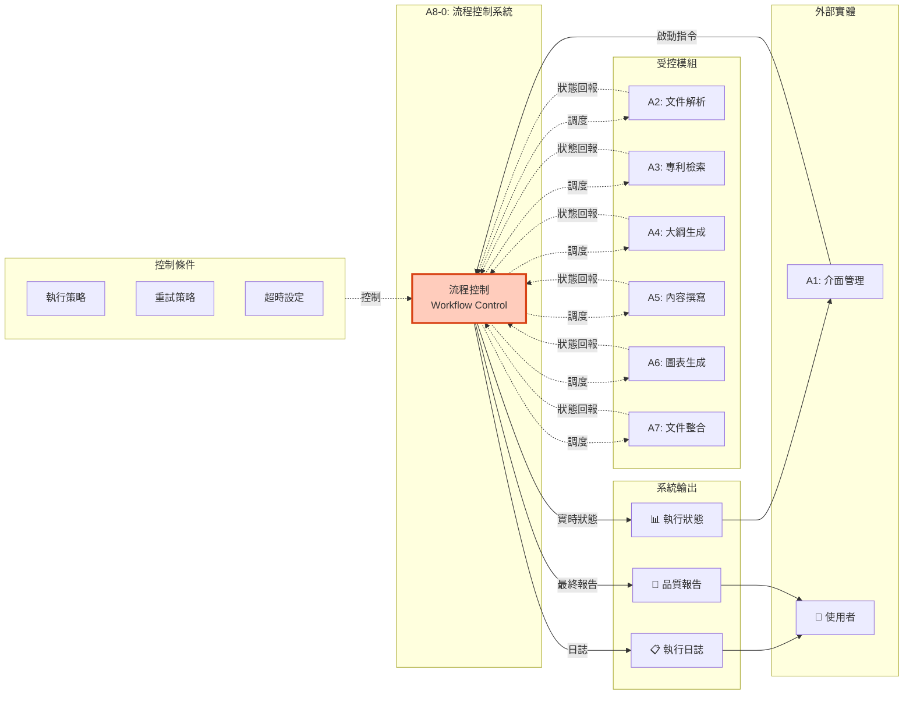
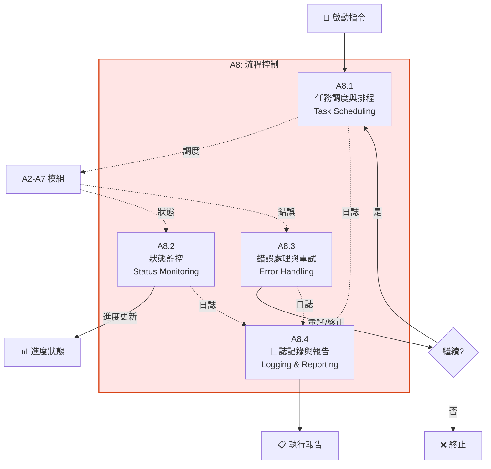
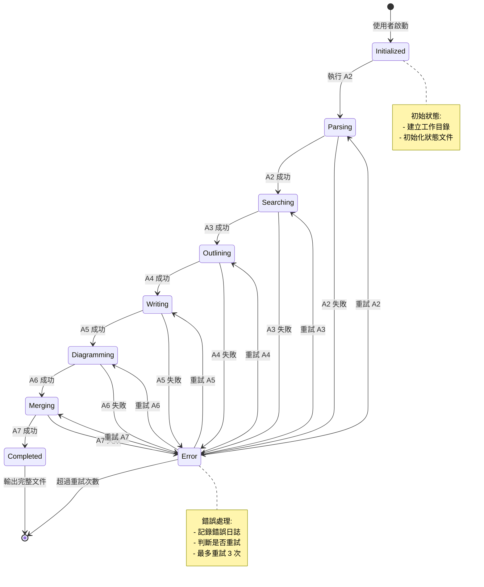
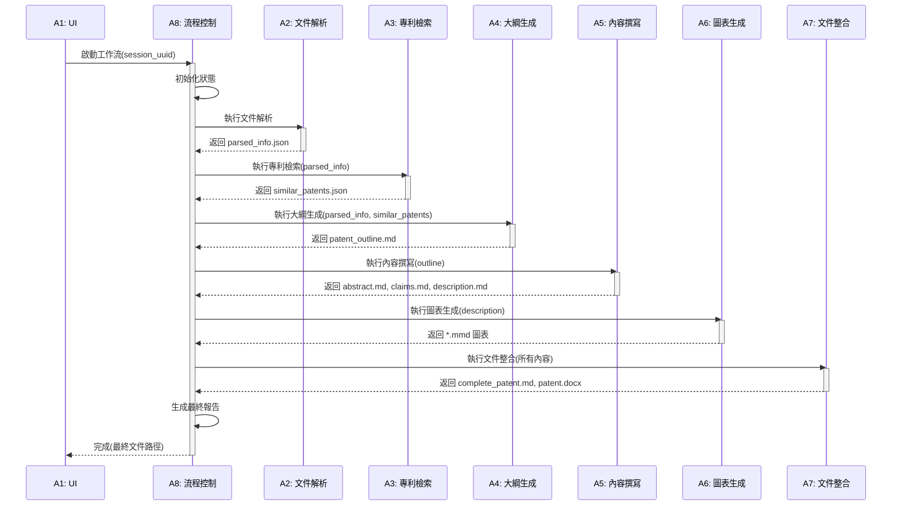

# A8 流程控制模組 IDEF0 詳細設計

## 文件資訊
- **模組編號**: A8
- **模組名稱**: 流程控制
- **英文名稱**: Workflow Control
- **版本**: v1.0
- **建立日期**: 2025-10-30
- **父模組**: A0 - 專利文件自動生成系統

---

## 模組概述

### 功能描述
流程控制模組是整個系統的指揮中樞,負責協調所有模組的執行順序、監控進度、處理錯誤,確保專利文件生成流程自動化運行。

### 核心職責
1. **任務調度與排程**: 按正確順序執行 A2-A7 模組
2. **狀態監控**: 追蹤各模組執行狀態和進度
3. **錯誤處理與重試**: 處理異常並自動重試
4. **日誌記錄與報告**: 記錄執行過程並生成報告

---

## A8-0: 情境圖



---

## A8: 頂層功能分解



---

## 子功能詳細設計

### A8.1: 任務調度與排程

#### 功能描述
按照預定義的順序和依賴關係調度各個模組的執行。

#### ICOM 分析

| 要素 | 項目 | 詳細說明 |
|------|------|----------|
| **Input** | 啟動指令 | 包含會話 ID、檔案路徑 |
| | 模組依賴關係 | A2→A3→A4→A5→A6→A7 |
| **Control** | 執行策略 | 嚴格順序執行 |
| | 並行策略 | 某些子任務可並行 (如 A5.1, A5.2) |
| **Output** | 調度計劃 | 模組執行順序和時間安排 |
| | 執行狀態 | 當前階段、下一階段 |
| **Mechanism** | 狀態機 | 管理執行狀態轉換 |
| | 任務佇列 | (可選) Celery, RQ |

#### 狀態機設計



#### 調度器實作

```python
from enum import Enum
from typing import Dict, Callable, Optional
import asyncio

class WorkflowState(Enum):
    """工作流狀態"""
    INITIALIZED = "initialized"
    PARSING = "parsing"
    SEARCHING = "searching"
    OUTLINING = "outlining"
    WRITING = "writing"
    DIAGRAMMING = "diagramming"
    MERGING = "merging"
    COMPLETED = "completed"
    ERROR = "error"
    STOPPED = "stopped"

class WorkflowScheduler:
    """工作流調度器"""

    def __init__(self, session_uuid: str):
        self.session_uuid = session_uuid
        self.current_state = WorkflowState.INITIALIZED
        self.retry_count: Dict[str, int] = {}
        self.max_retries = 3

        # 模組執行函數映射
        self.module_handlers = {
            WorkflowState.PARSING: self.run_parsing,
            WorkflowState.SEARCHING: self.run_searching,
            WorkflowState.OUTLINING: self.run_outlining,
            WorkflowState.WRITING: self.run_writing,
            WorkflowState.DIAGRAMMING: self.run_diagramming,
            WorkflowState.MERGING: self.run_merging
        }

        # 狀態轉換映射
        self.state_transitions = {
            WorkflowState.INITIALIZED: WorkflowState.PARSING,
            WorkflowState.PARSING: WorkflowState.SEARCHING,
            WorkflowState.SEARCHING: WorkflowState.OUTLINING,
            WorkflowState.OUTLINING: WorkflowState.WRITING,
            WorkflowState.WRITING: WorkflowState.DIAGRAMMING,
            WorkflowState.DIAGRAMMING: WorkflowState.MERGING,
            WorkflowState.MERGING: WorkflowState.COMPLETED
        }

    async def run(self):
        """執行完整工作流"""

        logger.info(f"工作流啟動: {self.session_uuid}")

        while self.current_state not in [WorkflowState.COMPLETED, WorkflowState.STOPPED]:
            try:
                # 獲取當前狀態的處理函數
                handler = self.module_handlers.get(self.current_state)

                if handler:
                    logger.info(f"執行模組: {self.current_state.value}")

                    # 執行模組
                    success = await handler()

                    if success:
                        # 成功,轉換到下一狀態
                        self.current_state = self.state_transitions[self.current_state]
                        self.retry_count[self.current_state.value] = 0

                        # 更新狀態文件
                        self.save_state()

                    else:
                        # 失敗,進入錯誤處理
                        await self.handle_error(self.current_state)

                else:
                    # 沒有處理函數,可能是終態
                    if self.current_state == WorkflowState.COMPLETED:
                        logger.info("工作流完成")
                        break
                    elif self.current_state == WorkflowState.ERROR:
                        logger.error("工作流錯誤")
                        break

            except Exception as e:
                logger.error(f"工作流執行異常: {e}")
                await self.handle_error(self.current_state)

        # 生成最終報告
        self.generate_final_report()

    async def run_parsing(self) -> bool:
        """執行 A2: 文件解析"""
        # 調用 input-parser Agent
        from agents.input_parser import InputParser

        parser = InputParser(self.session_uuid)
        result = await parser.run()

        return result.success

    async def run_searching(self) -> bool:
        """執行 A3: 專利檢索"""
        from agents.patent_searcher import PatentSearcher

        searcher = PatentSearcher(self.session_uuid)
        result = await searcher.run()

        return result.success

    # ... 其他模組的執行函數 ...

    async def handle_error(self, failed_state: WorkflowState):
        """錯誤處理"""

        state_key = failed_state.value
        current_retries = self.retry_count.get(state_key, 0)

        if current_retries < self.max_retries:
            # 重試
            self.retry_count[state_key] = current_retries + 1
            logger.warning(f"{failed_state.value} 失敗,重試第 {current_retries + 1} 次")

            # 等待一段時間後重試 (指數退避)
            wait_time = 2 ** current_retries
            await asyncio.sleep(wait_time)

        else:
            # 超過重試次數,終止
            logger.error(f"{failed_state.value} 失敗且超過重試次數,工作流終止")
            self.current_state = WorkflowState.ERROR

    def save_state(self):
        """儲存工作流狀態"""
        state_file = Path("output") / f"temp_{self.session_uuid}" / "metadata" / "workflow_state.json"

        state_data = {
            "current_state": self.current_state.value,
            "retry_count": self.retry_count,
            "updated_at": datetime.now().isoformat()
        }

        with open(state_file, "w", encoding="utf-8") as f:
            json.dump(state_data, f, indent=2)
```

---

### A8.2: 狀態監控

#### 功能描述
實時監控各模組的執行狀態,計算進度百分比,並將狀態更新推送到 UI。

#### ICOM 分析

| 要素 | 項目 | 詳細說明 |
|------|------|----------|
| **Input** | 模組執行狀態 | 進行中/完成/失敗 |
| | 模組輸出文件 | 檢查文件是否生成 |
| **Control** | 監控頻率 | 每 2 秒檢查一次 |
| | 進度計算規則 | A2:15%, A3:25%, ... |
| **Output** | 實時進度 | 0-100% |
| | 當前階段 | 模組名稱和狀態 |
| **Mechanism** | 狀態文件 | workflow_state.json |
| | WebSocket | (可選) 實時推送 |

#### 進度計算

```python
PROGRESS_MAPPING = {
    WorkflowState.INITIALIZED: 0,
    WorkflowState.PARSING: 15,
    WorkflowState.SEARCHING: 25,
    WorkflowState.OUTLINING: 35,
    WorkflowState.WRITING: 70,
    WorkflowState.DIAGRAMMING: 85,
    WorkflowState.MERGING: 95,
    WorkflowState.COMPLETED: 100
}

class StatusMonitor:
    """狀態監控器"""

    def __init__(self, session_uuid: str):
        self.session_uuid = session_uuid
        self.state_file = Path("output") / f"temp_{session_uuid}" / "metadata" / "workflow_state.json"

    def get_current_progress(self) -> Dict[str, Any]:
        """獲取當前進度"""

        if not self.state_file.exists():
            return {
                "progress": 0,
                "current_stage": "未啟動",
                "status": "idle"
            }

        with open(self.state_file, "r", encoding="utf-8") as f:
            state_data = json.load(f)

        current_state_str = state_data.get("current_state", "initialized")
        current_state = WorkflowState(current_state_str)

        progress = PROGRESS_MAPPING.get(current_state, 0)

        return {
            "progress": progress,
            "current_stage": current_state.value,
            "status": "running" if current_state not in [WorkflowState.COMPLETED, WorkflowState.ERROR] else "completed",
            "updated_at": state_data.get("updated_at")
        }

    def get_detailed_status(self) -> Dict[str, Any]:
        """獲取詳細狀態"""

        progress_info = self.get_current_progress()

        # 檢查各模組的輸出文件
        output_files = self.check_output_files()

        return {
            **progress_info,
            "output_files": output_files,
            "logs": self.get_recent_logs(limit=10)
        }

    def check_output_files(self) -> Dict[str, bool]:
        """檢查輸出文件是否存在"""

        base_path = Path("output") / f"temp_{self.session_uuid}"

        files_to_check = {
            "parsed_info": base_path / "01_input" / "parsed_info.json",
            "similar_patents": base_path / "02_research" / "similar_patents.json",
            "patent_outline": base_path / "03_outline" / "patent_outline.md",
            "abstract": base_path / "04_content" / "abstract.md",
            "claims": base_path / "04_content" / "claims.md",
            "description": base_path / "04_content" / "description.md",
            "complete_patent": base_path / "06_final" / "complete_patent.md",
            "patent_docx": base_path / "06_final" / "patent_application.docx"
        }

        return {
            key: file.exists()
            for key, file in files_to_check.items()
        }

    def get_recent_logs(self, limit: int = 10) -> List[str]:
        """獲取最近的日誌"""

        log_file = Path("output") / f"temp_{self.session_uuid}" / "metadata" / "workflow.log"

        if not log_file.exists():
            return []

        with open(log_file, "r", encoding="utf-8") as f:
            lines = f.readlines()

        return lines[-limit:]
```

---

### A8.3: 錯誤處理與重試

#### 功能描述
捕獲和處理各模組的錯誤,實施重試策略,並在必要時終止工作流。

#### 錯誤分類

```python
class WorkflowError(Exception):
    """工作流錯誤基類"""
    pass

class InputError(WorkflowError):
    """輸入錯誤 (不重試)"""
    pass

class NetworkError(WorkflowError):
    """網路錯誤 (重試)"""
    pass

class APIError(WorkflowError):
    """API 錯誤 (重試)"""
    pass

class ValidationError(WorkflowError):
    """驗證錯誤 (重試)"""
    pass

class SystemError(WorkflowError):
    """系統錯誤 (記錄並終止)"""
    pass

ERROR_HANDLING_STRATEGY = {
    InputError: {"retry": False, "notify_user": True},
    NetworkError: {"retry": True, "max_retries": 3, "backoff": "exponential"},
    APIError: {"retry": True, "max_retries": 3, "backoff": "exponential"},
    ValidationError: {"retry": True, "max_retries": 2, "backoff": "fixed"},
    SystemError: {"retry": False, "notify_admin": True}
}
```

#### 重試策略

```python
async def retry_with_strategy(
    func: Callable,
    error_type: type,
    max_retries: int = 3,
    backoff: str = "exponential"
) -> Any:
    """帶策略的重試"""

    for attempt in range(max_retries):
        try:
            result = await func()
            return result

        except error_type as e:
            if attempt < max_retries - 1:
                # 計算等待時間
                if backoff == "exponential":
                    wait_time = 2 ** attempt
                elif backoff == "fixed":
                    wait_time = 5
                else:
                    wait_time = 1

                logger.warning(f"嘗試 {attempt + 1} 失敗: {e}, {wait_time}秒後重試")
                await asyncio.sleep(wait_time)
            else:
                logger.error(f"達到最大重試次數: {e}")
                raise

def handle_module_error(
    module_name: str,
    error: Exception,
    session_uuid: str
):
    """處理模組錯誤"""

    # 記錄錯誤
    error_log_file = Path("output") / f"temp_{session_uuid}" / "metadata" / "agent_logs" / f"{module_name}_error.log"
    error_log_file.parent.mkdir(parents=True, exist_ok=True)

    with open(error_log_file, "a", encoding="utf-8") as f:
        f.write(f"\n[{datetime.now()}] {type(error).__name__}: {str(error)}\n")
        f.write(traceback.format_exc())

    # 根據錯誤類型決定處理策略
    strategy = ERROR_HANDLING_STRATEGY.get(type(error), {"retry": False})

    return strategy
```

---

### A8.4: 日誌記錄與報告

#### 功能描述
記錄工作流執行的詳細日誌,並在完成後生成總結報告。

#### 日誌格式

```python
import logging
from logging.handlers import RotatingFileHandler

def setup_logger(session_uuid: str) -> logging.Logger:
    """設置日誌記錄器"""

    log_file = Path("output") / f"temp_{session_uuid}" / "metadata" / "workflow.log"
    log_file.parent.mkdir(parents=True, exist_ok=True)

    logger = logging.getLogger(f"workflow_{session_uuid}")
    logger.setLevel(logging.DEBUG)

    # 文件處理器
    file_handler = RotatingFileHandler(
        log_file,
        maxBytes=10 * 1024 * 1024,  # 10MB
        backupCount=5,
        encoding="utf-8"
    )

    # 格式化器
    formatter = logging.Formatter(
        fmt="%(asctime)s | %(levelname)-8s | %(module)s:%(funcName)s:%(lineno)d | %(message)s",
        datefmt="%Y-%m-%d %H:%M:%S"
    )

    file_handler.setFormatter(formatter)
    logger.addHandler(file_handler)

    # 控制台處理器 (可選)
    console_handler = logging.StreamHandler()
    console_handler.setLevel(logging.INFO)
    console_handler.setFormatter(formatter)
    logger.addHandler(console_handler)

    return logger
```

#### 執行報告生成

```python
def generate_workflow_report(session_uuid: str) -> str:
    """生成工作流執行報告"""

    base_path = Path("output") / f"temp_{session_uuid}"
    state_file = base_path / "metadata" / "workflow_state.json"

    with open(state_file, "r", encoding="utf-8") as f:
        state_data = json.load(f)

    # 計算總執行時間
    project_info_file = base_path / "metadata" / "project_info.json"
    with open(project_info_file, "r", encoding="utf-8") as f:
        project_info = json.load(f)

    start_time = datetime.fromisoformat(project_info["created_at"])
    end_time = datetime.fromisoformat(state_data["updated_at"])
    duration = end_time - start_time

    report = f"""# 工作流執行報告

## 基本資訊
- **會話 ID**: {session_uuid}
- **開始時間**: {start_time.strftime("%Y-%m-%d %H:%M:%S")}
- **結束時間**: {end_time.strftime("%Y-%m-%d %H:%M:%S")}
- **總執行時間**: {duration}
- **最終狀態**: {state_data["current_state"]}

## 執行階段

| 階段 | 狀態 | 重試次數 |
|-----|------|---------|
"""

    for state in WorkflowState:
        if state in [WorkflowState.INITIALIZED, WorkflowState.ERROR, WorkflowState.STOPPED]:
            continue

        retries = state_data.get("retry_count", {}).get(state.value, 0)
        status_emoji = "✅" if retries == 0 else "⚠️"

        report += f"| {state.value} | {status_emoji} | {retries} |\n"

    report += f"""
## 輸出文件

"""

    # 檢查輸出文件
    output_files = StatusMonitor(session_uuid).check_output_files()
    for file_key, exists in output_files.items():
        status = "✅ 已生成" if exists else "❌ 未生成"
        report += f"- {file_key}: {status}\n"

    report += f"""
## 統計資訊

"""

    # 讀取內容統計
    if output_files.get("abstract"):
        abstract = (base_path / "04_content" / "abstract.md").read_text(encoding="utf-8")
        report += f"- 摘要字數: {len(abstract)}\n"

    if output_files.get("description"):
        description = (base_path / "04_content" / "description.md").read_text(encoding="utf-8")
        report += f"- 說明書字數: {len(description)}\n"

    report += """
---
**報告結束**
"""

    # 儲存報告
    report_file = base_path / "06_final" / "workflow_report.md"
    report_file.write_text(report, encoding="utf-8")

    return report
```

---

## 調度演算法

### 完整調度流程



---

## 監控指標定義

### 關鍵指標

```python
MONITORING_METRICS = {
    "業務指標": {
        "daily_patent_count": "每日完成專利數量",
        "average_processing_time": "平均處理時間 (分鐘)",
        "success_rate": "成功率 (%)",
        "user_satisfaction": "使用者滿意度"
    },
    "技術指標": {
        "api_response_time": "API 平均響應時間 (秒)",
        "token_usage": "Claude AI Token 使用量",
        "error_rate_by_module": "各模組錯誤率 (%)",
        "retry_count": "重試次數"
    },
    "資源指標": {
        "cpu_usage": "CPU 使用率 (%)",
        "memory_usage": "記憶體使用率 (%)",
        "disk_space": "磁碟空間 (GB)",
        "network_traffic": "網路流量 (MB)"
    }
}
```

---

## 實作建議

### 技術選型

```python
dependencies = [
    # 工作流引擎 (選項)
    "celery>=5.3.0",          # 分散式任務佇列
    # OR
    "prefect>=2.0.0",         # 現代化工作流引擎
    # OR
    "python-statemachine>=2.0.0",  # 輕量級狀態機

    # 監控
    "prometheus-client>=0.19.0",   # 指標收集
    "sentry-sdk>=1.40.0",          # 錯誤追蹤
]
```

### 程式碼結構

```
src/
├── workflow/
│   ├── __init__.py
│   ├── scheduler.py          # A8.1
│   ├── monitor.py            # A8.2
│   ├── error_handler.py      # A8.3
│   ├── logger.py             # A8.4
│   ├── state_machine.py      # 狀態機
│   └── utils.py
```

---

## 總結

### 模組特點

✅ **自動化**: 全流程自動調度
✅ **可監控**: 實時狀態和進度
✅ **容錯性**: 錯誤處理和重試
✅ **可追溯**: 完整日誌記錄

### 關鍵指標

| 指標 | 目標值 |
|-----|-------|
| 工作流成功率 | > 95% |
| 平均執行時間 | < 30 分鐘 |
| 錯誤恢復率 | > 90% |
| 日誌完整性 | 100% |

---

**文件結束**
