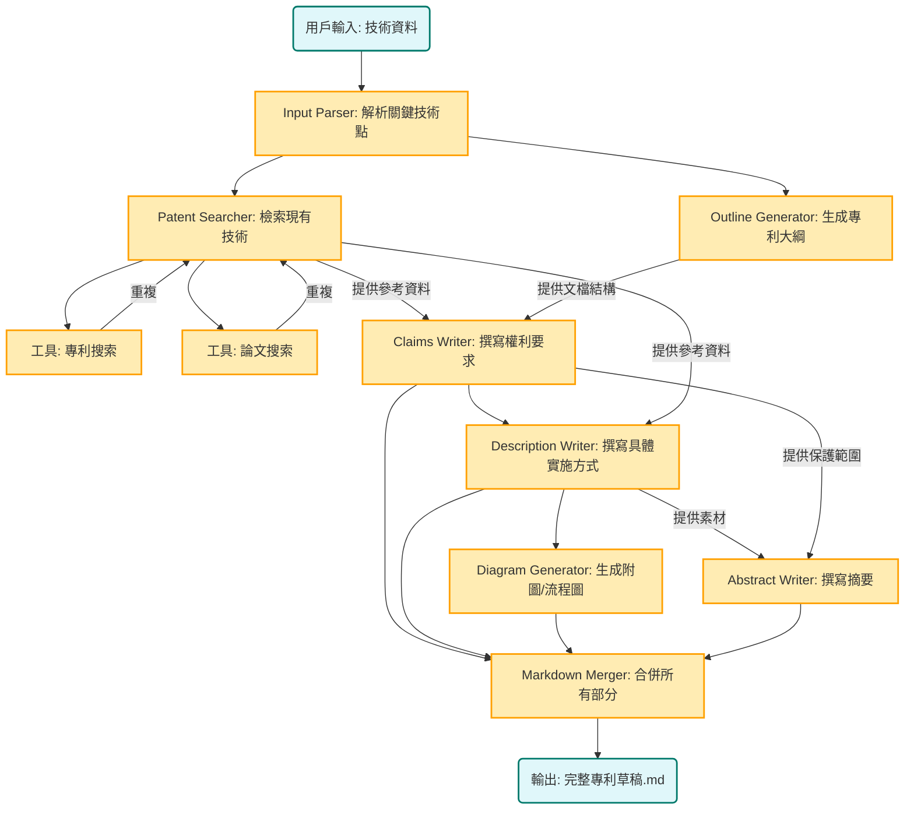

# 系統架構總覽

本文檔提供專利寫作智能體的技術架構總覽，面向開發者。

---

## 🏗️ 系統架構圖

### Workflow 設計



---

## 📂 專案目錄結構

```
PatentWriterAgent/
├── patent_writer_app.py        # Streamlit Web 應用主程式
├── run_app.py                  # 應用啟動腳本
├── requirements.txt            # Python 依賴清單
├── CLAUDE.md                   # Claude Agent 專案指令
├── README.md                   # 使用者文檔
├── APP_README.md               # Web 應用詳細說明
│
├── bin/                        # 工具腳本
│   ├── convert_to_traditional.py   # 簡繁轉換工具
│   └── check_mermaid.sh            # Mermaid 語法檢查
│
├── .claude/                    # Claude Code 配置
│   ├── commands/               # 自定義命令
│   └── settings.local.json     # 本機設定
│
├── .mcp.json                   # MCP 伺服器配置 (API Keys)
│
├── data/                       # 輸入文件目錄
│   └── 輸入.docx              # 技術交底書範例
│
├── output/                     # 輸出文件目錄
│   ├── {session_id}.log       # 執行日誌
│   └── temp_[uuid]/           # 專利生成工作目錄
│       ├── 01_input/          # 輸入解析結果
│       │   ├── raw_document.md
│       │   └── parsed_info.json
│       ├── 02_research/       # 專利檢索結果
│       │   ├── similar_patents.json
│       │   ├── prior_art_analysis.md
│       │   └── writing_style_guide.md
│       ├── 03_outline/        # 專利大綱
│       │   ├── patent_outline.md
│       │   └── structure_mapping.json
│       ├── 04_content/        # 專利內容
│       │   ├── abstract.md           # 摘要
│       │   ├── claims.md             # 權利要求書
│       │   └── description.md        # 說明書
│       ├── 05_diagrams/       # Mermaid 圖表
│       │   ├── flowcharts/
│       │   ├── structural_diagrams/
│       │   └── sequence_diagrams/
│       ├── 06_final/          # 最終輸出
│       │   ├── complete_patent.md    # 完整專利文件
│       │   └── summary_report.md     # 生成報告
│       └── metadata/          # 執行元數據
│           ├── project_info.json
│           └── agent_logs/
│
└── docs/                       # 開發者文檔
    ├── README.md              # 文檔導覽
    ├── ARCHITECTURE.md        # 本文檔 (架構總覽)
    ├── A0_system_idef0.md     # 系統頂層 IDEF0
    ├── A1_UI_Management_IDEF0.md        # UI 管理模組
    ├── A2_Document_Parsing_IDEF0.md     # 文件解析模組
    ├── A3_Patent_Search_IDEF0.md        # 專利檢索模組
    ├── A4_Outline_Generation_IDEF0.md   # 大綱生成模組
    ├── A5_Content_Writing_IDEF0.md      # 內容撰寫模組
    ├── A6_Diagram_Generation_IDEF0.md   # 圖表生成模組
    ├── A7_Document_Merging_IDEF0.md     # 文件合併模組
    ├── A8_Workflow_Control_IDEF0.md     # 工作流程控制模組
    └── troubleshooting/       # 故障排除文檔
        ├── README.md
        ├── Mermaid_最終解決方案.md
        ├── Mermaid_使用指南.md
        └── Mermaid_故障排除.md
```

---

## 🔄 執行流程

### 標準執行流程

```
1. 使用者上傳 DOCX → A1 (UI Management)
                        ↓
2. 解析技術內容 ←------- A2 (Document Parsing)
         ↓
3. 檢索相似專利 ←------- A3 (Patent Search)
         ↓
4. 生成專利大綱 ←------- A4 (Outline Generation)
         ↓
5. 並行撰寫內容 ←------- A5 (Content Writing)
   │                      - 權利要求書
   │                      - 具體實施方式
   │                      - 摘要
   ↓
6. 生成技術圖表 ←------- A6 (Diagram Generation)
         ↓
7. 合併完整文件 ←------- A7 (Document Merging)
         ↓
8. 輸出 Markdown ←------- A1 (下載結果)

全程監控與協調 ←------- A8 (Workflow Control)
```

### 子代理執行順序

各專業子代理必須按以下順序執行：

1. **input-parser** → 解析技術交底書
2. **patent-searcher** → 檢索相似專利
3. **outline-generator** → 生成專利大綱
4. **abstract-writer** → 撰寫摘要
5. **claims-writer** → 撰寫權利要求書
6. **description-writer** → 撰寫說明書 (>10,000字)
7. **diagram-generator** → 生成 Mermaid 圖表
8. **markdown-merger** → 合併所有內容

詳細流程請參考 [CLAUDE.md](../CLAUDE.md)

---

## 🛠️ 技術棧

### 核心技術

| 層級 | 技術 | 用途 |
|-----|------|------|
| **AI 引擎** | Claude 3.5 Sonnet | 專利內容生成、分析 |
| **Agent 框架** | Claude Code Agent SDK | 多 Agent 協調 |
| **前端** | Streamlit | Web 使用者介面 |
| **文件處理** | markitdown, python-docx | DOCX 解析 |
| **專利檢索** | Google Patents API (via SERP API) | 專利搜尋 |
| **網頁檢索** | Exa Search API | 技術文件搜尋 |
| **圖表生成** | Mermaid.js | 技術圖表 |
| **資料格式** | JSON, Markdown | 資料交換 |

### 開發工具

- **IDE**: VS Code + Claude Code 擴充套件
- **版本控制**: Git
- **文件格式**: Markdown + Mermaid
- **專案管理**: IDEF0 建模方法論

---

## 🔗 IDEF0 模組文檔

完整的 IDEF0 功能模組設計請參考：

- [A0 - 系統頂層架構](A0_system_idef0.md) - 系統全貌
- [A1 - 使用者介面管理](A1_UI_Management_IDEF0.md) - Web UI 設計
- [A2 - 文件解析](A2_Document_Parsing_IDEF0.md) - DOCX 處理
- [A3 - 專利檢索](A3_Patent_Search_IDEF0.md) - 檢索 API 整合
- [A4 - 大綱生成](A4_Outline_Generation_IDEF0.md) - 大綱生成邏輯
- [A5 - 內容撰寫](A5_Content_Writing_IDEF0.md) - 專利內容生成
- [A6 - 圖表生成](A6_Diagram_Generation_IDEF0.md) - Mermaid 圖表
- [A7 - 文件合併](A7_Document_Merging_IDEF0.md) - 最終文件組裝
- [A8 - 工作流程控制](A8_Workflow_Control_IDEF0.md) - Agent 協調

---

## 📋 資料流轉

### 子代理輸入輸出映射

| 子代理 | 工作目錄 | 輸入文件 | 輸出文件 |
|--------|----------|----------|----------|
| input-parser | 01_input/ | raw_document.docx | parsed_info.json |
| patent-searcher | 02_research/ | parsed_info.json | similar_patents.json, prior_art_analysis.md |
| outline-generator | 03_outline/ | similar_patents.json, parsed_info.json | patent_outline.md, structure_mapping.json |
| abstract-writer | 04_content/ | patent_outline.md | abstract.md |
| claims-writer | 04_content/ | patent_outline.md, abstract.md | claims.md |
| description-writer | 04_content/ | patent_outline.md, claims.md | description.md |
| diagram-generator | 05_diagrams/ | description.md, structure_mapping.json | *.mmd 圖表文件 |
| markdown-merger | 06_final/ | 所有 04_content/ 和 05_diagrams/ | complete_patent.md |

---

## 🎯 品質標準

### 文檔品質要求

- ✅ 嚴格遵循中國《專利法》和《專利審查指南》
- ✅ 具體實施方式章節 > 10,000 字
- ✅ 全文術語一致性 100%
- ✅ 各章節邏輯鏈條完整
- ✅ 所有中間文件保存在工作目錄

### 目錄結構品質要求

- ✅ 100% 符合標準目錄結構
- ✅ 文件放置在正確目錄
- ✅ JSON 文件格式正確可解析
- ✅ Mermaid 圖表語法正確 (.mmd 擴展名)

### 數據完整性要求

- ✅ 每個輸出包含版本號和時間戳
- ✅ 結構化數據包含完整字段驗證
- ✅ 關鍵術語在所有文件中一致
- ✅ 圖表引用與文件名匹配

---

## 🔧 開發者資源

### 相關文檔

- [系統 IDEF0 設計文檔](README.md) - 各模組詳細設計
- [故障排除指南](troubleshooting/README.md) - 開發除錯經驗
- [Mermaid 使用指南](troubleshooting/Mermaid_使用指南.md) - 圖表語法

### 技術規範

- [中國專利法](https://www.cnipa.gov.cn/) - 專利撰寫規範
- [IDEF0 標準](https://en.wikipedia.org/wiki/IDEF0) - 建模方法論
- [Mermaid 文件](https://mermaid.js.org/) - 圖表語法
- [Claude Code 文檔](https://claude.com/claude-code) - AI 開發環境

---

**最後更新**: 2025-10-30  
**文檔版本**: v1.0  
**維護者**: 專案架構團隊
