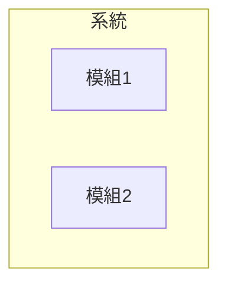
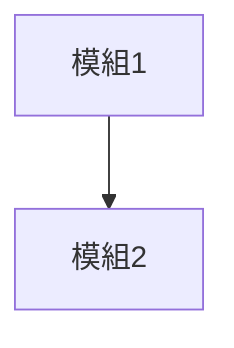
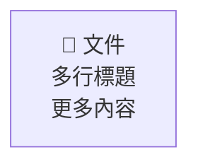
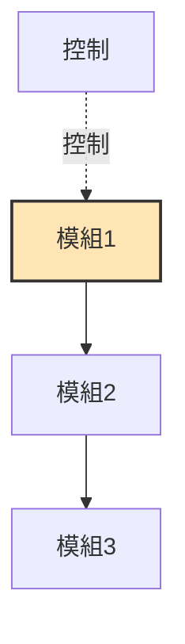
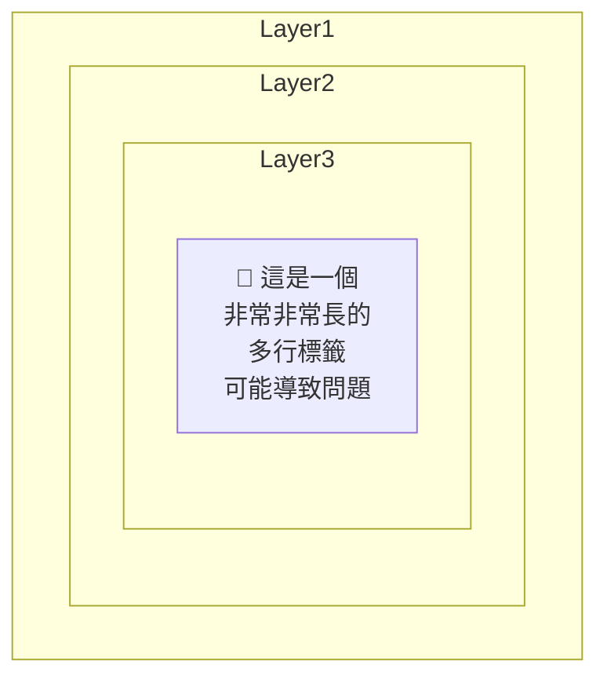
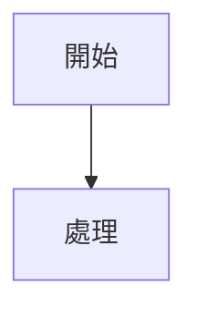
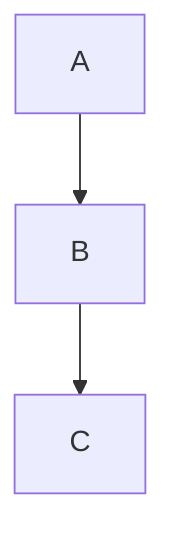

# Mermaid 圖表故障排除指南

## 🚨 常見錯誤訊息

### 錯誤 1: "No diagram type detected matching given configuration for text"

**症狀**：
- Mermaid 圖表無法渲染
- 顯示錯誤訊息而非圖表
- 預覽視窗中圖表區域為空白

**可能原因**：

1. **語法版本不相容**
   - 使用了較新的 `subgraph` 語法，但擴充套件版本較舊
   - 某些複雜的巢狀結構不被支援

2. **特殊字符問題**
   - Emoji 符號在某些版本中可能導致解析失敗
   - 繁體中文字符編碼問題
   - 換行符 `<br/>` 在舊版本中不支援

3. **語法錯誤**
   - 缺少必要的關鍵字
   - 引號或括號不匹配
   - 圖表類型聲明錯誤

---

## ✅ 解決方案

### 方案 1: 使用 `flowchart` 替代 `graph`

**問題語法**（可能導致錯誤）：
````markdown

````

**修復後語法**（更兼容）：
````markdown

````

**差異說明**：
- `flowchart` 是較新的語法，向後兼容性更好
- 移除 `subgraph` 可以避免巢狀結構問題
- 保持圖表扁平化結構

---

### 方案 2: 簡化特殊字符

**問題語法**：
````markdown

````

**修復後語法**：
````markdown

````

**建議**：
- 減少 `<br/>` 的使用
- 移除 emoji（或移到註解中）
- 使用簡短的節點標籤

---

### 方案 3: 更新擴充套件

```bash
# 強制更新到最新版本
code --install-extension bierner.markdown-mermaid --force

# 重新載入 VS Code
# Ctrl+Shift+P → "Reload Window"
```

---

### 方案 4: 檢查語法正確性

使用線上編輯器驗證：
1. 訪問 https://mermaid.live/
2. 複製您的 Mermaid 程式碼
3. 即時查看渲染結果
4. 修正錯誤後再貼回 VS Code

---

## 🔧 本專案的修復記錄

### 已修復的檔案

#### 1. `docs/A0_system_idef0.md`

**原始問題**：
- A0 頂層功能圖無法渲染
- 使用 `graph TB` + `subgraph` 組合
- 錯誤訊息：No diagram type detected

**修復方式**：
```diff
- graph TB
-     subgraph A0["A0: 專利文件自動生成系統"]
-         A1["A1<br/>介面管理<br/>UI Management"]
-         ...
-     end
+ flowchart TB
+     A1["A1 介面管理<br/>UI Management"] --> A2["A2 文件解析<br/>Document Parsing"]
+     ...
```

**效果**：
- ✅ 圖表成功渲染
- ✅ 保留所有節點和連線關係
- ✅ 樣式（顏色、邊框）正常顯示

---

## 📋 Mermaid 語法最佳實踐

### ✅ 推薦寫法



### ❌ 避免的寫法



---

## 🎯 快速診斷流程

### 步驟 1: 測試基本圖表

開啟 [`docs/Mermaid_測試.md`](Mermaid_測試.md) 並預覽（`Ctrl+Shift+V`）：

- ✅ **測試 1 成功**：基本功能正常
- ❌ **測試 1 失敗**：擴充套件未安裝或損壞 → 重新安裝

### 步驟 2: 測試進階功能

- ✅ **測試 2 成功**：支援虛線和樣式
- ❌ **測試 2 失敗**：版本過舊 → 更新擴充套件

### 步驟 3: 測試複雜結構

- ✅ **測試 3-4 成功**：支援所有語法
- ❌ **測試 3-4 失敗**：語法問題 → 簡化圖表結構

---

## 🛠️ 維護建議

### 定期更新

```bash
# 每月更新一次 Mermaid 擴充套件
code --install-extension bierner.markdown-mermaid --force
```

### 備份策略

1. **保留簡化版本**：為每個複雜圖表保留一個簡化版本
2. **記錄問題**：在註解中標註可能的兼容性問題
3. **測試環境**：在線上編輯器中驗證新語法

### 版本控制

```markdown
<!-- Mermaid 版本說明 -->
<!-- 此圖表需要 Mermaid v9.0+ -->
<!-- 如遇渲染問題，請參考 docs/Mermaid_故障排除.md -->
```

---

## 📚 參考資源

### 官方文件
- [Mermaid 官方文件](https://mermaid.js.org/)
- [Mermaid 語法參考](https://mermaid.js.org/intro/syntax-reference.html)
- [Flowchart 語法](https://mermaid.js.org/syntax/flowchart.html)

### 線上工具
- [Mermaid Live Editor](https://mermaid.live/) - 即時預覽和驗證
- [Mermaid CLI](https://github.com/mermaid-js/mermaid-cli) - 命令列工具

### VS Code 擴充套件
- [Markdown Preview Mermaid Support](https://marketplace.visualstudio.com/items?itemName=bierner.markdown-mermaid)
- [Mermaid Preview](https://marketplace.visualstudio.com/items?itemName=vstirbu.vscode-mermaid-preview)

---

## 🎓 學習路徑

### 初學者
1. 從簡單的流程圖開始
2. 逐步增加節點和連線
3. 學習基本樣式設定

### 進階使用者
1. 掌握所有圖表類型（時序圖、狀態圖等）
2. 學習樣式自訂和主題
3. 整合到 CI/CD 流程

### 專家級
1. 開發自訂插件
2. 貢獻到 Mermaid 開源專案
3. 創建企業級圖表標準

---

## 💡 小技巧

### Tip 1: 使用註解



### Tip 2: 分段建構

先建立基本結構，確認可以渲染後再添加細節：



### Tip 3: 使用變數

對於重複的樣式定義，可以使用 classDef：


---

## ✉️ 獲取幫助

如果問題仍未解決：

1. **檢查本文件** 的所有解決方案
2. **查看測試檔案** [`docs/Mermaid_測試.md`](Mermaid_測試.md)
3. **訪問線上編輯器** 驗證語法
4. **查閱官方文件** 確認語法正確性
5. **提交 Issue** 到 Mermaid GitHub 專案

---

**最後更新**: 2025-10-30
**適用版本**: Mermaid v9.0+ / VS Code Mermaid Extensions v1.29.0+
