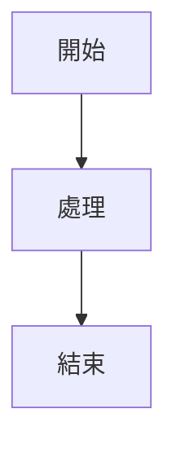
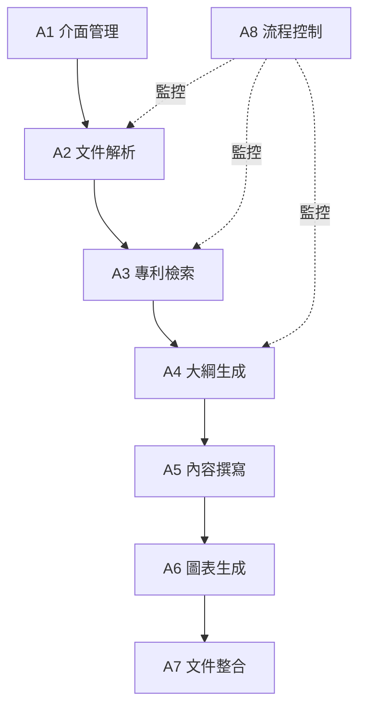
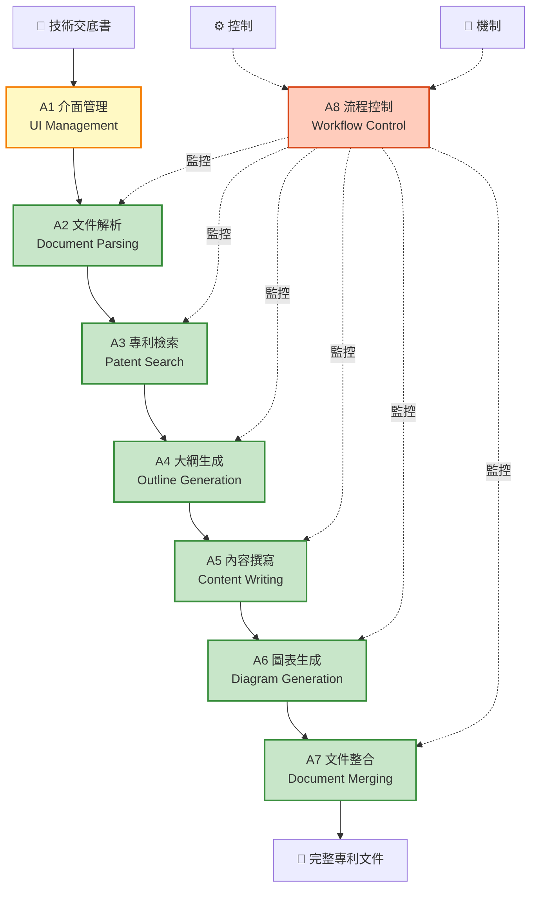
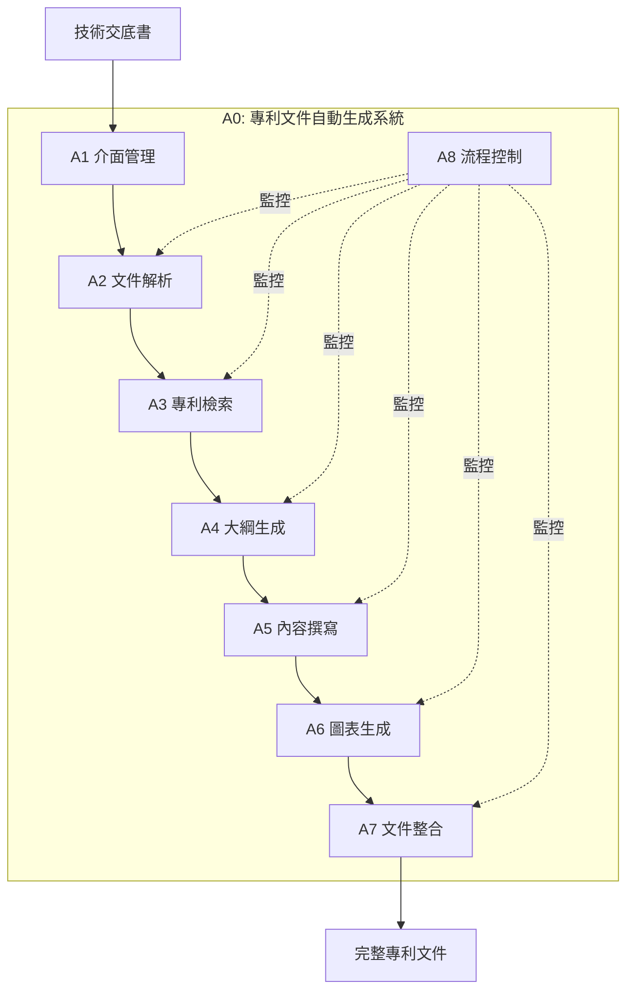

# Mermaid 圖表測試

## 測試 1: 簡單流程圖



## 測試 2: A0 頂層功能圖（簡化版）



## 測試 3: A0 頂層功能圖（完整版 - 無 subgraph）



## 測試 4: 使用 flowchart 語法（較新）



## 診斷說明

如果您看到以下錯誤訊息：
```
No diagram type detected matching given configuration for text
```

可能的原因：
1. **Mermaid 版本過舊**：某些語法在舊版本中不支援
2. **subgraph 語法問題**：部分 Mermaid 渲染器對 subgraph 支援不完整
3. **特殊字符問題**：emoji 或繁體中文可能導致問題
4. **換行符問題**：`<br/>` 在某些版本中可能不支援

## 解決方案

### 方案 1: 更新 Mermaid 擴充套件

```bash
# 更新到最新版本
code --install-extension bierner.markdown-mermaid --force
```

### 方案 2: 簡化圖表語法

移除可能導致問題的元素：
- 移除 emoji 符號
- 移除 `subgraph`
- 簡化 `<br/>` 換行
- 使用 `flowchart` 代替 `graph`

### 方案 3: 使用線上編輯器驗證

訪問 https://mermaid.live/ 測試您的 Mermaid 程式碼

## 測試結果

請按 `Ctrl + Shift + V` (或 `Cmd + Shift + V`) 開啟預覽，查看哪些圖表可以正常顯示。

如果測試 1-3 都無法顯示，可能是擴充套件安裝問題。
如果測試 1 可以但測試 2-4 不行，可能是語法複雜度問題。
