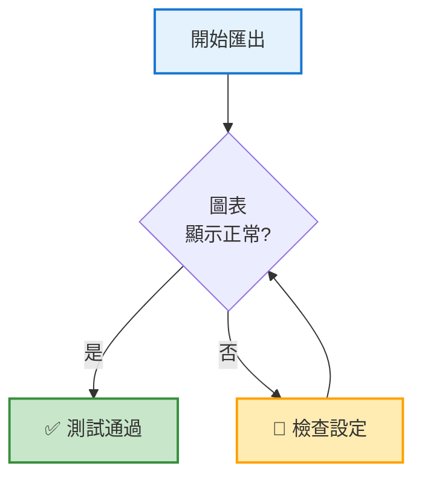
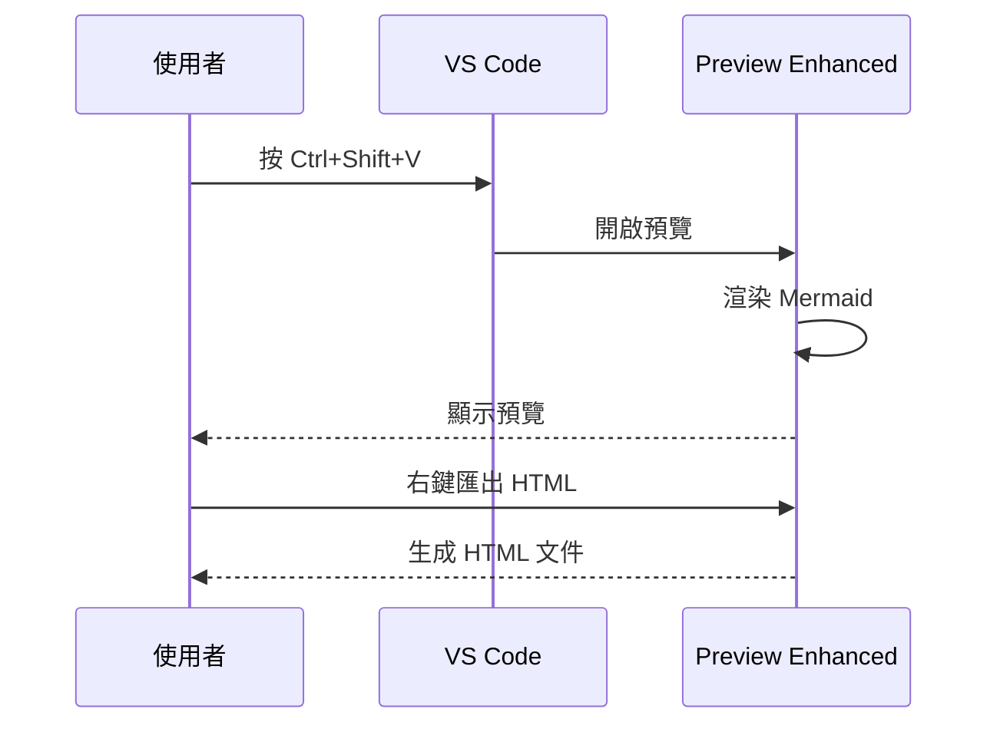

# HTML 匯出測試文件

**建立日期**：2025-10-30
**測試目的**：驗證 Markdown Preview Enhanced 的 HTML 匯出功能

---

## 測試項目

### 1. 基本 Markdown 元素

#### 標題層級
這是測試各級標題是否正確顯示。

#### 文字格式
- **粗體文字**
- *斜體文字*
- ~~刪除線~~
- `程式碼片段`

#### 列表
**無序列表**：
- 項目 1
- 項目 2
  - 子項目 2.1
  - 子項目 2.2
- 項目 3

**有序列表**：
1. 第一步
2. 第二步
3. 第三步

---

### 2. Mermaid 圖表測試

#### 測試 A：簡單流程圖


#### 測試 B：帶樣式的流程圖



#### 測試 C：時序圖



---

### 3. 程式碼區塊測試

#### JavaScript
```javascript
function exportToHTML() {
    console.log("匯出 HTML 功能測試");
    return true;
}
```

#### Python
```python
def test_export():
    """測試 HTML 匯出"""
    print("HTML 匯出測試成功")
    return True
```

#### Bash
```bash
#!/bin/bash
echo "HTML 匯出測試"
ls -lh docs/html/
```

---

### 4. 表格測試

| 功能 | 狀態 | 說明 |
|-----|------|------|
| 標題 | ✅ | 正常顯示 |
| Mermaid | ✅ | 圖表渲染 |
| 程式碼 | ✅ | 語法高亮 |
| 表格 | ✅ | 格式正確 |

---

### 5. 連結測試

- **外部連結**：[Mermaid 官方網站](https://mermaid.js.org/)
- **內部連結**：[回到頂部](#html-匯出測試文件)
- **文件連結**：[README](README.md)

---

### 6. 引用區塊測試

> 這是一個引用區塊。
>
> 用於測試引用格式是否正確顯示。
>
> **重要提示**：確保所有格式都正確匯出。

---

### 7. 水平線測試

上方是一條水平線。

---

下方也是一條水平線。

---

## 匯出檢查清單

完成 HTML 匯出後，請確認以下項目：

- [ ] HTML 文件可以在瀏覽器中開啟
- [ ] 所有標題層級正確
- [ ] 文字格式（粗體、斜體、程式碼）正常
- [ ] 列表縮排正確
- [ ] **Mermaid 圖表正確顯示**（最重要）
- [ ] 程式碼區塊有語法高亮
- [ ] 表格格式正確
- [ ] 連結可以點擊
- [ ] 引用區塊樣式正確
- [ ] 水平線顯示正常

---

## 匯出步驟

1. **開啟此文件**
   ```
   code docs/html/TEST_EXPORT.md
   ```

2. **開啟預覽**
   ```
   按 Ctrl+Shift+V
   ```

3. **確認所有元素正確顯示**

4. **匯出 HTML**
   ```
   預覽視窗右鍵 → HTML → HTML (offline)
   ```

5. **檢查生成的文件**
   ```
   在瀏覽器中開啟 TEST_EXPORT.html
   ```

---

## 預期結果

✅ **成功標準**：
- HTML 文件大小約 100-300 KB
- 所有 Mermaid 圖表完整顯示
- 文字格式和樣式正確
- 可以離線查看（不需要網路）

❌ **失敗跡象**：
- Mermaid 圖表顯示為空白或錯誤
- 程式碼區塊沒有語法高亮
- 表格格式錯亂
- 檔案過大（> 1MB）

---

## 故障排除

如果匯出失敗：

1. **檢查預覽**：確保在預覽中圖表正常顯示
2. **選擇正確選項**：使用「HTML (offline)」而非「HTML (CDN)」
3. **重新載入 VS Code**：`Ctrl+Shift+P` → "Reload Window"
4. **檢查擴充套件**：確認 Markdown Preview Enhanced 已正確安裝

---

**測試日期**：2025-10-30
**測試工具**：Markdown Preview Enhanced v0.8.19
**測試結果**：待測試
