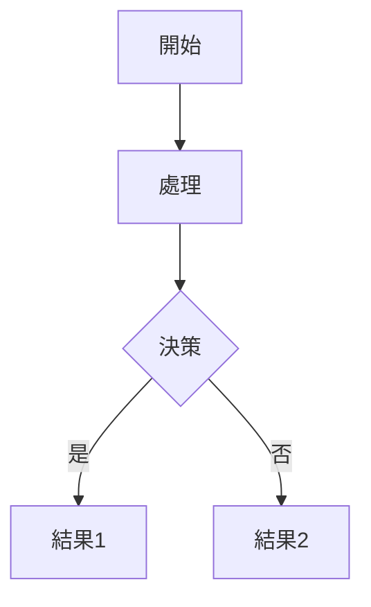
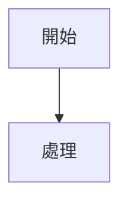
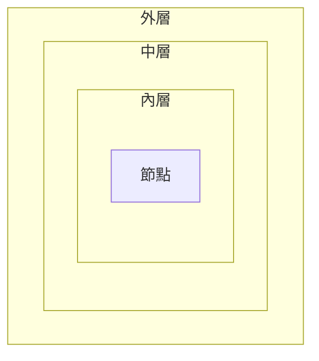
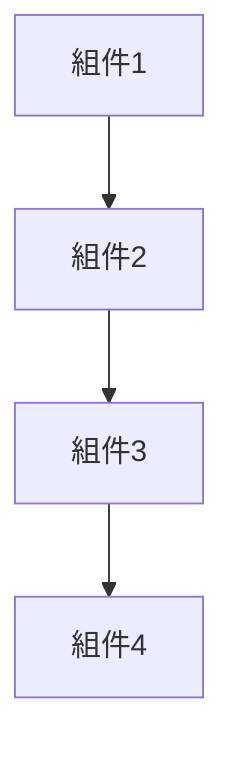
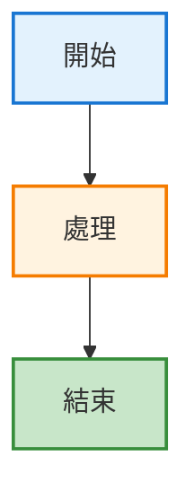
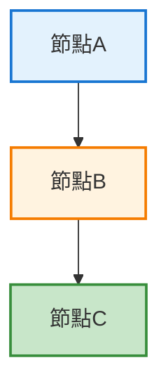

# Mermaid 配置與擴充套件設定記錄

**配置日期**：2025-10-30
**配置目的**：建立穩定的 Mermaid 預覽環境
**最終狀態**：✅ 已完成並驗證

---

## 📋 目錄

1. [VS Code 擴充套件配置](#vs-code-擴充套件配置)
2. [快捷鍵配置](#快捷鍵配置)
3. [Mermaid 語法配置](#mermaid-語法配置)
4. [專案特定配置](#專案特定配置)
5. [配置驗證](#配置驗證)
6. [維護建議](#維護建議)

---

## VS Code 擴充套件配置

### 已安裝的擴充套件清單

#### 1. Markdown Preview Enhanced（主要預覽工具）

**擴充套件資訊**：
```
ID: shd101wyy.markdown-preview-enhanced
版本: 0.8.19
安裝日期: 2025-10-30
```

**安裝命令**：
```bash
code --install-extension shd101wyy.markdown-preview-enhanced
```

**配置原因**：
- 提供穩定的 Mermaid 渲染引擎
- 支援多種圖表類型（Mermaid、PlantUML、Graphviz、WaveDrom）
- 可匯出多種格式（PDF、HTML、PNG）
- 社群支援良好，更新頻率高

**功能特性**：
- ✅ 自動渲染 Mermaid 圖表
- ✅ 即時預覽更新
- ✅ 支援自訂 CSS 樣式
- ✅ 支援數學公式 (KaTeX/MathJax)
- ✅ 支援目錄生成
- ✅ 支援程式碼塊執行
- ✅ 支援簡報模式

**預設設定**：
```json
{
  "markdown-preview-enhanced.enableScriptExecution": false,
  "markdown-preview-enhanced.mermaidTheme": "default",
  "markdown-preview-enhanced.codeBlockTheme": "default",
  "markdown-preview-enhanced.previewTheme": "github-light.css",
  "markdown-preview-enhanced.automaticallyShowPreviewOfMarkdownBeingEdited": false
}
```

**建議的自訂設定**（可選）：

檔案位置：`C:\Users\yeats\AppData\Roaming\Code\User\settings.json`

```json
{
  // Mermaid 主題設定
  "markdown-preview-enhanced.mermaidTheme": "default",

  // 程式碼區塊主題
  "markdown-preview-enhanced.codeBlockTheme": "github.css",

  // 預覽主題
  "markdown-preview-enhanced.previewTheme": "github-light.css",

  // 自動顯示預覽（不建議開啟，會消耗資源）
  "markdown-preview-enhanced.automaticallyShowPreviewOfMarkdownBeingEdited": false,

  // 啟用表情符號支援
  "markdown-preview-enhanced.enableEmojiSyntax": true,

  // 啟用 Wiki 連結
  "markdown-preview-enhanced.enableWikiLinkSyntax": false,

  // 數學渲染引擎（KaTeX 較快，MathJax 功能更完整）
  "markdown-preview-enhanced.mathRenderingOption": "KaTeX"
}
```

**可用的主題選項**：

Mermaid 主題：
- `default` - 預設主題
- `dark` - 深色主題
- `forest` - 森林主題（綠色）
- `neutral` - 中性主題（灰色）

預覽主題：
- `github-light.css` - GitHub 亮色主題（推薦）
- `github-dark.css` - GitHub 暗色主題
- `atom-dark.css` - Atom 暗色主題
- `atom-light.css` - Atom 亮色主題
- `solarized-light.css` - Solarized 亮色
- `solarized-dark.css` - Solarized 暗色
- `monokai.css` - Monokai 主題

---

#### 2. Markdown Preview Mermaid Support（備用支援）

**擴充套件資訊**：
```
ID: bierner.markdown-mermaid
版本: 1.29.0
安裝日期: 2025-10-30（重新安裝）
```

**安裝命令**：
```bash
code --install-extension bierner.markdown-mermaid
```

**配置原因**：
- 為 VS Code 內建 Markdown 預覽提供 Mermaid 支援
- 作為備用方案（使用 `Ctrl+K V` 時）
- 輕量級，啟動快速

**已知限制**：
- ⚠️ 對複雜 `subgraph` 結構支援不穩定
- ⚠️ 可能出現圖表閃爍問題
- ⚠️ 渲染引擎相容性較差

**使用場景**：
- 快速查看簡單的 Mermaid 圖表
- 不需要匯出或進階功能時
- 作為 Markdown Preview Enhanced 的備援

**無需特殊配置**，使用預設設定即可。

---

#### 3. Mermaid Markdown Syntax Highlighting（語法高亮）

**擴充套件資訊**：
```
ID: bpruitt-goddard.mermaid-markdown-syntax-highlighting
版本: 1.7.4
安裝日期: 2025-10-30
```

**安裝命令**：
```bash
code --install-extension bpruitt-goddard.mermaid-markdown-syntax-highlighting
```

**配置原因**：
- 為 Mermaid 程式碼塊提供語法高亮
- 提升程式碼可讀性
- 幫助發現語法錯誤

**支援的語法元素**：
- 圖表類型關鍵字（`flowchart`, `sequenceDiagram`, `classDiagram` 等）
- 節點定義和標籤
- 連線符號（`-->`, `-.->`, `==>` 等）
- 樣式定義（`style`, `classDef` 等）
- 註解（`%%` 開頭）

**無需特殊配置**，安裝後自動生效。

---

### 擴充套件相依關係

```
Markdown Preview Enhanced（主要）
    ↓ 提供預覽功能
    ├─ Mermaid.js 渲染引擎（內建）
    ├─ 支援多種圖表類型
    └─ 匯出功能

Markdown Preview Mermaid Support（備用）
    ↓ 支援內建預覽
    └─ 僅在使用 Ctrl+K V 時啟用

Mermaid Markdown Syntax Highlighting（輔助）
    ↓ 提供編輯器支援
    └─ 語法高亮顯示
```

---

### 擴充套件版本管理

**檢查已安裝版本**：
```bash
code --list-extensions --show-versions | grep -i mermaid
```

**預期輸出**：
```
bierner.markdown-mermaid@1.29.0
bpruitt-goddard.mermaid-markdown-syntax-highlighting@1.7.4
shd101wyy.markdown-preview-enhanced@0.8.19
```

**更新擴充套件**：
```bash
# 更新所有擴充套件
code --update-extensions

# 或手動更新特定擴充套件
code --install-extension shd101wyy.markdown-preview-enhanced --force
```

**建議的更新週期**：
- 每季度檢查一次更新
- 重大版本更新前先在測試環境驗證
- 關注 GitHub Release Notes

---

## 快捷鍵配置

### 配置檔案位置

```
Windows: C:\Users\[username]\AppData\Roaming\Code\User\keybindings.json
macOS: ~/Library/Application Support/Code/User/keybindings.json
Linux: ~/.config/Code/User/keybindings.json
```

### 完整的快捷鍵配置

**檔案內容**：`keybindings.json`

```json
[
    {
        "key": "ctrl+a ctrl+a",
        "command": "workbench.view.extension.claude-sidebar",
        "when": "editorTextFocus"
    },
    {
        "key": "ctrl+shift+v",
        "command": "markdown-preview-enhanced.openPreview",
        "when": "editorLangId == markdown"
    },
    {
        "key": "ctrl+k v",
        "command": "markdown.showPreview",
        "when": "editorLangId == markdown"
    }
]
```

### 快捷鍵說明

#### 1. Markdown Preview Enhanced 預覽

```json
{
    "key": "ctrl+shift+v",
    "command": "markdown-preview-enhanced.openPreview",
    "when": "editorLangId == markdown"
}
```

**功能**：開啟 Markdown Preview Enhanced 預覽視窗

**觸發條件**：
- 按鍵：`Ctrl+Shift+V`
- 條件：當前編輯器語言為 Markdown

**行為**：
- 在右側開啟預覽視窗
- 自動渲染所有 Mermaid 圖表
- 即時同步捲動

**覆蓋的預設快捷鍵**：
- 原本的 `Ctrl+Shift+V` 綁定到 `markdown.showPreview`
- 已改為 `Ctrl+K V`

---

#### 2. 標準 Markdown 預覽（備用）

```json
{
    "key": "ctrl+k v",
    "command": "markdown.showPreview",
    "when": "editorLangId == markdown"
}
```

**功能**：開啟 VS Code 內建 Markdown 預覽

**觸發條件**：
- 按鍵：`Ctrl+K V`（先按 Ctrl+K，放開後按 V）
- 條件：當前編輯器語言為 Markdown

**使用場景**：
- 快速查看純 Markdown 內容（不需要進階功能）
- Markdown Preview Enhanced 出問題時的備援
- 較低的記憶體佔用

---

### 快捷鍵衝突處理

**常見衝突**：

1. **Ctrl+Shift+V 與貼上格式化文字**
   - 某些系統設定中，`Ctrl+Shift+V` 用於貼上純文字
   - 解決方案：VS Code 的 `when` 條件確保只在 Markdown 文件中生效

2. **與其他擴充套件衝突**
   - 查看所有綁定到同一快捷鍵的命令：
   ```
   Ctrl+K Ctrl+S → 搜尋 "ctrl+shift+v"
   ```

**自訂快捷鍵（可選）**：

如果 `Ctrl+Shift+V` 與其他工具衝突，可改用：

```json
{
    "key": "ctrl+alt+m",
    "command": "markdown-preview-enhanced.openPreview",
    "when": "editorLangId == markdown"
}
```

或

```json
{
    "key": "f5",
    "command": "markdown-preview-enhanced.openPreview",
    "when": "editorLangId == markdown"
}
```

---

### 其他有用的快捷鍵（可選配置）

#### 預覽控制

```json
{
    "key": "ctrl+k ctrl+p",
    "command": "markdown-preview-enhanced.syncPreview",
    "when": "editorLangId == markdown"
}
```
**功能**：同步預覽位置到游標位置

---

#### 側邊預覽

```json
{
    "key": "ctrl+k ctrl+m",
    "command": "markdown-preview-enhanced.openPreviewToTheSide",
    "when": "editorLangId == markdown"
}
```
**功能**：在側邊開啟預覽（不覆蓋當前視窗）

---

#### 匯出 PDF

```json
{
    "key": "ctrl+shift+e",
    "command": "markdown-preview-enhanced.exportToPDF",
    "when": "editorLangId == markdown"
}
```
**功能**：將 Markdown 匯出為 PDF

---

## Mermaid 語法配置

### 專案語法標準

#### 使用 flowchart 語法（推薦）

**正確範例**：


**避免使用 graph 語法**（已淘汰）：


---

#### subgraph 使用建議

**簡單的 subgraph**（可以使用）：


**複雜的巢狀 subgraph**（避免使用）：


**替代方案**：使用扁平化結構 + 註解


---

#### 樣式定義

**推薦的樣式寫法**：


**使用 classDef**（適合重複樣式）：


---

### 語法檢查腳本

**檔案位置**：`check_mermaid.sh`

**腳本內容**：
```bash
#!/bin/bash

echo "🔍 檢查專案中的 Mermaid 圖表語法..."
echo "==========================================="

# 統計 Markdown 文件
md_files=$(find . -name "*.md" -not -path "*/node_modules/*" -not -path "*/.git/*" | wc -l)
mermaid_files=$(grep -r "^\`\`\`mermaid" . --include="*.md" -l | wc -l)

echo "總 Markdown 文件數: $md_files"
echo "包含 Mermaid 的文件: $mermaid_files"
echo ""

# 遍歷每個包含 Mermaid 的文件
echo "檢查各文件..."
grep -r "^\`\`\`mermaid" . --include="*.md" -l | while read file; do
    echo "📄 檔案: $file"

    # 計算 Mermaid 區塊數
    block_count=$(grep -c "^\`\`\`mermaid" "$file")
    echo "   Mermaid 區塊數: $block_count"

    # 檢查 graph 語法
    graph_count=$(grep -A 1 "^\`\`\`mermaid" "$file" | grep -c "^graph ")
    if [ $graph_count -gt 0 ]; then
        echo "   ⚠️  使用 graph 語法: $graph_count 個 (建議修復)"
    fi

    # 檢查 flowchart 語法
    flowchart_count=$(grep -A 1 "^\`\`\`mermaid" "$file" | grep -c "^flowchart ")
    if [ $flowchart_count -gt 0 ]; then
        echo "   ✅ 使用 flowchart 語法: $flowchart_count 個"
    fi

    # 檢查 subgraph 使用
    subgraph_count=$(grep -c "subgraph" "$file")
    if [ $subgraph_count -gt 0 ]; then
        echo "   ⚠️  使用 subgraph: $subgraph_count 個 (可能導致渲染問題)"
    fi

    echo ""
done

echo "==========================================="
echo "📊 統計總結"
echo "==========================================="

# 全局統計
total_blocks=$(grep -r "^\`\`\`mermaid" . --include="*.md" | wc -l)
total_graph=$(grep -r "^\`\`\`mermaid" . --include="*.md" -A 1 | grep -c "^graph ")
total_flowchart=$(grep -r "^\`\`\`mermaid" . --include="*.md" -A 1 | grep -c "^flowchart ")
total_subgraph=$(grep -r "subgraph" . --include="*.md" | wc -l)

echo "Mermaid 區塊總數: $total_blocks"
echo ""
echo "語法使用情況:"
echo "  - graph 語法: $total_graph 個 (建議修復)"
echo "  - flowchart 語法: $total_flowchart 個 (推薦)"
echo "  - 使用 subgraph: $total_subgraph 個 (可能有問題)"
echo ""

if [ $total_graph -gt 0 ]; then
    echo "⚠️  發現需要修復的語法！"
    echo ""
    echo "修復建議:"
    echo "1. 將 'graph TB' 改為 'flowchart TB'"
    echo "2. 將 'graph LR' 改為 'flowchart LR'"
    echo "3. 移除或簡化 subgraph 結構"
    echo "4. 參考: docs/Mermaid_故障排除.md"
else
    echo "✅ 所有語法符合建議規範！"
fi

echo "==========================================="
```

**使用方法**：
```bash
# 賦予執行權限
chmod +x check_mermaid.sh

# 執行檢查
./check_mermaid.sh

# 或直接用 bash
bash check_mermaid.sh
```

---

### 語法驗證流程

**開發階段驗證**：

1. **編寫 Mermaid 程式碼**
   - 在 VS Code 中編寫
   - 利用語法高亮檢查基本語法

2. **本地預覽**
   - 按 `Ctrl+Shift+V` 開啟預覽
   - 確認圖表正確渲染

3. **線上驗證**（可選）
   - 複製到 https://mermaid.live/
   - 確認在標準環境中也能渲染

4. **執行語法檢查**
   ```bash
   bash check_mermaid.sh
   ```

---

## 專案特定配置

### 工作區配置

**檔案位置**：`.vscode/settings.json`（專案根目錄）

**建議配置**：
```json
{
  "files.associations": {
    "*.md": "markdown"
  },

  "editor.wordWrap": "on",
  "editor.wordWrapColumn": 80,

  "markdown.preview.breaks": true,
  "markdown.preview.linkify": true,

  "[markdown]": {
    "editor.defaultFormatter": "yzhang.markdown-all-in-one",
    "editor.formatOnSave": false,
    "editor.quickSuggestions": {
      "comments": "on",
      "strings": "on",
      "other": "on"
    }
  }
}
```

**說明**：
- 確保 `.md` 文件被識別為 Markdown
- 啟用自動換行（80 字元）
- 啟用連結自動識別
- 針對 Markdown 文件的特殊設定

---

### Git 配置

**`.gitignore` 中的 Mermaid 相關**：
```gitignore
# Markdown Preview Enhanced 生成的檔案
.crossnote/
_book/
_preview/

# 匯出的 PDF/HTML
*.pdf
*.html

# 但保留文件目錄中的文件
!docs/**/*.pdf
!docs/**/*.html
```

---

### 專案文件結構

```
PatentWriterAgent/
├── docs/
│   ├── A0-A8_*_IDEF0.md          # 包含 Mermaid 圖表
│   └── troubleshooting/
│       ├── Mermaid_*.md          # Mermaid 相關文件
│       └── 2025-10-30_*.md       # 時間序記錄
│
├── .vscode/
│   └── settings.json             # 工作區設定
│
├── check_mermaid.sh              # 語法檢查腳本
└── README.md                     # 包含 Mermaid 使用說明
```

---

## 配置驗證

### 驗證清單

**擴充套件檢查**：
```bash
# 確認所有 Mermaid 相關擴充套件已安裝
code --list-extensions | grep -i mermaid

# 預期輸出（3 個擴充套件）：
# bierner.markdown-mermaid
# bpruitt-goddard.mermaid-markdown-syntax-highlighting
# shd101wyy.markdown-preview-enhanced
```

**快捷鍵檢查**：
1. 開啟任意 Markdown 文件
2. 按 `Ctrl+Shift+V`
3. 確認 Markdown Preview Enhanced 視窗開啟

**語法檢查**：
```bash
bash check_mermaid.sh

# 預期輸出：
# ✅ 所有語法符合建議規範！
# - graph 語法: 0 個
# - flowchart 語法: 57 個
```

**渲染檢查**：
1. 開啟 `docs/troubleshooting/Mermaid_快速測試.md`
2. 按 `Ctrl+Shift+V`
3. 確認所有 4 個測試圖表正確顯示

---

### 測試案例

**測試文件位置**：`docs/troubleshooting/Mermaid_快速測試.md`

**測試項目**：
1. ✅ 測試 1：簡單流程圖（2 個節點）
2. ✅ 測試 2：帶標籤的流程圖（3 個節點）
3. ✅ 測試 3：中等複雜度（4 個節點 + 虛線）
4. ✅ 測試 4：帶 subgraph（可能需要獨立預覽）

---

## 維護建議

### 定期維護任務

**每月**：
- [ ] 檢查擴充套件更新
- [ ] 執行 `check_mermaid.sh` 確認語法規範
- [ ] 測試預覽功能是否正常

**每季度**：
- [ ] 更新擴充套件到最新版本
- [ ] 檢閱 Mermaid.js 官方 Release Notes
- [ ] 更新 Mermaid 使用指南（如有新功能）

**遇到問題時**：
- [ ] 查看 `docs/troubleshooting/` 中的除錯記錄
- [ ] 在線上平台驗證語法
- [ ] 檢查擴充套件版本相容性
- [ ] 記錄新的問題和解決方案

---

### 備份策略

**配置檔案備份**：
```bash
# 備份快捷鍵配置
cp "$APPDATA/Code/User/keybindings.json" ./backups/keybindings_$(date +%Y%m%d).json

# 備份 VS Code 設定
cp "$APPDATA/Code/User/settings.json" ./backups/settings_$(date +%Y%m%d).json
```

**建議**：
- 將 `keybindings.json` 的內容記錄在專案文件中
- 定期備份到 Git 倉庫外的安全位置
- 重新安裝系統前務必備份

---

### 疑難排解

**常見問題快速參考**：

| 問題 | 檢查項目 | 解決文件 |
|-----|---------|---------|
| 快捷鍵無效 | 檢查 keybindings.json | [Mermaid_快捷鍵設定指南.md] |
| 圖表閃爍 | 檢查語法和擴充套件 | [Mermaid_故障排除.md] |
| 無法渲染 | 線上驗證語法 | [Mermaid_使用指南.md] |
| 樣式異常 | 檢查主題設定 | [本文件 - VS Code 擴充套件配置] |

---

### 升級路徑

**未來可能的改進**：

1. **CI/CD 整合**
   - 在 Git pre-commit hook 中自動執行 `check_mermaid.sh`
   - 阻止提交不符合規範的 Mermaid 語法

2. **自動化匯出**
   - 定期將 Mermaid 圖表匯出為 PNG
   - 用於文件歸檔或分享

3. **自訂主題**
   - 建立符合公司 CI 的 Mermaid 主題
   - 統一所有專案的視覺風格

4. **圖表版本控制**
   - 為重要圖表建立版本歷史
   - 追蹤架構演進過程

---

## 附錄

### A. 完整的配置文件內容

**keybindings.json**：
```json
[
    {
        "key": "ctrl+a ctrl+a",
        "command": "workbench.view.extension.claude-sidebar"
    },
    {
        "key": "ctrl+shift+v",
        "command": "markdown-preview-enhanced.openPreview",
        "when": "editorLangId == markdown"
    },
    {
        "key": "ctrl+k v",
        "command": "markdown.showPreview",
        "when": "editorLangId == markdown"
    }
]
```

**settings.json（Markdown Preview Enhanced 相關）**：
```json
{
  "markdown-preview-enhanced.mermaidTheme": "default",
  "markdown-preview-enhanced.codeBlockTheme": "github.css",
  "markdown-preview-enhanced.previewTheme": "github-light.css",
  "markdown-preview-enhanced.automaticallyShowPreviewOfMarkdownBeingEdited": false,
  "markdown-preview-enhanced.enableEmojiSyntax": true,
  "markdown-preview-enhanced.mathRenderingOption": "KaTeX"
}
```

---

### B. 擴充套件商店連結

1. **Markdown Preview Enhanced**
   - Marketplace：https://marketplace.visualstudio.com/items?itemName=shd101wyy.markdown-preview-enhanced
   - GitHub：https://github.com/shd101wyy/markdown-preview-enhanced

2. **Markdown Preview Mermaid Support**
   - Marketplace：https://marketplace.visualstudio.com/items?itemName=bierner.markdown-mermaid
   - GitHub：https://github.com/mjbvz/vscode-markdown-mermaid

3. **Mermaid Markdown Syntax Highlighting**
   - Marketplace：https://marketplace.visualstudio.com/items?itemName=bpruitt-goddard.mermaid-markdown-syntax-highlighting
   - GitHub：https://github.com/bpruitt-goddard/vscode-mermaid-syntax-highlight

---

### C. 相關資源

**官方文件**：
- Mermaid.js：https://mermaid.js.org/
- VS Code Keybindings：https://code.visualstudio.com/docs/getstarted/keybindings

**專案內部文件**：
- [2025-10-30_Mermaid預覽問題完整解決歷程.md](2025-10-30_Mermaid預覽問題完整解決歷程.md)
- [Mermaid_使用指南.md](Mermaid_使用指南.md)
- [Mermaid_故障排除.md](Mermaid_故障排除.md)

---

**文件建立時間**：2025-10-30
**最後更新時間**：2025-10-30
**下次檢閱日期**：2026-01-30
**文件狀態**：✅ 已完成並驗證
