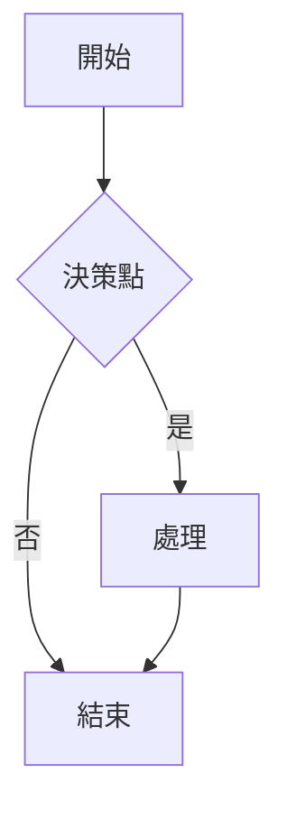
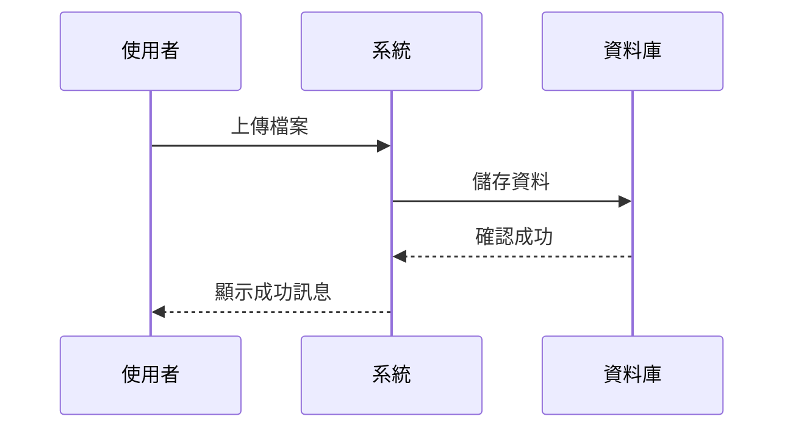
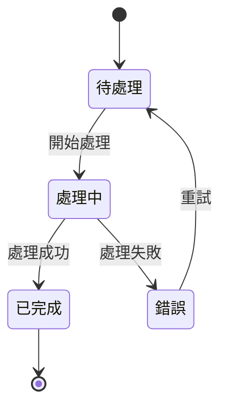
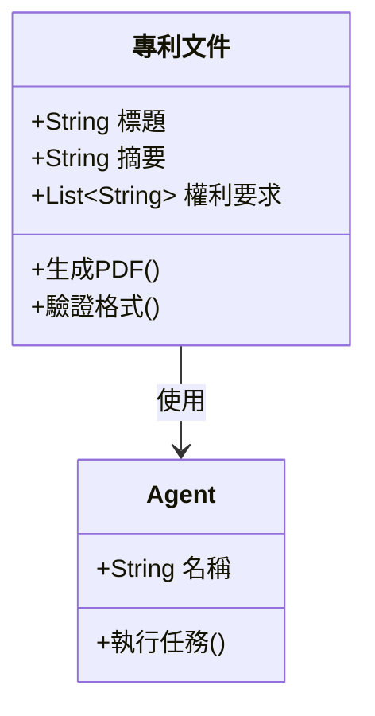
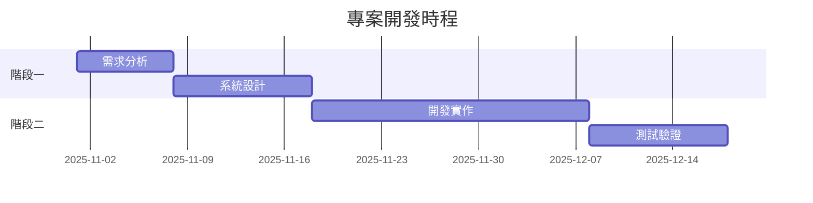
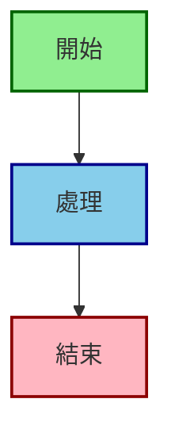

# Mermaid 圖表使用指南

## 📦 已安裝的擴充套件

您的 VS Code 已安裝以下 Mermaid 擴充套件：

1. ✅ **Markdown Preview Mermaid Support** (`bierner.markdown-mermaid`)
2. ✅ **Mermaid Markdown Syntax Highlighting** (`bpruitt-goddard.mermaid-markdown-syntax-highlighting`)
3. ✅ **Mermaid Preview** (`vstirbu.vscode-mermaid-preview`)

---

## 🚀 快速開始

### 方法 1：在 Markdown 預覽中查看 Mermaid 圖表

1. **開啟任何包含 Mermaid 圖表的 Markdown 檔案**
   - 例如：`docs/A0_system_idef0.md`

2. **開啟預覽視窗**
   - Windows/Linux: `Ctrl + Shift + V`
   - Mac: `Cmd + Shift + V`
   - 或點擊右上角的預覽圖示 (📖)

3. **即時查看圖表**
   - Mermaid 圖表會自動渲染
   - 編輯時會即時更新

---

### 方法 2：使用獨立的 Mermaid 預覽視窗

1. **開啟命令面板**
   - Windows/Linux: `Ctrl + Shift + P`
   - Mac: `Cmd + Shift + P`

2. **輸入指令**
   ```
   Mermaid: Preview Diagram
   ```

3. **獨立預覽視窗會在右側開啟**
   - 支援即時編輯預覽
   - 可以匯出為圖片

---

## 📝 Mermaid 語法範例

### 1. 流程圖 (Flowchart)

````markdown

````

**效果**：


---

### 2. 時序圖 (Sequence Diagram)

````markdown

````

**效果**：


---

### 3. 狀態圖 (State Diagram)

````markdown

````

**效果**：


---

### 4. 類別圖 (Class Diagram)

````markdown

````

**效果**：


---

### 5. 甘特圖 (Gantt Chart)

````markdown

````

**效果**：


---

## 🎨 樣式自訂

### 自訂顏色

````markdown

````

---

## 🔧 進階功能

### 1. 匯出圖表為圖片

使用 **Mermaid Preview** 擴充套件：

1. 開啟 Mermaid 預覽視窗
2. 右鍵點擊圖表
3. 選擇 "Save as PNG" 或 "Save as SVG"

### 2. 線上編輯器

如果需要更複雜的編輯，可以使用線上工具：
- [Mermaid Live Editor](https://mermaid.live/)
- 支援即時預覽和匯出

---

## 📚 專案中的 Mermaid 圖表

本專案的以下文件包含大量 Mermaid 圖表：

### 系統架構文件
- [`docs/A0_system_idef0.md`](A0_system_idef0.md) - 系統總覽
- [`arch.md`](../arch.md) - 多智慧體系統架構

### 子模組設計文件
- [`docs/A1_UI_Management_IDEF0.md`](A1_UI_Management_IDEF0.md)
- [`docs/A2_Document_Parsing_IDEF0.md`](A2_Document_Parsing_IDEF0.md)
- [`docs/A3_Patent_Search_IDEF0.md`](A3_Patent_Search_IDEF0.md)
- [`docs/A4_Outline_Generation_IDEF0.md`](A4_Outline_Generation_IDEF0.md)
- [`docs/A5_Content_Writing_IDEF0.md`](A5_Content_Writing_IDEF0.md)
- [`docs/A6_Diagram_Generation_IDEF0.md`](A6_Diagram_Generation_IDEF0.md)
- [`docs/A7_Document_Merging_IDEF0.md`](A7_Document_Merging_IDEF0.md)
- [`docs/A8_Workflow_Control_IDEF0.md`](A8_Workflow_Control_IDEF0.md)

**總計**：40+ 個 Mermaid 圖表

---

## ⌨️ 常用快捷鍵

| 功能 | Windows/Linux | Mac |
|------|--------------|-----|
| 開啟 Markdown 預覽 | `Ctrl + Shift + V` | `Cmd + Shift + V` |
| 開啟命令面板 | `Ctrl + Shift + P` | `Cmd + Shift + P` |
| 並排預覽 | `Ctrl + K V` | `Cmd + K V` |

---

## 🐛 常見問題

### Q1: 圖表沒有顯示？

**解決方法**：
1. 確認擴充套件已安裝並啟用
2. 重新載入 VS Code (`Ctrl + Shift + P` → "Reload Window")
3. 確認 Mermaid 語法正確（查看 VS Code 錯誤訊息）

### Q2: 圖表顯示為空白？

**解決方法**：
1. 檢查網路連線（需要載入 Mermaid 渲染引擎）
2. 更新擴充套件到最新版本
3. 嘗試使用線上編輯器驗證語法

### Q3: 繁體中文顯示異常？

**解決方法**：
1. 確保檔案編碼為 UTF-8
2. 在 Mermaid 圖表中使用繁體中文應該沒問題
3. 如果有問題，可以使用英文標籤配合註解

---

## 📖 學習資源

- [Mermaid 官方文件](https://mermaid.js.org/)
- [Mermaid 語法參考](https://mermaid.js.org/intro/syntax-reference.html)
- [Mermaid Live Editor](https://mermaid.live/) - 線上編輯器

---

## 🎯 快速測試

開啟本文件並按 `Ctrl + Shift + V` (或 `Cmd + Shift + V`)，您應該能看到上面所有的圖表範例都正確渲染！

---

**祝您使用愉快！** 🎉

如有任何問題，請參考 [Mermaid 官方文件](https://mermaid.js.org/) 或在專案中搜尋現有的 Mermaid 圖表範例。
