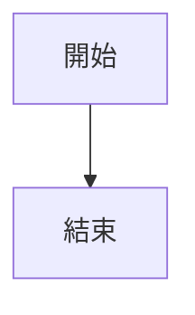
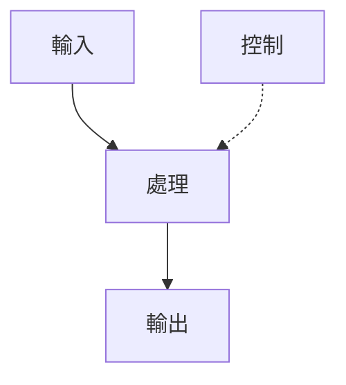

# Mermaid 快速測試 - 診斷閃爍問題

## 測試 1: 最簡單的流程圖

## 測試 2: 帶標籤的流程圖

## 測試 3: 中等複雜度（無 subgraph）

## 測試 4: 帶 subgraph（問題來源）

---

## 使用 vstirbu 擴充套件預覽的方法

### 方法 1: 命令面板
1. 將游標放在 Mermaid 程式碼塊中
2. 按 `Ctrl+Shift+P`
3. 輸入 "Mermaid: Preview"
4. 選擇 "Mermaid: Preview Diagram"

### 方法 2: 右鍵選單
1. 在 Mermaid 程式碼塊中右鍵
2. 選擇 "Preview Mermaid Diagram"

---

## 診斷步驟

**如果測試 1-2 失敗**：
- 擴充套件安裝有問題，需要重新安裝

**如果測試 3 失敗**：
- 可能是圖表複雜度或樣式問題

**如果只有測試 4 失敗**：
- 確認是 subgraph 的問題

**如果所有測試都閃爍後失敗**：
- VS Code 渲染引擎有問題，建議使用線上平台
